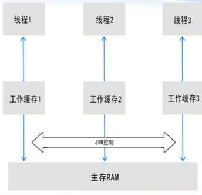
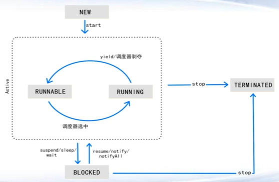

# (1) Java多线程和并发

## 多进程和多线程

多进程概念

* 当前的操作系统都是多任务OS
* 每个独立执行的任务就是一个进程
* OS将时间划分为多个时间片(时间很短)
* 每个时间片内将CPU分配给某一个任务，时间片结束，CPU将自动回收，再分配给另外任务。从外部看，所有任务是同时在执行。但是在CPU上，任务是按照串行依次运行(单核CPU)。如果是多核，多个进程任务可以并行。但是单个核上，多进程只能串行执行。
* 多进程的优点
  * 可以同时运行多个任务
  * 程序因IO堵塞时，可以释放CPU，让CPU为其他程序服务
  * 当系统有多个CPU时，可以为多个程序同时服务.
    * 我们的CPU不再提高频率，而是提高核数（散热、频率瓶颈）
    * 2005年Herb Sutter的文章The free lunch is over,指明多核和并行程序才是提高程序性能的唯一办法
* 多进程的缺点
  * 太笨重，不好管理
  * 太笨重，不好切换

多线程概念

* 一个程序可以包括多个子任务，这些子任务可串/并行
* 每个子任务可以称为一个线程
* 如果一个子任务阻塞，程序可以将CPU调度另外一个子任务进行工作。这样CPU还是保留在本程序中，而不是被调度到别的程序(进程)去。这样，提高本程序所获得CPU时间和利用率。

多进程vs多线程

* 线程共享数据
* 线程通讯更高效
* 线程更轻量级，更容易切换
* 多个线程更容易管理

 ## Java多线程实现

Java多线程创建

* java.lang.Thread

  * 线程继承Thread类，实现run方法

    ~~~java
    public class Thread1 extends Thread{
    	public void run(){
    		System.out.println("hello");
    	}
    	public static void main(String[] a){
    		new Thread1().start();
    	}
    }
    ~~~

* java.lang.Runnable接口

  * 线程实现Runnable接口，实现run方法

    ~~~java
    public class Thread2 implements Runnable{
    	public void run(){
    		System.out.println("hello");
    	}
    	public static void main(String[] a){
    		new Thread(new Thread2()).start();
    	}
    }
    ~~~

Java多线程启动

* start方法，会自动以新进程调用run方法（底层使用JNI实现，它提供若干API，使得Java调用C/C++程序）
* 直接调用run方法，将变成串行执行
* **同一个线程，多次start会报错**， 只执行第一次start方法.
* 多个线程启动，其启动的**先后顺序是随机**的
* 线程无需关闭，只要其run方法执行结束后，**自动关闭**
* main函数(线程)可能早于新线程结束，整个程序并不终止
* 整个程序终止是**等所有的线程都终止**(包括main函数线程)

Java多线程实现对比

- Thread占据了父类的名额，不如Runnable方便（继承了Thread就不能继承其他类，但是接口可以实现多个）
- Thread 类实现Runnable（继承Thread类本质上实现了Runnable接口）
- Runnable启动时需要Thread类的支持.
- Runnable更容易实现多线程中资源共享（Thread使用static变量共享，Runnable里普通变量达到共享）
- 结论：建议实现Runnable接口来完成多线程

## Java多线程信息共享

多线程信息共享

* 粗粒度：子线程与子线程之间、和main线程之间缺乏交流

* 细粒度：线程之间有信息交流通讯
  * 通过共享变量达到信息共享
  * JDK原生库暂不支持发送消息（类似MPI并行库直接发送消息）
  
* 通过共享变量在多个线程中共享消息
  * static变量（如果一个线程类继承了Thread类，它的信息共享只能通过static，普通成员变量达不到信息共享的目的）
  * 同一个Runnable类的成员变量（实现Runnable接口的类new一次，线程包装类new多次）
  
*  多线程信息共享问题
  * 工作**缓存副本**（每个线程工作缓存并不是最新变量值）
    
  * **关键步骤缺乏加锁限制**
  
* 例如i++， 并非原子性操作
  * 读取主存i(正本)到工作缓存(副本)中
  * 每个CPU执行(副本)i+1操作
  * CPU将结果写入到缓存(副本)中
  * 数据从工作缓存(副本)刷到主存(正本)中

* 变量**副本问题**的解决方法.

  * 采用**volatile** 关键字修饰变量
  * 保证不同线程对共享变量操作时的可见性

* 关键步骤**加锁**限制

  * 互斥：某一个线程运行一个**代码段(关键区)**，其他线程不能同时运行这个代码段
  * 同步：多个线程的运行，必须按照某-种规定的先后顺序来运行
  * 互斥是同步的一种特例

* 互斥的关键字是synchronized

  * **synchronized代码块/函数，只能一个线程进入**
  * synchronized加大性能负担，但是使用简便

* 示例

  ~~~java
  public class ThreadDemo3 {
  	public static void main(String[] args) {
  		TestThread3 t = new TestThread3();
  		new Thread(t, "Thread-0").start();
  		new Thread(t, "Thread-1").start();
  		new Thread(t, "Thread-2").start();
  		new Thread(t, "Thread-3").start();
  	}
  }
  
  class TestThread3 implements Runnable {
  	private volatile int tickets = 100; // 多个 线程在共享的
  	String str = new String("");
  
  	public void run() {
  		while (true) {
              synchronized(str){ //同步代码块，任何一个非空对象放在这作为锁，每个线程去抢这把锁
  				sale();
              }
  			try {
  				Thread.sleep(100);
  			} catch (Exception e) {
  				System.out.println(e.getMessage());
  			}
  			if (tickets <= 0) {
  				break;
  			}
  		}
  	}
  
  	public synchronized/*这里和上面的synchronized只需要一个即可加锁*/ void sale() { // 同步函数
  		if (tickets > 0) {
  			System.out.println(Thread.currentThread().getName() + " is saling ticket " + tickets--);
  		}
  	}
  }
  ~~~

## Java多线程状态管理

多线程管理

* 线程类
  * 通过继承Thread或实现Runnable
  * 通过start方法，调用run方法，run方法工作
  * 线程run结束后，线程退出
* 粗粒度:子线程与子线程之间、和main线程之间缺乏同步
* 细粒度:线程之间有同步协作
  * 等待
  * 通知/唤醒
  * **终止**
* 线程状态
  * NEW刚创建(new)
  * RUNNABLE就绪态(start)
  * RUNNING运行中(run)
  * BLOCK阻塞(sleep)
  * TERMINATED结束
  * 
* Thread的部分API已经废弃
  * 暂停和恢复suspend/ resume
  * 消亡stop/ destroy
* 线程阻塞/和唤醒
  * sleep，时间一到，自己会醒来
  * wait/ notify/notifyAll，等待，需要别人来唤醒
  * join， 等待另外一个线程结束.
  * interrupt,向另外一个线程发送中断信号，该线程收到信号，会
    触发InterruptedException(可解除阻塞)，并进行下一步处理

看例子

* 线程被动地暂停和终止（自己wait了靠别人notify来解脱自己）
  * 依靠别的线程来拯救自己（比较危险，自己还拿着资源比如锁）
  * 没有及时释放资源
* **线程主动暂停和终止**
  * 定期监测共享变量
  * 如果需要暂停或者终止，先释放资源，再主动动作
  * 暂停：Thread.sleep()，休眠
  * 终止：run方法结束，线程终止

看例子

* 多线程死锁
  * 每个线程互相持有别人需要的锁（哲学家吃面问题）
  * 预防死锁，对资源进行等级排序
* 守护(后台)线程
  * 普通线程的结束，是run方法运行结束
  * 守护线程的结束，是run方法运行结束，或main函数结束
  * **守护线程永远不要访问资源**，如文件或数据库或锁等（来不及释放资源就结束）
* 线程查看工具jvisualvm

## Java并发框架Executor

并行计算

* 业务：任务多，数据量大
* 串行 vs 并行
  - 串行编程简单，并行编程困难一
  - 单个计算核频率下降，计算核数增多，整体性能变高
* 并行困难（任务分配和执行过程**高度耦合**）
  * 如何控制粒度，切割任务
  * 如何分配任务给线程，监督线程执行过程
* 并行模式
  * 主从模式(Master-Slave) ，主线程协调指挥从线程工作，更简单一些
  * Worker模式(Worker-Worker)，P2P，平等，无中心
* Java并发编程
  * Thread/Runnable/Thread组管理
  * Executor(本节重点)
  * Fork-Join框架

线程组管理

* 线程组ThreadGroup
  * 线程的集合
  * 树形结构，大线程组可以包括小线程组
  * 可以通过enumerate方法遍历组内的线程，执行操作
  * 能够有效管理多个线程，但是**管理效率低**
  * 任务分配和执行过程**高度耦合**
  * 重复创建线程、关闭线程操作，**无法重用**线程。（只是提供数组方式来方便控制进程。线程和线程组内的线程，都是new产生出来，但是start一次以后，就不能再次使用，即再次start。new的代价很昂贵，只运行一次,性价比过低）

看例子

Executor

* 从JDK 5开始提供Executor FrameWork (java.util.concurrent.*)
  * 分离任务的创建和执行者的创建
  * 线程重复利用(new线程代价很大)
* 理解**共享线程池**的概念
  * 预设好的多个Thread，可弹性增加
  * 多次执行很多很小的任务
  * 任务创建和执行过程解耦
  * 程序员**无需关心线程池**执行任务过程
* 主要类: ExecutorService，ThreadPoolExecutor，Future
  * Executors.newCachedThreadPool / newFixedThreadPool创建线程池
  * ExecutorService 线程池服务
  * Callable 具体的逻辑对象(线程类)，Callable和Runnable是等价的，可以用来执行一个任务。Runnable的run方法没有返回值而Callable的call方法可以有返回值
  * Future 返回结果

看例子

## Java并发框架Fork-Join

* Java7 提供另一种并行框架：分解、治理、合并（**分治**编程）
* 适合用于整体任务量不好确定的场合（**最小任务可确定**）
* 关键类
  * ForkjoinPool 任务池
  * RecursiveAction
  * RecursiveTask

看例子

## Java并发数据结构

* 常用的数据结构是线程不安全的
  * ArrayList, HashMap, HashSet 非同步的
  * 多个线程同时读写，可能会抛出异常或数据错误
* 传统Vector，Hashtable等支持同步的集合性能过差
* 并发数据结构：数据添加和删除
  * 阻塞式集合：当集合为空或者满时，等待
  * 非阻塞式集合：当集合为空或者满时，不等待，返回null或异常
* List
  * Vector 同步安全，**写多读少**
  * ArrayList 不安全
  * Collections.synchronizedList(List list) 基于synchronized，效率差
  * CopyOnWriteArrayList **读多写少**，基于复制机制，非阻塞，性能比较好
* Set
  * HashSet 不安全
  * Collections.synchronizedSet(Set set) 基于synchronized，效率差
  * CopyOnWriteArraySet，基于CopyOnWriteArrayList实现，**读多写少**非阻塞
* Map
  * Hashtable 同步安全，写多读少
  * HashMap 不安全
  * Collections.synchronizedMap(Map map) 基于synchronized，效率差
  * ConcurrentHashMap 读多写少，非阻塞
* Queue & Deque （队列，JDK 1.5 提出）
  * ConcurrentLinkedQueue 非阻塞
  * ArrayBlockingQueue / LinkedBlockingQueue 阻塞

# Java并发协作控制

* Thread/Executor/Fork-Join
  * 线程启动，运行，结束
  * 线程之间缺少协作
* synchronized 同步
  * 限定只有一个线程才能进入关键区
  * 简单粗暴，性能损失有点大

Lock

* Lock也可以实现同步的效果
  * 实现更复杂的临界区结构
  * tryLock方法可以预判锁是否空闲
  * 允许分离读写的操作，多个读，一个写
  * 性能更好
* Reentrantlock类，可重入的互斥锁。
* ReentrantReadWriteLock类，可重入的读写锁
* lock和unlock函数