* 2-4篇文献研读及报告（15%）
  * 经典和最新文献研读（不是专业英语）
* 若干作业（10%）
* 1-3个quiz(10%)
* 1个project（35％）（team work），12.22项目展示
* 1个test期末笔试30%（open book），12.29考试
  * 基于非关系数据库管理数据，解决关系数据库管理数据的痛点

* E-mail: [hzhao@sei.ecnu.edu.cn](mailto:hzhao@sei.ecnu.edu.cn)

  Phone: 62231225

  Office : 理科大楼B1011

  Office Hours: 3:30pm-4:30pm(Wednesday)

* TA ：张韵琪

  微信：zyq000317

  办公室：理科大楼B1006

# 概述

## 非关系型数据库产生的背景

* 大数据特征：
  * Volume（大量）：数据量大
  * Velocity（高速）：数据被创建、移动和处理的速度
  * Variety（多样）：文字、图像、图片、地理位置等
  * Value（价值）：具有价值但价值密度低
* 传统关系数据库自身的局限性无法应对大数据产生的应用需求，如扩展困难、读写慢、成本高、容量有限等。为了应对数据高并发的读写需求和海量数据的存储需求，非关系型数据库应运而生。
* 开发数据管理应用考虑的问题：
  * 用户量
  * 数据量（预估与日增）
  * 数据访问模式（读or写密集）
  * 数据场景（强事务型or分析型需求）
  * 运行性能（并发量，高峰平均低估的预估
* 传统的数据模型：关系数据模型、E-R数据模型、基于对象的数据模型、XML/JSON、网状模型、层次模型
* 关系数据库特点
  * **数据模型简单：**二维表结构，数据以行为单位，每行表示一个记录，每行数据的属性都相同。
  * **事务管理机制完善：**支持 ACID 特性，维护数据的一致性，关系数据库非常重要的特性。
  * **SQL** **语言使用方便**，支持 join 等复杂操作
  * **成熟的产品提供良好的服务**：MySql、Oracle、SQL Server、PostgreSQL等
  * **高并发下数据库存在瓶颈**：数据按行存储，针对某一列的运算，IO代价较高；
  * **维护数据一致性代价大**：为了保证事务ACID特性，数据库提供并发控制与故障恢复机制，事务的隔离级别越高，读写性能会受影响。隔离级别，从低到高依次是读未提交、读已提交、可重复度、串行化，事务隔离级别越低，可能导致的并发异常越多，但是能提供的并发能力越强
  * **维护索引代价大**：数据更新必然导致索引更新，降低了关系型数据库的读写能力；索引占存储的空间。
  * **水平扩展带来的问题：**应对业务规模扩大，数据库分库是常用的方法，分库之后，数据迁移、跨库 join、分布式事务处理都是需要考虑的问题。
  * **数据库schema结构不易扩展：**如果需要修改表结构，需要执行 DDL语句，修改期间会锁表，部分服务不可用。
* 单节点数据库面临的压力：新的数据类型，数据库模式free，可靠性、可伸缩性、大规模数据、高吞吐量、高并发访问等
* 基于关系数据库不擅长：
  * 大量数据的写入操作
    * 解决：读写分离（多台服务器的数据一致性问题）、不同的表分配给不同的数据库（跨服务器实现join非常困难）
  * 有数据更新时需要更新索引甚至更新表结构
    * 更新时需要加锁，数据访问受限制，高并发应用的性能受影响
  * 表结构不固定的应用
* 几种计算机体系结构
  * Shared RAM（BUS）
  * Shared Disk（LAN）
  * Shared Nothing（LAN）

## 非关系型数据库与NoSQL

* NoSQL定义：符合非关系型、分布式、开源和具有水平可扩展能力的下一代数据库。
* NoSQL数据库的诞生定位于非结构化性强的数据
  * 对于NoSQL Community，NoSQL称Not only SQL 
  * 数据模型包括
    * key-value 数据模型：数组组织成key-value对，使用key访问value。
    * Graph数据模型：采用图结构存储数据之间的关系
    * Column family数据模型 (例如，Bigtable)：类似稀疏矩阵，行和列作为key，列族由多个列构成
    * Document-oriented数据模型：存储层次数据结构的数据
  * 不提供Join操作
  * Schemaless: allows data to have arbitrary structures as they are not explicitly defined by a data definition language (schema-on-write). Instead, they are implicitly encoded by the application logic (schema-on-read).
  * 运行于shared-nothing的商用计算机构成的集群上
  * 具有横向可扩展性
* NoSQL不是关于SQL语言，NoSQL 不是指不使用SQL查询语言的数据库系统。
* NoSQL数据库也提供SQL查询语言。
* 既有开源NoSQL数据库产品，也有商用产品。
* NoSQL数据库不仅仅针对大数据中的量大（volume）和高速（velocity）特征，同样注重多样性.
* NoSQL不是云计算：因为良好的可伸缩性，不少NoSQL系统部署在云中。 NoSQL既可以运行在云环境中，也可以运行在自己的数据中心。
* NoSQL不是基于RAM和SSD的应用，而是利用RAM和SSD提高性能，NoSQL系统可以运行在标准的硬件上。
* Multi-Model Database：多模型数据库，数据自然地以不同的格式和模型进行组织，包括结构化（kv、图数据），半结构化（XML/JSON）和非结构化数据（文本文件）

# 相关基础知识及概念

## 单机的局限性

* 多核、多独立CPU，加上高性能内存，解决了的大多数常见的数据应用。但是，在大数据环境下，单机的操作响应速度存在物理极限性
* 物理硬盘的性能是影响数据读写速度的重要因素
* 解决单机局限性的方案
  * **纵向扩展**：提高单机的物理配置。PC服务器->小型机->大型机
  * **横向扩展**：添加更多的节点，节点之间用高速网络连接，当需要更高的性能或更大的容量时，可迅速向集群中添加节点，而不会导致任何宕机（高可用Web应用）

## 计算平台分类

计算平台的Flynn分类法，主要根据指令流和数据流来分类，共分为四种类型的计算平台

* SISD：单指令流单数据流
  * 传统的串行计算机，硬件不支持任何形式的并行计算，所有的指令都是串行执行
* SIMD：单指令流多数据流
  * 在单个时钟周期内处理多个数据单元，数据级别的并行处理。例GPU的应用，图像处理、矩阵计算
* MIMD：多指令流多数据流
  * 紧耦合MIMD和松耦合MIMD
  * 多核、多CPU共享内存
* MISD：多指令流单数据流
  * 理论模型，没有实际实现

##  水平扩展基础知识

* **集群**：
  * 集群是紧密耦合的一些服务器或节点，这些服务器通过高速网络连接在一起作为一个工作单元。
  * 集群中每个节点都有自己的专属资源：CPU、内存和硬盘
  * 通过将任务分解成若干个小任务分配给集群中的节点服务器上，协同完成任务。
* **I/O并行**
  * 通过在多个节点（计算机）上对多个磁盘上的数据集进行分区，减少从磁盘检索数据所需的时间
    * 跨节点并行
    * 一个节点跨磁盘并行
  * **水平分区**：数据记录被划分在多个节点上，即每个节点上存储一个数据子集（默认）
  * 垂直分区：例如 r(A,B,C,D)，主键为A ，划分为r1(A,B)和r2(A,C,D)
* I/O并行技术(设节点数为n):
  * 轮询方法（Round-robin）：
    * 第*i*条记录存储到的节点为 *i* **mod** *n*
  * Hash分区：
    * 选择一个或多个属性作为分区属性
    * 选择取值范围为0…n-1的哈希函数h
    * 设*i* 为哈希函数h应用于记录属性的计算结果，然后将记录存储在节点*i*
  * 范围分区:
    * 选择分区的属性
    * 选定分区向量partition vector [v0, v1, ..., vn-2]。
    * 设v是一个记录分区属性的值，那么vi <= vi+1 的记录分配到节点 i + 1；v < v0 的记录分配到节点0；v >= vn-2 的记录分配到节点n-1.
* 分片（Sharding）
  * 水平地将大的数据集划分成较小的、易于管理的数据集的过程。
  * 每个小数据集可以独立地为所负责的数据提供读写服务
  * 某个查询的数据可能来自两个小数据集
  * 数据分片要考虑查询模式以便小数据集本身不会成为性能瓶颈
* 复制
  * 多个节点上存储数据集的多个拷贝，称作副本
  * 相同的数据在不同的节点上存在多个副本，提供了可伸缩性、可用性和容错性
  * 复制实现方法：
    * 主从复制
      * 系统配置是主从配置环境
      * 所有数据写入主节点，持久化后复制到多个从节点
      * 数据的写（增删改）操作访问主节点的数据，读（查询）操作访问任意节点。
      * 适用于读密集型应用
      * 需要考虑读一致性的问题（延迟，可能读的不是最新）：投票机制，大多数从节点包含相同版本的记录，则声明读操作是一致的。实现投票机制需要从节点之间建立可靠、快速的沟通机制
    * 对等复制
      * 节点之间不分主从，每个节点是对等的，每个写操作数据复制到所有对等的节点上。
      * 每个节点都可以处理读请求和写请求
      * 对等复制容易导致写不一致问题：同时更新多个节点的同一个数据。悲观并发策略：基于锁机制；乐观并发策略：不用锁，最终一致性
      * 读不一致性问题：投票机制
* **数据分布倾斜**（Data-distribution skew）
  * 一些节点拥有较多记录，而其他节点则拥有的记录数很少
  * 数据分布倾斜类型
    * 属性-值倾斜
      * 一些分区属性值出现在多个记录中
      * 分区属性值相同的所有记录最终都在同一个分区中
      * 范围分区和hash分区都会出现这个问题
    * 分区倾斜
      * 选择不当的范围分区向量可能会将太多记录分配给某些分区，而将太少记录分配给其他分区（数据探查）
  * 执行倾斜
    * 某些运算符运行的时间比其他运算符长，执行时间的差异可能会导致一些处理器空闲，而其他处理器仍然计算查询的一部分。

* **处理范围分区中的倾斜**
  * 创建平衡的分区向量
    * 基于分区属性对数据进行排序
    * 按照如下顺序扫描数据来构造分区向量
      * 每读取1/n的数据之后，下一个记录的分区属性值被添加到分区向量中（n表示分区数量）
    * 如果分区属性中存在重复项，则可能导致不平衡
  * 减少代价
    * 分区向量可以使用记录的随机样本创建
    * 另外一种方法：采用直方图（histograms）建立分区向量。等宽直方图；等深直方图 （划分范围，使每个范围具有（大约）相同数量的记录）
* **虚拟节点分区**
  * 核心思想：引入虚拟节点，假设虚拟节点的数量是实际节点倍数
  * 虚拟节点映射到真实节点
    * **轮询：**虚拟节点*i* 映射到真实节点 (*i* mod *n*)+1
    * **映射表：**用一个映射表记录虚拟节点和真实节点的对应关系。通过将虚拟节点从加载较多的节点移动到加载较少的节点来处理倾斜。可以解决数据倾斜和执行倾斜
  * 使用范围分区向量跨虚拟节点划分记录
    * 也可以用Hash分区
* 一致性HASH（考）
  * 为了解决分布式Cache问题：哈希映射到N个Cache，如果某个Cache m坏了或者需要增添Cache如何解决。
  * 环形hash空间：设共有$2^{32}$个bucket空间，首尾相接形成环形空间，按顺时针方向编址。通过hash函数计算将数据对象映射到环形hash空间
  * 使用相同的hash函数将节点（cache/server）映射到环形hash空间（通常使用节点的IP地址）
  * 将数据对象映射到节点。沿顺时针方向，根据数据对象的key值，遇到第一个节点（cache/server），就将数据存储在这个cache/server中
  * 如果某节点server停机，例如Server2停机，按顺时针迁移的规则，Server2上的 object2被迁移到server3中，其它对象还保持这原有的存储位置。
  * 如果增加一个新节点（Server/cache），例如新增server4，按顺时针迁移的规则，object4被迁移到了server4中，其它数据对象还保持这原有的存储位置
  * 如果节点分布不均匀，会出现分布Skew问题，可引入虚拟节点来解决。复制因子。每个物理节点关联的虚拟节点数量根据具体的生产环境情况确定
* 并行vs.分布式
  * 并行计算：
    * 单指令流多数据流计算机：SIMD
    * 多台计算机中多个CPU，多指令流伛数据流MIMD
  * 分布式计算
    * 多台计算机中多个CPU，MIMD
    * CPU间高延迟通信
    * 不同节点可以是异构的系统，可靠性维护困难
* **分布式系统的可靠性要求**
  * 允许部分节点失效
  * 如果某节点失效，其负载应由其他节点承担，确保数据可恢复
  * 某节点失效重启后应能加入原来的计算机组，而不必重启所有的节点
  * 并发操作或部分内部失效不应导致外部可见的不确定性，应确保一致性
  * 新增节点应提升系统的性能
  * 整个系统应阻止非授权访问，要比单机系统更多考虑攻击，以确保安全

## 事务及其特性

* **ACID**特性
  * **Atomicity.** 事务的所有操作或者全部执行，或者全不执行，是一个不可分割的整体。
  * **Consistency.** 在并发环境中，不同事务访问相同数据时，事务执行保证数据的一致性，即事务必须在任何时候满足系统定义的协议和原则，数据库在事务开始和结束时必须保持一致状态。
  * **Isolation.** 多个事务并发访问同一个数据库时，每个事务都有自己的数据空间，对其他事务的执行不知情；事务无法访问处于中间状态或未完成状态的任何其他事务的数据，每个事务自身是独立的。
  * **Durability.**一旦事务完成（成功提交），所有对数据的更新是持久的，即使数据库发生故障。
* 事务的状态
  * **Active** **：**事务执行对数据库的读写操作。   
  * **Partially committed** **：**事务的最后一个语句执行之后进入部分提交状态，数据在缓冲区中。
  * **Failed** **：**事务无法继续正常地执行。 
  * **Aborted** **：**事务回滚且数据库恢复到事务执行之前的状态
    * 重新启动事务
    * 杀掉事务
  * **Committed** **：**成功执行后的状态
    

* 数据访问
  * 事务Ti通过其私有工作区和系统缓冲区之间传输数据，与数据库系统进行交互，使用以下两个操作完成数据传递
    * **read**(*X*) 将数据项X的值赋予局部变量*xi*.
    * **write**(*X*) 将局部变量*xi* 的值赋予缓冲块中的数据项*X*
  * 两个操作都需要考虑数据块是否在主存中，如果不在就发指令**input**(B_X) 。
  * 事务第一次访问数据时，必须执行**read**(*X*) ，之后的操作作用于局部的拷贝x，最后一次访问数据后，事务执行**write**(*X*）
  * **output**(*B_X*) 不必要在**write**(*X*)之后立刻执行（因为数据块B中可能还有其他正在被访问的数据），系统在合适的时候执行**output**(*B_X*)将数据写到磁盘上。
    

* **事务并发执行**
  * 提高CPU和磁盘的利用率。例如：一个事务利用CPU的同时另一个事务在读或者写磁盘
  * **减少事务的平均响应时间**。例如：短事务不需要等待长事务提交后再得到响应

* **并发操作引起的问题**

  * 丢失修改。 事务T1与事务T2从数据库中读入数据A并修改，事务T2的写操作破坏了事务T1的结果，导致事务T1的修改被丢失
  * 读“脏数据”（未提交随后被撤销的数据）。事务1修改数据A，并将其写回数据库，事务2读取数据A后，事务1由于某种原因被撤消，这时事务1已修改过的数据恢复原值。事务2读到的数据与数据库中的数据不一致，是不正确的数据，又称为“脏”数据。
  * 不可重复读问题。事务1读取数据后，事务2执行更新操作，使事务1无法再现前一次读取结果。

* **并发控制机制的任务**

  * 并发控制机制协调事务的执行，确保事务的隔离性
  * 对并发操作进行正确调度
  * 保证事务的隔离性
  * 保证数据库的一致性

* **并发控制机制**

  * 基于锁的并发控制机制：2PL
    * 锁是一种控制并发访问数据的机制。
    * 事务必须在读和写数据前获得锁。
    * 使用锁必须恰当
      * 事务必须在读/写数据前拥有锁，之后必须释放锁
      * 不存在两个事务同时对同一数据加锁
  * 基于时间戳的并发控制机制
  * 基于多版本的并发控制机制MVCC（新型非关系数据库OLAP）

* **事务的4种隔离级别**

  * | 隔离级别 | 脏读   | 不可重复读 | 幻读   |
    | -------- | ------ | ---------- | ------ |
    | 读未提交 | 允许   | 允许       | 允许   |
    | 读已提交 | 不允许 | 允许       | 允许   |
    | 可重复读 | 不允许 | 不允许     | 允许   |
    | 可串行化 | 不允许 | 不允许     | 不允许 |

  * 脏读：指一个事务在执行过程中读到并发的、还没有提交的写事务的修改内容。

  * 不可重复读：指在同一个事务内,先后两次读到的同一条记录的内容发生了变化(被并发的写事务修改)。

  * 幻读：指在同一个事务内,先后两次执行的、谓词条件相同的范围查询，返回的结果不同(并发写事务插入了新记录)。

  * 隔离级别越高，在一个事务执行过程中，它能“感知”到的并发事务的影响越小，在最高的可串行化隔离级别下，任意一个事务的执行，均“感知”不到有任何其他并发事务执行的影响，并且所有事务执行的效果就和一个个顺序执行的效果完全相同

## NoSQL的数据一致性

* CAP是分布式环境中设计和部署系统要考虑的三个重要的系统需求(主流的非关系数据库是分布式系统)
  * Consistency（强一致性）：分布式系统中所有节点上的数据时刻保持同步，更新操作执行成功后所有的用户都应该读到**最新的值**（所有节点在同一时间的数据完全一致）
  * Availability（可用性）：每一个操作总能在**一定的时间**返回结果，不会发生错误和超时（服务在正常响应时间内一直可用）
  * Partition Tolerance（分区容忍性）：当网络发生故障时，系统仍能**保持响应**客户的请求
* 分布式系统只能保证CAP三个特性中的两个特性
  * 如果一致性和可用性是必需的，可用节点之间需要通信确保一致性，分区容忍性达不到；CA：传统关系型数据库
  * 如果一致性和分区容忍性是必需的，为了实现一致性节点将变得不可用，可用性达不到；CP：分布式数据库HBASE
  * 如果可用性和分区容忍性是必需的，考虑节点之间的通信需要，一致性做出让步，不考虑ACID。AP：读为主分布式数据库Cassandra、KV、QQ头像修改、DNS
* 数据一致性模型
  * 对于数据不断增长的系统，尤其是OLAP应用（列式存储祝导），对可用性A和分区容忍性P的要求高于强一致性C。一些分布式系统通过复制数据的方法来提高系统的可靠性和容错性，将数据的不同副本存放在不同的机器上。
  * 强一致性（实时交易系统）：不论针对哪一个副本进行数据更新，之后所有的读操作都能读到最新的数据
  * 弱一致性（细微不关心）：数据更新后，用户可以在某个时间后读到更新后的数据——不一致性窗口
  * 最终一致性：弱一致性的特例，系统中的副本经过一段时间后最终能够达到一致，保证用户最终可以读到数据的更新。允许脏数据
* 对于面向大数据的分布式系统，可用性和分区容忍性要求高，但对于一些应用，完全牺牲一致性会导致数据混乱。BASE：根据CAP定理的分布式数据库设计原则
  * Basically Available：基本可用，容忍部分失败而不导致系统整体不可用
  * Soft-state：不要求系统一直保持强一致状态，系统状态可能随时间的推移有变化
  * Eventual Consistency：一旦系统停止接受输入，系统中的副本经过一段时间后最终能够达到一致，保证用户最终可以读到数据的更新

# 数据模型

## Key-Value

* Key
  * key的内容可以有实际含义，而且可以是复杂的自定义结构，但要保证key的唯一性
  * Key不是越长越好，否则内存开销大，增加查询代价
  * Key太短也不可取，否则可能含义不清，如中国:上海:浦东比CSP要好
* Value
  * 可以存放任何类型数据
  * 编码为BLOB形式存储
  * 无需预先定义数据类型
* 数据包括两个部分：
  * Key:唯一索引值，确保Key-Value记录唯一性
  * Value:对应Key的数据
  * 类似hash表结构，key作为查询值的索引
  * Key和value形成一对一的对应关系
* NameSpace
  * 由Key-value对构成的集合，通常一类Key-value对构成一个集合
  * 在key-value的基础上加NameSpace目的是在内存中访问该数据集时，该数据集具有唯一名称。类似表的名称
* 示例：分布式web内容服务
  * Key：表示URL
  * Value：任何形式的文件，如PDFs，JPEGs，JSON 或XML documents
  * 这样的设计可以在集群环境中管理大量的请求和web内容
* 根据数据的持久性，key-value存储分为以下三类：
  * 内存（In-memory）存储：例如Memcached，数据存储在内存中，提供非常快速的数据访问，通常用做云中应用的的缓存层，处理密集型的请求，如 API调用、数据库查询、页面呈现等。
  * 持久（Persistent）存储：例如Riak KV and Oracle NoSQL, 提供对存储在HDD/SSD中的信息高可用性访问。
  * 混合（Hybrid）存储：例如Redis和Aerospike，数据首先保存在内存中，当满足一定条件后数据持久存储。
* 基于key的查询操作
  * get(key):检索与key关联的value（或具有不同版本的value的列表）
  * put(key,value):仅当key不在数据库中时，将kv对添加到数据库中。否则，将使用新版本更新存储的value。注意，即使更新存储的value中的一部分也需要替换整个value。 
  * delete(key): 删除key 及其关联的value(s)
  * 这些操作依赖一致性模型和索引。执行时可通过REST或Lucene接口访问
* K-V数据库代表
  * Redis, Riak KV, Oracle NoSQL, Hyperdex(2012), Yahoo Pnuts (2008), Oracle Berkeley DB和 Project Voldemort

## Column Family

* Column Family 数据模型
  * 以表的形式存储数据，表有行（row）和列（ column ）
    * column 是数据库中最小的存储单元，它是一个带时间戳的key-value 对。
  * 每一个row 也是一个key-value 对，表示一个高度结构化的数据项，row key是该row数据的唯一标示，value 是一个column的集合。
  * column family由任意数量的column构成，这些column在逻辑上相互关联，通常一起访问
    * Row和column确定为一个cell，每个cell存储同一份数据的多个版本，用时间戳来区分
    * 时间戳：用来区分数据版本的索引。
  * 访问控制、磁盘和内存使用统计在column family层面, column family的模式灵活，可以在运行时添加或删除其中的列

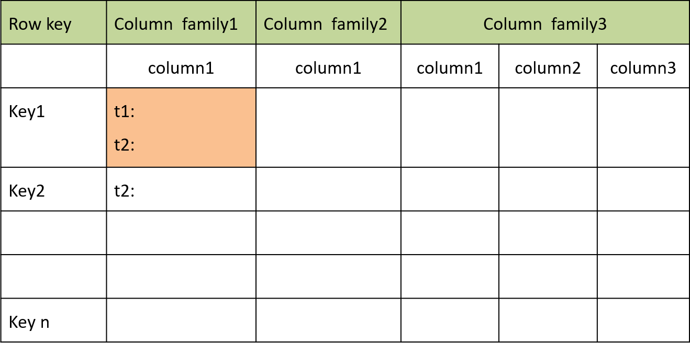

* Column Family存储实例
  * 通过三元组 <row-key, column-key, timestamp\>检索cell的value
  * Column family数据库中的数据可以有效地进行水平（按行）和垂直（按列族）分区，使得它们适合存储大数据集
    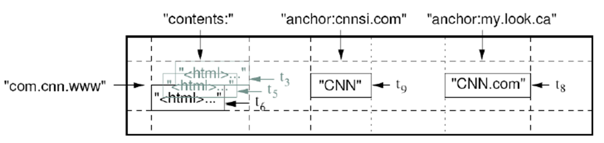
* Column family 嵌套结构
  * 一些column family数据库提供*aggregate* (或embedded/nested）数据结构，允许一个column-family嵌套在其他column-families中。（如Apache Cassandra）
  * column family数据库支持不同的建模结构，例如row、 column family和nested column-families 。这些结构可用于根据查询工作负载创建*aggregate*层次结构，从而通过访问collocated数据来提高查询性能
* 基于Column family存储的查询案例
  * Facebook针对收件箱搜索服务，采用Column family数据模型组织数据（包含aggregate）提供服务：用户基于关键字或发件人/收件人的名字查询发送和接收的邮件
  * 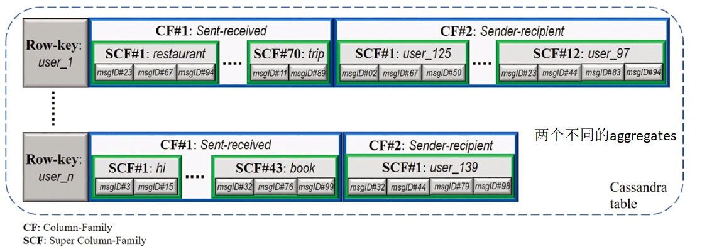
  * 通过创建不同的聚合，可以简化这些查询需求。更确切地，对于关键字和发件人/收件人的名字查询，用户ID是行键。两个Column family：Sent-received和Sender-recipient代表两个不同的聚合（针对同一个用户），分别满足关键字和发件人/收件人的名字查询的要求。对于Sent-received列族，组成用户消息的关键字成为超级列族。对于每个超级列族，单独的消息ID（或消息链接）作为列，从而将冗余最小化。类似地，对于Sender-recipient列族，属于用户消息的所有Sender/recipients的用户id成为超级列族。 对于每个超级列族，单个消息id作为列。这个例子包含两个aggregates
* 具有存储和分析大数据的优势
  * Column family数据库中的数据可以有效地水平划分（by *rows* ）和垂直划分（by *column-families*），适于存储大数据集。
  * 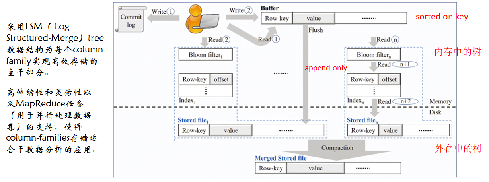
* Column family数据模型的代表
  * Apache Cassandra
  * HBASE
  * Bigtable
  * Hypertable

## LSM树

传统关系型数据库使用B+树作为存储结构，查找高效。但是逻辑上相近的数据物理上却可能相隔很远，导致大量的随机读写磁盘操作。

随机读写比顺序读写慢很多。

为了提升I/O性能，需要一种能将随机操作变为顺序操作的机制。

LSM树能够实现顺序写磁盘，从而大幅提升写操作，作为代价的是牺牲了一些读性能。

* 结构
  * LSM树由两个或以上的存储结构组成
  * 一个存储结构常驻内存中，称为C0 tree，具体可以是任何方便健值查找的数据结构，比如红黑树、map，甚至可以是跳表。
  * 另外一个存储结构常驻在硬盘中，称为C1 tree，具体结构类似B树。C1所有节点都是100%满的，节点的大小为磁盘块大小。
* Insert
  * 插入一条新纪录时，首先在Log文件中插入操作日志（WAL） ，以便后面恢复使用。日志是以append形式插入，所以速度非常快
  * 将新纪录的索引插入到C0中（在内存中完成，不涉及磁盘IO操作）
  * 当C0大小达到某一阈值时或者每隔一段时间，将C0中记录滚动合并到磁盘C1中；
  * 对于多个存储结构的情况，当C1越来越大就向C2合并，以此类推，一直合并到Ck
    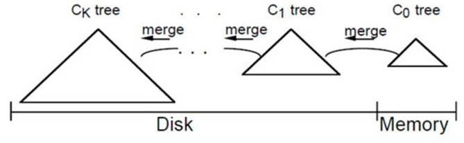
* Merge
  * 合并过程中会使用两个块：emptying block和filling block
    * 1 从C1中读取未合并叶子节点，放置内存中的emptying block中。
    * 2 从小到大查找C0中的节点，与emptying block进行合并排序，合并结果保存到filling block中，并将C0对应的节点删除。
    * 3 不断执行第2步操作，合并排序结果不断填入filling block中，当其满了则将其**追加**到磁盘的新位置上。合并期间如果emptying block使用完了，再从C1中读取未合并的叶子节点。
    * 4 C0和C1所有叶子节点都按以上合并完成后即完成一次合并
  * 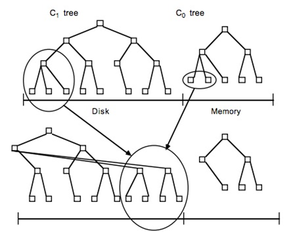
* 查找及删除
  * 查找：先找内存的C0树，找不到则找磁盘的C1树，然后是C2树，以此类推
  * 删除：为了快速执行，主要是通过标记来实现，在内存的C0树中将要删除的记录加delete marker。客户端检索时读不到实际的值；如果删除C0树不存在的记录，则在C0树中生成一个节点，加delete marker ，查找时可在内存中得知该记录已被删除，无需查找磁盘
* 读写文件（以HBASE 为例）
  * 更新文件时，数据先记录在日志WAL（Write-Ahead Log）中，然后写入内存中的memeStore中
  * 当memStore中数据累计超过给定的阈值，系统将数据从内存刷写到磁盘中HFile文件
  * 数据移出内存后，系统丢弃对应的提交日志，只保留未持久化到磁盘的提交日志
  * 在将数据移出memStore到磁盘的过程中，系统不阻塞读写操作
    * 用空的memStore获取更新的数据，将满的旧memStore中的数据转写到磁盘文件
  * 删除操作时，加删除标记
  * 读数据时，数据由两部分组成：memeStore中没写到磁盘的数据和磁盘上的存储的数据
  * 随着memStore中的数据不断刷写到磁盘中，产生越来越多的HFile，HBase合并多个文件成一个较大的文件
    * 将一个Region中多个HFile重写到一个新的HFile中

## Document-oriented

* 数据模型

  * Key-Value的扩展形式，value表示为document，以标准半结构化格式，如XML、JSON或BSON（二进制JSON）
  * Document：是document-oriented数据库的基本概念，是自包含的的数据单元，是一系列数据项的集合
    * 每个数据项有名字与对应的值，值既可以是简单的数据类型，也可以是复杂的类型。
    * 每个document有全局唯一的ID和版本号
    * document是半结构化数据类型的数据
    * document具有灵活的模式，可以在运行时添加或删除属性（属性具有名称和一个或多个值）
  * 同一个document中数据的属性数量和类型可以不同。
  * Document的格式已知，支持在key和value上建立索引和实现查询功能

* 基本存储结构

  * 适用于数据可以表达为document格式的应用，例如内容管理、博客等，数据包含各种属性，存在嵌套的情况
  * Key-value pair形式
    * 基本的key-value pair
      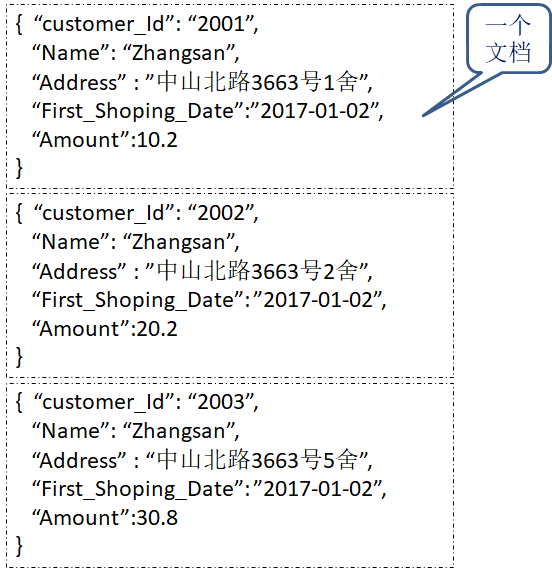
    * 带结构的Key-Value pair：Value有数组或嵌入的文档
      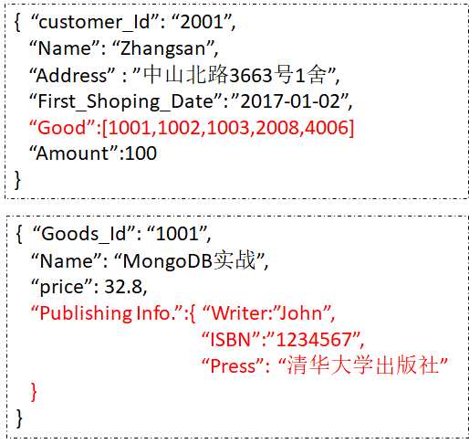
    * 多结构的Key-Value pair：Value的结构不同
      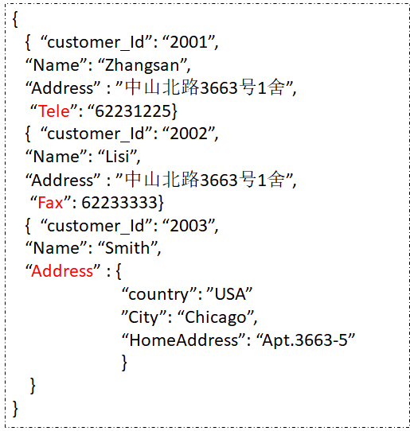
  * Document
    * Key-value pair构成的有序集
    * JSON、XML、BSON格式
  * Collection
    * 由若干个document构成的对象，通常这些document具有相关性
  * Database
    * 包含多个集合
    * Database={collection}

* 数据示例

  * 在图像数据管理系统中，JSON格式的document 如下

    ~~~json
    {
        route: /usr/images/img.png,
        owner: {
        	name: Xiaoming
        	surname: Wang 
    	},
    	tags: ["sea","beach"]
    } 
    ~~~

  * 随着系统需求变化，新的特征可以添加到系统中 ，如修改image owner 、图像的 checksum、用户的级别等，document 变为

    ~~~json
    { 
        route: /usr/images/img.png, 
        owner: { 
           name: Xiaoming,
           surname: Wang,
           web: http://www.abcde.ecnu.edu.cn,
        }, 
        tags: ["sea","beach"], 
        md5: 123456789abcdef123456789abcdef12, 
        ratings: {
           { 
              user: John,
              comment: "Verygood!",
               stars: 4 
           },
           { 
            user: Jane, 
            comment: "BadIllumination", 
            stars: 1 
            } 
        } 
    } 
    ~~~

* 数据查询

  * 允许查询document中的数据，而不必检索整个document
  * CouchBase中的SQL-like 查询语言 (N1QL)
    * 例如：查找*title=*“Vince Shields”的文档，返回属性 url 和categories的
    * SELECT c.url, c.categories FROM Content_MetaData c WHERE title = 'Vince Shields'

* 数据模型的代表

  * MongoDB
  * CouchBase
  * ArangoDB

## 图数据模型

* 动机：语义Web、Web数据挖掘、知识图谱、生物系统中蛋白质的相互作用、社交网络应用等产生了大量面向图的数据，催生了图数据管理的需求。
  * 有效地存储图数据，提供查询和分析图数据的操作
  * 图论作为数据存储的理论基础：顶点表示实体、边表示实体间的关系
* 用图结构存储数据，完成语义查询
  * 由节点、节点间关系和属性表达和存储数据
  * 节点存储数据
  * 边存储节点之间的关系
  * 属性表达数据的特征
  * 用 Traversal 进行数据查询
    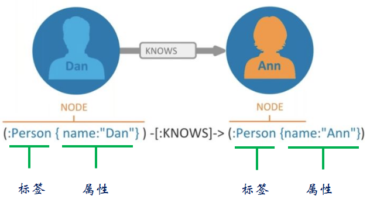
* 图模型种类
  * 常用的图模型有3种，分别是属性图（Property Graph）、资源描述框架（RDF）三元组和超图（HyperGraph）
* 数据模型示例
  * 应用场景：社交网络、交通物流、推荐引擎、欺诈检测、知识图谱、生命科学和 IT/网络游戏开发等
  * 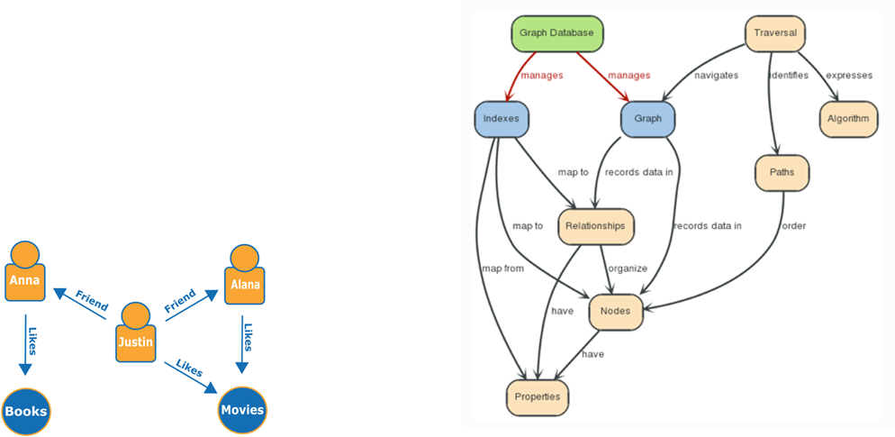
* 图数据存储
  * Nonnative
    * 基于非图数据存储，如document-oriented存储或者关系数据库系统，通常需要索引技术提高图遍历的效率
    * 例如，OrientDB、ArangoDB采用文档方式存储，Titan有两种存储选择： wide-column和 key-value).
    * 分区策略基于底层的存储
  * Native
    * 存储基于图数据模型
    * 例如Neo4j
  * 三种著名的图优化存储技术
    * Compressed Sparse Row (CSR)
    * adjacency list
    * edge list
* 图数据访问
  * Online graph navigations
    * A basic path query 例如：查找John的社交网络中的朋友的名字（以及朋友的朋友……）
    * A pattern matching query 例如：在John的社交网络中查找所有访问过埃菲尔铁塔的用户的名字。SPARQL, Neo4j Cypher和Gremlin是三个最著名的图查询语言，具有pattern matching 能力
  * Offline analytical graph computations
    * 需访问整个图的顶点和边的有效部分（例如，研究图的拓扑结构和寻找连通的组件），需要考虑高吞吐量的需求
    * 研究热点
* 图数据模型典型代表
  * Neo4j
  * Titan
  * OrientDB
  * GraphDB

