* 2-4篇文献研读及报告（15%）
  * 经典和最新文献研读（不是专业英语）
* 若干作业（10%）
* 1-3个quiz(10%)
* 1个project（35％）（team work），12.22项目展示
* 1个test期末笔试30%（open book），12.29考试
  * 基于非关系数据库管理数据，解决关系数据库管理数据的痛点

* E-mail: [hzhao@sei.ecnu.edu.cn](mailto:hzhao@sei.ecnu.edu.cn)

  Phone: 62231225

  Office : 理科大楼B1011

  Office Hours: 3:30pm-4:30pm(Wednesday)

* TA ：张韵琪

  微信：zyq000317

  办公室：理科大楼B1006

# 概述

## 非关系型数据库产生的背景

* 大数据特征：
  * Volume（大量）：数据量大
  * Velocity（高速）：数据被创建、移动和处理的速度
  * Variety（多样）：文字、图像、图片、地理位置等
  * Value（价值）：具有价值但价值密度低
* 传统关系数据库自身的局限性无法应对大数据产生的应用需求，如扩展困难、读写慢、成本高、容量有限等。为了应对数据高并发的读写需求和海量数据的存储需求，非关系型数据库应运而生。
* 开发数据管理应用考虑的问题：
  * 用户量
  * 数据量（预估与日增）
  * 数据访问模式（读or写密集）
  * 数据场景（强事务型or分析型需求）
  * 运行性能（并发量，高峰平均低估的预估
* 传统的数据模型：关系数据模型、E-R数据模型、基于对象的数据模型、XML/JSON、网状模型、层次模型
* 关系数据库特点
  * **数据模型简单：**二维表结构，数据以行为单位，每行表示一个记录，每行数据的属性都相同。
  * **事务管理机制完善：**支持 ACID 特性，维护数据的一致性，关系数据库非常重要的特性。
  * **SQL** **语言使用方便**，支持 join 等复杂操作
  * **成熟的产品提供良好的服务**：MySql、Oracle、SQL Server、PostgreSQL等
  * **高并发下数据库存在瓶颈**：数据按行存储，针对某一列的运算，IO代价较高；
  * **维护数据一致性代价大**：为了保证事务ACID特性，数据库提供并发控制与故障恢复机制，事务的隔离级别越高，读写性能会受影响。隔离级别，从低到高依次是读未提交、读已提交、可重复度、串行化，事务隔离级别越低，可能导致的并发异常越多，但是能提供的并发能力越强
  * **维护索引代价大**：数据更新必然导致索引更新，降低了关系型数据库的读写能力；索引占存储的空间。
  * **水平扩展带来的问题：**应对业务规模扩大，数据库分库是常用的方法，分库之后，数据迁移、跨库 join、分布式事务处理都是需要考虑的问题。
  * **数据库schema结构不易扩展：**如果需要修改表结构，需要执行 DDL语句，修改期间会锁表，部分服务不可用。
* 单节点数据库面临的压力：新的数据类型，数据库模式free，可靠性、可伸缩性、大规模数据、高吞吐量、高并发访问等
* 基于关系数据库不擅长：
  * 大量数据的写入操作
    * 解决：读写分离（多台服务器的数据一致性问题）、不同的表分配给不同的数据库（跨服务器实现join非常困难）
  * 有数据更新时需要更新索引甚至更新表结构
    * 更新时需要加锁，数据访问受限制，高并发应用的性能受影响
  * 表结构不固定的应用
* 几种计算机体系结构
  * Shared RAM（BUS）
  * Shared Disk（LAN）
  * Shared Nothing（LAN）

## 非关系型数据库与NoSQL

* NoSQL定义：符合非关系型、分布式、开源和具有水平可扩展能力的下一代数据库。
* NoSQL数据库的诞生定位于非结构化性强的数据
  * 对于NoSQL Community，NoSQL称Not only SQL 
  * 数据模型包括
    * key-value 数据模型：数组组织成key-value对，使用key访问value。
    * Graph数据模型：采用图结构存储数据之间的关系
    * Column family数据模型 (例如，Bigtable)：类似稀疏矩阵，行和列作为key，列族由多个列构成
    * Document-oriented数据模型：存储层次数据结构的数据
  * 不提供Join操作
  * Schemaless: allows data to have arbitrary structures as they are not explicitly defined by a data definition language (schema-on-write). Instead, they are implicitly encoded by the application logic (schema-on-read).
  * 运行于shared-nothing的商用计算机构成的集群上
  * 具有横向可扩展性
* NoSQL不是关于SQL语言，NoSQL 不是指不使用SQL查询语言的数据库系统。
* NoSQL数据库也提供SQL查询语言。
* 既有开源NoSQL数据库产品，也有商用产品。
* NoSQL数据库不仅仅针对大数据中的量大（volume）和高速（velocity）特征，同样注重多样性.
* NoSQL不是云计算：因为良好的可伸缩性，不少NoSQL系统部署在云中。 NoSQL既可以运行在云环境中，也可以运行在自己的数据中心。
* NoSQL不是基于RAM和SSD的应用，而是利用RAM和SSD提高性能，NoSQL系统可以运行在标准的硬件上。
* Multi-Model Database：多模型数据库，数据自然地以不同的格式和模型进行组织，包括结构化（kv、图数据），半结构化（XML/JSON）和非结构化数据（文本文件）

# 相关基础知识及概念

## 单机的局限性

* 多核、多独立CPU，加上高性能内存，解决了的大多数常见的数据应用。但是，在大数据环境下，单机的操作响应速度存在物理极限性
* 物理硬盘的性能是影响数据读写速度的重要因素
* 解决单机局限性的方案
  * **纵向扩展**：提高单机的物理配置。PC服务器->小型机->大型机
  * **横向扩展**：添加更多的节点，节点之间用高速网络连接，当需要更高的性能或更大的容量时，可迅速向集群中添加节点，而不会导致任何宕机（高可用Web应用）

## 计算平台分类

计算平台的Flynn分类法，主要根据指令流和数据流来分类，共分为四种类型的计算平台

* SISD：单指令流单数据流
  * 传统的串行计算机，硬件不支持任何形式的并行计算，所有的指令都是串行执行
* SIMD：单指令流多数据流
  * 在单个时钟周期内处理多个数据单元，数据级别的并行处理。例GPU的应用，图像处理、矩阵计算
* MIMD：多指令流多数据流
  * 紧耦合MIMD和松耦合MIMD
  * 多核、多CPU共享内存
* MISD：多指令流单数据流
  * 理论模型，没有实际实现

##  水平扩展基础知识

* **集群**：
  * 集群是紧密耦合的一些服务器或节点，这些服务器通过高速网络连接在一起作为一个工作单元。
  * 集群中每个节点都有自己的专属资源：CPU、内存和硬盘
  * 通过将任务分解成若干个小任务分配给集群中的节点服务器上，协同完成任务。
* **I/O并行**
  * 通过在多个节点（计算机）上对多个磁盘上的数据集进行分区，减少从磁盘检索数据所需的时间
    * 跨节点并行
    * 一个节点跨磁盘并行
  * **水平分区**：数据记录被划分在多个节点上，即每个节点上存储一个数据子集（默认）
  * 垂直分区：例如 r(A,B,C,D)，主键为A ，划分为r1(A,B)和r2(A,C,D)
* I/O并行技术(设节点数为n):
  * 轮询方法（Round-robin）：
    * 第*i*条记录存储到的节点为 *i* **mod** *n*
  * Hash分区：
    * 选择一个或多个属性作为分区属性
    * 选择取值范围为0…n-1的哈希函数h
    * 设*i* 为哈希函数h应用于记录属性的计算结果，然后将记录存储在节点*i*
  * 范围分区:
    * 选择分区的属性
    * 选定分区向量partition vector [v0, v1, ..., vn-2]。
    * 设v是一个记录分区属性的值，那么vi <= vi+1 的记录分配到节点 i + 1；v < v0 的记录分配到节点0；v >= vn-2 的记录分配到节点n-1.
* 分片（Sharding）
  * 水平地将大的数据集划分成较小的、易于管理的数据集的过程。
  * 每个小数据集可以独立地为所负责的数据提供读写服务
  * 某个查询的数据可能来自两个小数据集
  * 数据分片要考虑查询模式以便小数据集本身不会成为性能瓶颈
* 复制
  * 多个节点上存储数据集的多个拷贝，称作副本
  * 相同的数据在不同的节点上存在多个副本，提供了可伸缩性、可用性和容错性
  * 复制实现方法：
    * 主从复制
      * 系统配置是主从配置环境
      * 所有数据写入主节点，持久化后复制到多个从节点
      * 数据的写（增删改）操作访问主节点的数据，读（查询）操作访问任意节点。
      * 适用于读密集型应用
      * 需要考虑读一致性的问题（延迟，可能读的不是最新）：投票机制，大多数从节点包含相同版本的记录，则声明读操作是一致的。实现投票机制需要从节点之间建立可靠、快速的沟通机制
    * 对等复制
      * 节点之间不分主从，每个节点是对等的，每个写操作数据复制到所有对等的节点上。
      * 每个节点都可以处理读请求和写请求
      * 对等复制容易导致写不一致问题：同时更新多个节点的同一个数据。悲观并发策略：基于锁机制；乐观并发策略：不用锁，最终一致性
      * 读不一致性问题：投票机制
* **数据分布倾斜**（Data-distribution skew）
  * 一些节点拥有较多记录，而其他节点则拥有的记录数很少
  * 数据分布倾斜类型
    * 属性-值倾斜
      * 一些分区属性值出现在多个记录中
      * 分区属性值相同的所有记录最终都在同一个分区中
      * 范围分区和hash分区都会出现这个问题
    * 分区倾斜
      * 选择不当的范围分区向量可能会将太多记录分配给某些分区，而将太少记录分配给其他分区（数据探查）
  * 执行倾斜
    * 某些运算符运行的时间比其他运算符长，执行时间的差异可能会导致一些处理器空闲，而其他处理器仍然计算查询的一部分。

* **处理范围分区中的倾斜**
  * 创建平衡的分区向量
    * 基于分区属性对数据进行排序
    * 按照如下顺序扫描数据来构造分区向量
      * 每读取1/n的数据之后，下一个记录的分区属性值被添加到分区向量中（n表示分区数量）
    * 如果分区属性中存在重复项，则可能导致不平衡
  * 减少代价
    * 分区向量可以使用记录的随机样本创建
    * 另外一种方法：采用直方图（histograms）建立分区向量。等宽直方图；等深直方图 （划分范围，使每个范围具有（大约）相同数量的记录）
* **虚拟节点分区**
  * 核心思想：引入虚拟节点，假设虚拟节点的数量是实际节点倍数
  * 虚拟节点映射到真实节点
    * **轮询：**虚拟节点*i* 映射到真实节点 (*i* mod *n*)+1
    * **映射表：**用一个映射表记录虚拟节点和真实节点的对应关系。通过将虚拟节点从加载较多的节点移动到加载较少的节点来处理倾斜。可以解决数据倾斜和执行倾斜
  * 使用范围分区向量跨虚拟节点划分记录
    * 也可以用Hash分区
* **一致性HASH**（考！）
  * 为了解决分布式Cache问题：哈希映射到N个Cache，如果某个Cache m坏了或者需要增添Cache如何解决。
  * 环形hash空间：设共有$2^{32}$个bucket空间，首尾相接形成环形空间，按顺时针方向编址。通过hash函数计算将数据对象映射到环形hash空间
  * 使用相同的hash函数将节点（cache/server）映射到环形hash空间（通常使用节点的IP地址）
  * 将数据对象映射到节点。沿顺时针方向，根据数据对象的key值，遇到第一个节点（cache/server），就将数据存储在这个cache/server中
  * 如果某节点server停机，例如Server2停机，按顺时针迁移的规则，Server2上的 object2被迁移到server3中，其它对象还保持这原有的存储位置。
  * 如果增加一个新节点（Server/cache），例如新增server4，按顺时针迁移的规则，object4被迁移到了server4中，其它数据对象还保持这原有的存储位置
  * 如果节点分布不均匀，会出现分布Skew问题，可引入虚拟节点来解决。复制因子。每个物理节点关联的虚拟节点数量根据具体的生产环境情况确定
* 并行vs.分布式
  * 并行计算：
    * 单指令流多数据流计算机：SIMD
    * 多台计算机中多个CPU，多指令流伛数据流MIMD
  * 分布式计算
    * 多台计算机中多个CPU，MIMD
    * CPU间高延迟通信
    * 不同节点可以是异构的系统，可靠性维护困难
* **分布式系统的可靠性要求**
  * 允许部分节点失效
  * 如果某节点失效，其负载应由其他节点承担，确保数据可恢复
  * 某节点失效重启后应能加入原来的计算机组，而不必重启所有的节点
  * 并发操作或部分内部失效不应导致外部可见的不确定性，应确保一致性
  * 新增节点应提升系统的性能
  * 整个系统应阻止非授权访问，要比单机系统更多考虑攻击，以确保安全

## 事务及其特性

* **ACID**特性
  * **Atomicity.** 事务的所有操作或者全部执行，或者全不执行，是一个不可分割的整体。
  * **Consistency.** 在并发环境中，不同事务访问相同数据时，事务执行保证数据的一致性，即事务必须在任何时候满足系统定义的协议和原则，数据库在事务开始和结束时必须保持一致状态。
  * **Isolation.** 多个事务并发访问同一个数据库时，每个事务都有自己的数据空间，对其他事务的执行不知情；事务无法访问处于中间状态或未完成状态的任何其他事务的数据，每个事务自身是独立的。
  * **Durability.**一旦事务完成（成功提交），所有对数据的更新是持久的，即使数据库发生故障。
* 事务的状态
  * **Active** **：**事务执行对数据库的读写操作。   
  * **Partially committed** **：**事务的最后一个语句执行之后进入部分提交状态，数据在缓冲区中。
  * **Failed** **：**事务无法继续正常地执行。 
  * **Aborted** **：**事务回滚且数据库恢复到事务执行之前的状态
    * 重新启动事务
    * 杀掉事务
  * **Committed** **：**成功执行后的状态
    

* 数据访问
  * 事务Ti通过其私有工作区和系统缓冲区之间传输数据，与数据库系统进行交互，使用以下两个操作完成数据传递
    * **read**(*X*) 将数据项X的值赋予局部变量*xi*.
    * **write**(*X*) 将局部变量*xi* 的值赋予缓冲块中的数据项*X*
  * 两个操作都需要考虑数据块是否在主存中，如果不在就发指令**input**(B_X) 。
  * 事务第一次访问数据时，必须执行**read**(*X*) ，之后的操作作用于局部的拷贝x，最后一次访问数据后，事务执行**write**(*X*）
  * **output**(*B_X*) 不必要在**write**(*X*)之后立刻执行（因为数据块B中可能还有其他正在被访问的数据），系统在合适的时候执行**output**(*B_X*)将数据写到磁盘上。
    

* **事务并发执行**
  * 提高CPU和磁盘的利用率。例如：一个事务利用CPU的同时另一个事务在读或者写磁盘
  * **减少事务的平均响应时间**。例如：短事务不需要等待长事务提交后再得到响应

* **并发操作引起的问题**

  * 丢失修改。 事务T1与事务T2从数据库中读入数据A并修改，事务T2的写操作破坏了事务T1的结果，导致事务T1的修改被丢失
  * 读“脏数据”（未提交随后被撤销的数据）。事务1修改数据A，并将其写回数据库，事务2读取数据A后，事务1由于某种原因被撤消，这时事务1已修改过的数据恢复原值。事务2读到的数据与数据库中的数据不一致，是不正确的数据，又称为“脏”数据。
  * 不可重复读问题。事务1读取数据后，事务2执行更新操作，使事务1无法再现前一次读取结果。

* **并发控制机制的任务**

  * 并发控制机制协调事务的执行，确保事务的隔离性
  * 对并发操作进行正确调度
  * 保证事务的隔离性
  * 保证数据库的一致性

* **并发控制机制**

  * 基于锁的并发控制机制：2PL
    * 锁是一种控制并发访问数据的机制。
    * 事务必须在读和写数据前获得锁。
    * 使用锁必须恰当
      * 事务必须在读/写数据前拥有锁，之后必须释放锁
      * 不存在两个事务同时对同一数据加锁
  * 基于时间戳的并发控制机制
  * 基于多版本的并发控制机制MVCC（新型非关系数据库OLAP）

* **事务的4种隔离级别**

  * | 隔离级别 | 脏读   | 不可重复读 | 幻读   |
    | -------- | ------ | ---------- | ------ |
    | 读未提交 | 允许   | 允许       | 允许   |
    | 读已提交 | 不允许 | 允许       | 允许   |
    | 可重复读 | 不允许 | 不允许     | 允许   |
    | 可串行化 | 不允许 | 不允许     | 不允许 |

  * 脏读：指一个事务在执行过程中读到并发的、还没有提交的写事务的修改内容。

  * 不可重复读：指在同一个事务内,先后两次读到的同一条记录的内容发生了变化(被并发的写事务修改)。

  * 幻读：指在同一个事务内,先后两次执行的、谓词条件相同的范围查询，返回的结果不同(并发写事务插入了新记录)。

  * 隔离级别越高，在一个事务执行过程中，它能“感知”到的并发事务的影响越小，在最高的可串行化隔离级别下，任意一个事务的执行，均“感知”不到有任何其他并发事务执行的影响，并且所有事务执行的效果就和一个个顺序执行的效果完全相同

## NoSQL的数据一致性

* CAP是分布式环境中设计和部署系统要考虑的三个重要的系统需求(主流的非关系数据库是分布式系统)
  * Consistency（强一致性）：分布式系统中所有节点上的数据时刻保持同步，更新操作执行成功后所有的用户都应该读到**最新的值**（所有节点在同一时间的数据完全一致）
  * Availability（可用性）：每一个操作总能在**一定的时间**返回结果，不会发生错误和超时（服务在正常响应时间内一直可用）
  * Partition Tolerance（分区容忍性）：当网络发生故障时，系统仍能**保持响应**客户的请求
* 分布式系统只能保证CAP三个特性中的两个特性
  * 如果一致性和可用性是必需的，可用节点之间需要通信确保一致性，分区容忍性达不到；CA：传统关系型数据库
  * 如果一致性和分区容忍性是必需的，为了实现一致性节点将变得不可用，可用性达不到；CP：分布式数据库HBASE
  * 如果可用性和分区容忍性是必需的，考虑节点之间的通信需要，一致性做出让步，不考虑ACID。AP：读为主分布式数据库Cassandra、KV、QQ头像修改、DNS
* 数据一致性模型
  * 对于数据不断增长的系统，尤其是OLAP应用（列式存储祝导），对可用性A和分区容忍性P的要求高于强一致性C。一些分布式系统通过复制数据的方法来提高系统的可靠性和容错性，将数据的不同副本存放在不同的机器上。
  * 强一致性（实时交易系统）：不论针对哪一个副本进行数据更新，之后所有的读操作都能读到最新的数据
  * 弱一致性（细微不关心）：数据更新后，用户可以在某个时间后读到更新后的数据——不一致性窗口
  * 最终一致性：弱一致性的特例，系统中的副本经过一段时间后最终能够达到一致，保证用户最终可以读到数据的更新。允许脏数据
* 对于面向大数据的分布式系统，可用性和分区容忍性要求高，但对于一些应用，完全牺牲一致性会导致数据混乱。BASE：根据CAP定理的分布式数据库设计原则
  * Basically Available：基本可用，容忍部分失败而不导致系统整体不可用
  * Soft-state：不要求系统一直保持强一致状态，系统状态可能随时间的推移有变化
  * Eventual Consistency：一旦系统停止接受输入，系统中的副本经过一段时间后最终能够达到一致，保证用户最终可以读到数据的更新

# 数据模型

## Key-Value

* Key
  * key的内容可以有实际含义，而且可以是复杂的自定义结构，但要保证key的唯一性
  * Key不是越长越好，否则内存开销大，增加查询代价
  * Key太短也不可取，否则可能含义不清，如中国:上海:浦东比CSP要好
* Value
  * 可以存放任何类型数据
  * 编码为BLOB形式存储
  * 无需预先定义数据类型
* 数据包括两个部分：
  * Key:唯一索引值，确保Key-Value记录唯一性
  * Value:对应Key的数据
  * 类似hash表结构，key作为查询值的索引
  * Key和value形成一对一的对应关系
* NameSpace
  * 由Key-value对构成的集合，通常一类Key-value对构成一个集合
  * 在key-value的基础上加NameSpace目的是在内存中访问该数据集时，该数据集具有唯一名称。类似表的名称
* 示例：分布式web内容服务
  * Key：表示URL
  * Value：任何形式的文件，如PDFs，JPEGs，JSON 或XML documents
  * 这样的设计可以在集群环境中管理大量的请求和web内容
* 根据数据的持久性，key-value存储分为以下三类：
  * 内存（In-memory）存储：例如Memcached，数据存储在内存中，提供非常快速的数据访问，通常用做云中应用的的缓存层，处理密集型的请求，如 API调用、数据库查询、页面呈现等。
  * 持久（Persistent）存储：例如Riak KV and Oracle NoSQL, 提供对存储在HDD/SSD中的信息高可用性访问。
  * 混合（Hybrid）存储：例如Redis和Aerospike，数据首先保存在内存中，当满足一定条件后数据持久存储。
* 基于key的查询操作
  * get(key):检索与key关联的value（或具有不同版本的value的列表）
  * put(key,value):仅当key不在数据库中时，将kv对添加到数据库中。否则，将使用新版本更新存储的value。注意，即使更新存储的value中的一部分也需要替换整个value。 
  * delete(key): 删除key 及其关联的value(s)
  * 这些操作依赖一致性模型和索引。执行时可通过REST或Lucene接口访问
* K-V数据库代表
  * Redis, Riak KV, Oracle NoSQL, Hyperdex(2012), Yahoo Pnuts (2008), Oracle Berkeley DB和 Project Voldemort

## Column Family

* Column Family 数据模型
  * 以表的形式存储数据，表有行（row）和列（ column ）
    * column 是数据库中最小的存储单元，它是一个带时间戳的key-value 对。
  * 每一个row 也是一个key-value 对，表示一个高度结构化的数据项，row key是该row数据的唯一标示，value 是一个column的集合。
  * column family由任意数量的column构成，这些column在逻辑上相互关联，通常一起访问
    * Row和column确定为一个cell，每个cell存储同一份数据的多个版本，用时间戳来区分
    * 时间戳：用来区分数据版本的索引。
  * 访问控制、磁盘和内存使用统计在column family层面, column family的模式灵活，可以在运行时添加或删除其中的列

* Column Family存储实例
  * 通过三元组 <row-key, column-key, timestamp\>检索cell的value
  * Column family数据库中的数据可以有效地进行水平（按行）和垂直（按列族）分区，使得它们适合存储大数据集
    
* Column family 嵌套结构
  * 一些column family数据库提供*aggregate* (或embedded/nested）数据结构，允许一个column-family嵌套在其他column-families中。（如Apache Cassandra）
  * column family数据库支持不同的建模结构，例如row、 column family和nested column-families 。这些结构可用于根据查询工作负载创建*aggregate*层次结构，从而通过访问collocated数据来提高查询性能
* 基于Column family存储的查询案例
  * Facebook针对收件箱搜索服务，采用Column family数据模型组织数据（包含aggregate）提供服务：用户基于关键字或发件人/收件人的名字查询发送和接收的邮件
  * 
  * 通过创建不同的聚合，可以简化这些查询需求。更确切地，对于关键字和发件人/收件人的名字查询，用户ID是行键。两个Column family：Sent-received和Sender-recipient代表两个不同的聚合（针对同一个用户），分别满足关键字和发件人/收件人的名字查询的要求。对于Sent-received列族，组成用户消息的关键字成为超级列族。对于每个超级列族，单独的消息ID（或消息链接）作为列，从而将冗余最小化。类似地，对于Sender-recipient列族，属于用户消息的所有Sender/recipients的用户id成为超级列族。 对于每个超级列族，单个消息id作为列。这个例子包含两个aggregates
* 具有存储和分析大数据的优势
  * Column family数据库中的数据可以有效地水平划分（by *rows* ）和垂直划分（by *column-families*），适于存储大数据集。
  * 
* Column family数据模型的代表
  * Apache Cassandra
  * HBASE
  * Bigtable
  * Hypertable

## LSM树

传统关系型数据库使用B+树作为存储结构，查找高效。但是逻辑上相近的数据物理上却可能相隔很远，导致大量的随机读写磁盘操作。

随机读写比顺序读写慢很多。

为了提升I/O性能，需要一种能将随机操作变为顺序操作的机制。

LSM树能够实现顺序写磁盘，从而大幅提升写操作，作为代价的是牺牲了一些读性能。

* 结构
  * LSM树由两个或以上的存储结构组成
  * 一个存储结构常驻内存中，称为C0 tree，具体可以是任何方便健值查找的数据结构，比如红黑树、map，甚至可以是跳表。
  * 另外一个存储结构常驻在硬盘中，称为C1 tree，具体结构类似B树。C1所有节点都是100%满的，节点的大小为磁盘块大小。
* Insert
  * 插入一条新纪录时，首先在Log文件中插入操作日志（WAL） ，以便后面恢复使用。日志是以append形式插入，所以速度非常快
  * 将新纪录的索引插入到C0中（在内存中完成，不涉及磁盘IO操作）
  * 当C0大小达到某一阈值时或者每隔一段时间，将C0中记录滚动合并到磁盘C1中；
  * 对于多个存储结构的情况，当C1越来越大就向C2合并，以此类推，一直合并到Ck
    
* Merge
  * 合并过程中会使用两个块：emptying block和filling block
    * 1 从C1中读取未合并叶子节点，放置内存中的emptying block中。
    * 2 从小到大查找C0中的节点，与emptying block进行合并排序，合并结果保存到filling block中，并将C0对应的节点删除。
    * 3 不断执行第2步操作，合并排序结果不断填入filling block中，当其满了则将其**追加**到磁盘的新位置上。合并期间如果emptying block使用完了，再从C1中读取未合并的叶子节点。
    * 4 C0和C1所有叶子节点都按以上合并完成后即完成一次合并
  * 
* 查找及删除
  * 查找：先找内存的C0树，找不到则找磁盘的C1树，然后是C2树，以此类推
  * 删除：为了快速执行，主要是通过标记来实现，在内存的C0树中将要删除的记录加delete marker。客户端检索时读不到实际的值；如果删除C0树不存在的记录，则在C0树中生成一个节点，加delete marker ，查找时可在内存中得知该记录已被删除，无需查找磁盘
* 读写文件（以HBASE 为例）
  * 更新文件时，数据先记录在日志WAL（Write-Ahead Log）中，然后写入内存中的memeStore中
  * 当memStore中数据累计超过给定的阈值，系统将数据从内存刷写到磁盘中HFile文件
  * 数据移出内存后，系统丢弃对应的提交日志，只保留未持久化到磁盘的提交日志
  * 在将数据移出memStore到磁盘的过程中，系统不阻塞读写操作
    * 用空的memStore获取更新的数据，将满的旧memStore中的数据转写到磁盘文件
  * 删除操作时，加删除标记
  * 读数据时，数据由两部分组成：memeStore中没写到磁盘的数据和磁盘上的存储的数据
  * 随着memStore中的数据不断刷写到磁盘中，产生越来越多的HFile，HBase合并多个文件成一个较大的文件
    * 将一个Region中多个HFile重写到一个新的HFile中

## Document-oriented

* 数据模型

  * Key-Value的扩展形式，value表示为document，以标准半结构化格式，如XML、JSON或BSON（二进制JSON）
  * Document：是document-oriented数据库的基本概念，是自包含的的数据单元，是一系列数据项的集合
    * 每个数据项有名字与对应的值，值既可以是简单的数据类型，也可以是复杂的类型。
    * 每个document有全局唯一的ID和版本号
    * document是半结构化数据类型的数据
    * document具有灵活的模式，可以在运行时添加或删除属性（属性具有名称和一个或多个值）
  * 同一个document中数据的属性数量和类型可以不同。
  * Document的格式已知，支持在key和value上建立索引和实现查询功能

* 基本存储结构

  * 适用于数据可以表达为document格式的应用，例如内容管理、博客等，数据包含各种属性，存在嵌套的情况
  * Key-value pair形式
    * 基本的key-value pair
      
    * 带结构的Key-Value pair：Value有数组或嵌入的文档
      
    * 多结构的Key-Value pair：Value的结构不同
      
  * Document
    * Key-value pair构成的有序集
    * JSON、XML、BSON格式
  * Collection
    * 由若干个document构成的对象，通常这些document具有相关性
  * Database
    * 包含多个集合
    * Database={collection}

* 数据示例

  * 在图像数据管理系统中，JSON格式的document 如下

    ~~~json
    {
        route: /usr/images/img.png,
        owner: {
        	name: Xiaoming
        	surname: Wang 
    	},
    	tags: ["sea","beach"]
    } 
    ~~~

  * 随着系统需求变化，新的特征可以添加到系统中 ，如修改image owner 、图像的 checksum、用户的级别等，document 变为

    ~~~json
    { 
        route: /usr/images/img.png, 
        owner: { 
           name: Xiaoming,
           surname: Wang,
           web: http://www.abcde.ecnu.edu.cn,
        }, 
        tags: ["sea","beach"], 
        md5: 123456789abcdef123456789abcdef12, 
        ratings: {
           { 
              user: John,
              comment: "Verygood!",
               stars: 4 
           },
           { 
            user: Jane, 
            comment: "BadIllumination", 
            stars: 1 
            } 
        } 
    } 
    ~~~

* 数据查询

  * 允许查询document中的数据，而不必检索整个document
  * CouchBase中的SQL-like 查询语言 (N1QL)
    * 例如：查找*title=*“Vince Shields”的文档，返回属性 url 和categories的
    * SELECT c.url, c.categories FROM Content_MetaData c WHERE title = 'Vince Shields'

* 数据模型的代表

  * MongoDB
  * CouchBase
  * ArangoDB

## 图数据模型

* 动机：语义Web、Web数据挖掘、知识图谱、生物系统中蛋白质的相互作用、社交网络应用等产生了大量面向图的数据，催生了图数据管理的需求。
  * 有效地存储图数据，提供查询和分析图数据的操作
  * 图论作为数据存储的理论基础：顶点表示实体、边表示实体间的关系
* 用图结构存储数据，完成语义查询
  * 由节点、节点间关系和属性表达和存储数据
  * 节点存储数据
  * 边存储节点之间的关系
  * 属性表达数据的特征
  * 用 Traversal 进行数据查询
    
* 图模型种类
  * 常用的图模型有3种，分别是属性图（Property Graph）、资源描述框架（RDF）三元组和超图（HyperGraph）
* 数据模型示例
  * 应用场景：社交网络、交通物流、推荐引擎、欺诈检测、知识图谱、生命科学和 IT/网络游戏开发等
  * 
* 图数据存储
  * Nonnative
    * 基于非图数据存储，如document-oriented存储或者关系数据库系统，通常需要索引技术提高图遍历的效率
    * 例如，OrientDB、ArangoDB采用文档方式存储，Titan有两种存储选择： wide-column和 key-value).
    * 分区策略基于底层的存储
  * Native
    * 存储基于图数据模型
    * 例如Neo4j
  * 三种著名的图优化存储技术
    * Compressed Sparse Row (CSR)
    * adjacency list
    * edge list
* 图数据访问
  * Online graph navigations
    * A basic path query 例如：查找John的社交网络中的朋友的名字（以及朋友的朋友……）
    * A pattern matching query 例如：在John的社交网络中查找所有访问过埃菲尔铁塔的用户的名字。SPARQL, Neo4j Cypher和Gremlin是三个最著名的图查询语言，具有pattern matching 能力
  * Offline analytical graph computations
    * 需访问整个图的顶点和边的有效部分（例如，研究图的拓扑结构和寻找连通的组件），需要考虑高吞吐量的需求
    * 研究热点
* 图数据模型典型代表
  * Neo4j
  * Titan
  * OrientDB
  * GraphDB

# BigTable

* 出现的背景：Google众多的产品面临数据管理的挑战，如Google Web Index、Google Analytics、Personalized Search、Google Earth
* 动机：
  * 需要存储的数据种类繁多、类型多样。如URL、图片、文字、视频、html文件、用户设置数据等
  * 需要处理海量的服务请求
  * 商用数据库无法满足Google的需求，底层系统技术的掌控便于系统维护和升级
* 目标（这俩不考）
  * 广泛的适用性：满足Google的系列产品的需求
  * 很强的可扩展性：横向扩展和纵向扩展
  * 高可用性：确保系统24×7可用
  * 简单：底层系统简单减少出错概率，为上层应用开发提供便利

## 数据模型

* 分布式多维映射表结构
* 表中数据通过**行关键字**（Row key）、**列关键字**（Column key）以及**时间戳**进行索引，所有数据以字符串形式存储，由用户解析数据结构。
* 存储逻辑表示为(row:string, column:string, item:int64) -> string
* 例：网页[www.cnn.com](http://www.cnn.com/)的数据片段
  * 行名称是倒排的*URL*
    * 便于同一地址域的网页被存储在表中连续的位置
    * 便于数据压缩，大幅提高压缩率
  * *contents*列族包含了网页内容
  * *anchor*列族包含了任何引用这个页面的*anchor*文本
    * *CNN*的主页被*Sports Illustrated*和*MY-look*主页同时引用，因此，行包含了名称为”anchor:cnnsi.com”和”anchor:my.look.ca”的列
  * 每个*anchor*单元格都只一个版本，*contents*列有三个版本，分别对应于时间戳*t3,t5*和*t6*
    
* Rows
  * BigTable的row key是任意的字符串，大小不超过64KB
  * 对于每行数据的读写操作都是原子的（atomic），不管这个行中所包含的列族数量是多少
  * BigTable中的数据按照row key的字典顺序排序
  * 单个大规模的大表不利于数据的处理与分析，BigTable将一个表划分成多个**子表**（Tablet），是负载均衡和数据分发的基本单位
* Column Families
  * BigTable将column key组织成列族（column family），是基本的访问控制单元，每个列族的数据属于同一个类型，同列族数据**压缩**存储
  * 在把数据存放到这个column family的某个column key下之前，必须首先创建这个column family，创建后，可以使用column key 
    * 表当中所包含的column family的数量尽可能少（至多几百个列族），在操作过程当中， column family很少发生变化；一个表可以包含无限数量的列。
    * column key命名语法：family:qualifier。例: *anchor:cnnsi.com*
    * 访问控制以及磁盘、内存审计在column family级别完成
* timestamps
  * 在BigTable中，每个单元都包含相同数据的多个版本，这些版本采用时间戳进行索引
  * 时间戳是64位整数，代表真实时间，以微秒来计算。客户应用也可以直接分配时间戳
  * 需要避免冲突的应用必须生成唯一的时间戳
  * 一个单元的不同版本根据时间戳**降序**顺序存储，最新的版本可以被最先读取
  * 为了减轻版本数据的管理负担， BigTable支持用户设定保存单元中数据的最近n个版本，或者只保存足够新版本（比如只保存最近7天内的数据版本）

## 体系结构

* **BigTable基于Google的的三个云计算组件**（考！）
  * GFS: Google File System
    * 基于廉价的商用计算机的大型分布式文件系统
  * Chubby
    * 基于松耦合分布式系统的锁服务
    * 存储元数据的存储系统
    * 名字服务
  * WorkQueue
    * 分布式任务调度器，用于处理分布式系统队列分组与调度
    * 未公开

## Chubby

* 分布式锁服务**Chubby**
  * 提供存储服务并为其他基础设施（GFS和Bigtable）提供协调服务
    * GFS使用Chubby选取master服务器，Bigtable使用chubby指定master服务器并发现、控制相关的子表服务器。
  * 提供粗粒度的分布式锁
    * Advisory lock，不是Mandatory lock
    * 锁持有时间可以长达几天
  * 提供一个文件系统，为小文件提供可靠存储，补充GFS提供的服务
  * 做Google内部的名字服务
  * 核心服务：提供分布式共识解决方案
    * 其他服务从这一服务衍生
  * 通常一个数据中心运行一个chubby cell（服务实例）
* Chubby的一些**设计考虑**：Google没有直接实现包含Paxos算法的函数库来保持数据一致性，而是设计实现了锁服务Chubby
  * 单独的锁服务可以保证原有系统架构不发生改变
  * 避免应大量系统组件之间的事件通信导致的系统性能下降
    * 系统中很多事件的发生需要告知其它用户和服务器，使用基于文件系统的锁服务可以将变动写入文件，从而需要了解变动的用户和服务器直接访问文件，
  * 相比一致性算法，基于锁的开发接口容易被开发者接受
  * 单独的锁服务使用一台服务器可以保证高可用性
    * 实现chubby服务采用多台服务器实现高可用性，而外部用户则需一台服务器保证高可用性
  * Chubby**采用建议性锁而不是强制性锁**
    * 当用户访问拥有锁的文件时，强制性锁阻止访问，而建议性锁不会阻止。
* Chubby**体系结构**
  * 两个部分：client和server，通过RPC通信
    * 客户端每个客户有一个Chubby library，客户端应用调用这个库中的函数
    * 服务端称作Chubby cell，通常由5个副本组成，其中一个副本被指定为主副本(master)，并且一段时间只有一个master。这段时间成为master lease
  * 每个副本维护一个小型数据库，管理Chubby命名空间中的实体，即目录和锁
  * 数据库的一致性使用底层的共识协议（Paxos算法）实现
    * 基于操作日志
    * 支持创建快照snapshots（在给定时间点上完整的系统状态）
  * 
* Chubby**文件**
  * Chubby提供基于文件系统的抽象，每一个数据对象是一个文件，文件组织成层次的命名空间，采用 目录结构
    * 所有操作在文件的基础上完成
  * Chubby的名字空间结构类似于文件系统，这样就使得可以为应用提供特定的API，也可以使用他文件系统的接口，例如GFS
  * 文件系统与Unix文件系统类似
    * 文件名形式：/ls/chubby_cell/directory_name/…/file_name
      * ls指锁服务lock service，指明是chubby系统的一部分
      * Chubby_cell是chubby系统的一个特定实例的名字
  * 名字空间由文件和目录组成，统称为node。每个node在一个Chubby cell单元中只有一个名称与之关联
  * 实现时，文件系统由多个节点组成，分为永久型和临时型，每个节点是一个文件或目录，包含元数据
    * 三个访问控制列表(ACLs)：用于控制读、写操作及修改节点的访问控制列表(ACL)
  * 每个节点的元数据还包含4个严格递增的64位数字，通过它们客户端可以很方便的检测出变化
    * 实例号
    * 内容生成号
    * 锁生成号
    * ACL生成号
* Chubby**访问接口**
  
* **chubby一致性**
  * Chubby cell有5个副本，通过选举产生主服务器（主副本），存在一致性问题
    * 采用Paxos算法
  * 客户端所有读写操作由主服务器负责完成，写操作面临数据一致性问题
    * 采用Paxos算法

## Master Server

* BigTable的基本架构—**Master Server**
  * Master Server的作用
    * 新Tablet分配
    * Tablet Server状态监控
    * Tablet Server之间的负载均衡
  * Master Server启动
    1. 从Chubby中获取一个独占锁，确保同一时间只有一个Master Server
    2. 扫描服务器目录，发现目前活跃的Tablet Server
    3. 与所有活跃Tablet Server建立联系并了解Tablet的分配情况
    4. 扫描METADATA表，发现未分配的Tablet并将其分配到合适的Tablet Server 。如果METADATA表未分配，则首先将Root Tablet加入未分配的Tablet中（Root Tablet保存其他Metadata Tablet的信息）

## Tablet Server

* BigTable的基本架构—**Tablet Server**
  * Bigtable中数据以Tablet的形式保存在Tablet Server上，客户只和Tablet Server通信。
  * SSTable（Sorted String Table）
    * SSTable是Google为Bigtable设计的内部数据存储格式，所有SSTable文件存储在GFS上（自己实现文件管理）
    * 一个SSTable提供一个持久化的、排序的、不可变的、从key到value的映射，其中，key和value都是任意的字节字符串
    * 用户通过key查询相应的值。
  * SSTable中的数据被分成64KB大小的块，索引保存块的位置信息（OS通常4KB）
    
  * Tablet的组成
    * 概念上， Tablet是表中一系列行的集合。
    * 每个Tablet由多个SSTable和日志文件构成，不同Tablet的SSTable可以共享。
    * 日志是一种共享文件，每Tablet Server仅保存一个日志文件，日志内容按key值排序
    * 
  * Tablet Location：类似B+树的三层架构
    * 第一层是一个存储在Chubby中的文件，包含root tablet的位置信息。root tablet包含了所有tablet的位置信息，存储在METADATA表中。
    * 每个METADATA表都包含一个user tablet集合的位置信息。
    * root tablet是METADATA表中第一个Tablet，任何情况下不会被拆分，保证了tablet的位置层次不会超过三层。
    * METADATA表将每个子表的位置信息存储在一个Row key下， Row key由tablet所在的表的标识符和tablet的最后一行编码而成。
    * 
  * Bigtable使用Cache和Prefetch技术提高客户访问效率
    * 子表的地址缓存在客户端
    * 如果缓存信息过时或为空，客户需要进行Network Round-trip通信来寻址
    * 说明：*客户端函数库会缓存Tablet位置信息。如果客户端不知道一个Tablet的位置信息，或者它发现，它所缓存的Tablet位置信息部正确，那么，它就会在Tablet位置层次结构中依次向上寻找。如果客户端缓存是空的，那么定位算法就需要进行三次轮询，其中就包括一次从Chubby中读取信息。如果客户端的缓存是过期的，定位算法就要进行六次轮询，因为，只有在访问无效的时候才会发现缓存中某个entry是过期的（这里假设METADATA Tablets不会频繁移动）。虽然，Tablets位置信息是保存在缓存中，从而不需要访问GFS，但是，我们仍然通过让客户端库函数预抓取tablet位置信息，来进一步减少代价，具体方法是：每次读取METADATA表时，都要读取至少两条以上的Tablet位置信息。 我们也在METADATA表中存储了二级信息，包括一个日志，它记载了和每个tablet有关的所有事件，比如，一个服务器什么时候开始提供这个tablet服务。这些信息对于性能分析和程序调试是非常有用的。*
  * Tablet Assignment
    * 每次、每个Tablet最多被分配到一个Tablet Server。Master Server跟踪运行的Tablet Server的状况，掌握当前Tablet被分配到Tablet Server的情况，记录哪个Tablet还没有被分配。
    * 当一个Tablet没有被分配，并且一个Tablet Server空间足够，可以容纳该Tablet且可用时，Master server向这个Tablet Server发送一个tablet load请求，将Tablet分配给这个Tablet Server 。
    * Chubby用于跟踪Tablet servers，Tablet server启动时请求互斥锁
  * Tablet数据存储
    * 较新的数据存储在Memtable的有序缓存中
    * 较早的数据以SSTable格式存储在GFS中
    * 
  * Tablet数据读写操作
    * WriteOp：需要先访问Chubby中保存的访问控制列表，确定用户的写权限，认证后有效的修改操作会记录在提交日志里。当写操作提交后，它的内容被插入到memtable
    * ReadOp：需要先通过认证，然后合并内存表和SSTable表读数据。由于SSTable和memtable是字典排序的数据结构，合并视图的执行非常高效
* BigTable的**性能优化**
  * 局部群组化（Locality groups）
    * 多个column family一起分组到一个locality group中。
    * 为每个tablet中的每个locality group创建一个单独的SSTable。
    * 通常不被一起访问的column family分割到不同的locality group，实现更高效的读。
    * 一些有用的参数，可以针对每个locality group来设定。例如，一个locality group可以设置成存放在内存中。
  * 压缩（Compression）
    * 客户端可以决定是否对相应于某个locality group的SSTable进行压缩和压缩格式，自定义的压缩格式可以被应用到每个SSTable块中（块的尺寸可以采用与locality group相关的参数来进行控制）
    * 许多客户端都使用“两段自定义压缩模式”。第一遍使用Bentley and McIlroy模式，它对一个大窗口内的长公共字符串进行压缩。第二遍使用一个快速的压缩算法，这个压缩算法在一个16KB数据量的窗口内寻找重复数据
  * **改进读性能的缓存技术（Caching for read performance ）**
    * tablet服务器使用两级缓存
      * Scan Cache是高层次的缓存，它缓存了由tablet服务器代码的SSTable接口返回的key-value对。ScanCache对于那些频繁读取相同数据的应用来说非常有用
      * BlockCache是低层次的缓存，它缓存了从GFS当中读取的SSTable块。Block缓存对于那些倾向于读取与自己最近读取数据临近的数据的应用来说，比较有用
  * 布隆过滤器（Bloom filter）
    * 一个读操作必须从构成一个tablet的当前状态的所有SSTable中读取数据
    * 为减少磁盘访问，通过bloom过滤器可以查询一个SSTable是否包含了特定行/列对的数据
    * 对于某些应用程序，只使用了少量的tablet服务器内存来存储Bloom过滤器，却大幅度减少了读操作需要的磁盘访问次数
    * Bloom过滤器的使用也意味着对不存在的行或列的大多数查询不需要访问硬盘
    * 说明：*Bloom filter：由 Howard Bloom 在 1970 年提出的二进制向量数据结构，它具有很好的空间和时间效率，被用来检测一个元素是不是集合中的一个成员。如果检测结果为是，该元素不一定在集合中；但如果检测结果为否，该元素一定不在集合中。 Bloom filter 采用的是哈希函数的方法，将一个元素映射到一个 m 长度的阵列上的一个点，当这个点是 1 时，那么这个元素在集合内，反之则不在集合内。这个方法的缺点就是当检测的元素很多的时候可能有冲突，解决方法就是使用 k个哈希 函数对应 k个点，如果所有点都是 1的话，那么元素在集合内，如果有 0 的话，元素则不在集合内。*

# HBase

随着发展，架构视角会变化

* HDFS（HadoopDistributedFileSystem，Hadoop 分布式文件系统）是 Hadoop 体系中数据存储管理的基础。
* MapReduce 是一种“分而治之”的计算模型，用以进行大数据量的计算。
* HBase是一个可伸缩、高可靠、高性能、分布式和面向列的动态模式数据库，采用Column-family数据模型组织数据。
* Hive是数据仓库架构，它提供数据 ETL（抽取、转换和加载）工具、数据存储管理和大型数据集的查询和分析能力。
* Pig 是对大型数据集进行分析和评估的平台，提供了一个高层次的、面向领域的抽象语言：PigLatin。
* ZooKeeper 作为一个分布式的服务框架，解决了分布式计算中的一致性问题。
* Mahout 提供一些可扩展的机器学习领域经典算法的实现，帮助开发人员更加方便快捷地创建智能应用程序，已经包含了聚类、分类、推荐引擎（协同过滤）和频繁集挖掘等广泛使用的数据挖掘方法。除了算法，Mahout 还包含数据的输入/输出工具、与其他存储系统（如数据库、MongoDB 或 Cassandra）集成等数据挖掘支持架构。
* Flume 是 Cloudera 开发维护的分布式、可靠、高可用的海量日志收集系统。它将数据从产生、传输、处理并最终写入目标的路径的过程抽象为数据流。
* Sqoop 是 SQL-to-Hadoop 的缩写，提供结构化数据存储与 Hadoop 之间进行数据交换，可以将一个关系型数据库（例如 MySQL、Oracle、PostgreSQL 等）中的数据导入 Hadoop 的 HDFS、Hive 中，也可以将 HDFS、Hive 中的数据导入关系型数据库中。整个数据导入导出过程都是用 MapReduce 实现并行化。
* Avro 是一个数据序列化系统，设计用于支持大批量数据交换的应用。支持二进制序列化方式，可以便捷，快速地处理大量数据。Doug Cutting研发
* Kafka 是由 Apache 软件基金会开发的一个开源流处理平台，由 Scala 和 Java编写。Kafka 是一种高吞吐量的分布式发布订阅消息系统，是通过 Hadoop 的并行加载机制来统一线上和离线的消息处理，也是为了通过集群来提供实时的消息。

## HBASE数据模型

* 在HBase中, 数据以表的形式存放
  * 一个table有若干行，其中每列可以有多个版本
  * 一行（row）由若干列组成，由row key确定存储，具有唯一性
  * Column（列）是HBase最基本的单位
  * 若干列形成column family（列族）。一个列族的所有列存储在同一个底层文件中：HFile
  * 在每个cell存储不同的值
  * 每一列的值或cell的值都有时间戳
* 所有的行按row key字典序排序存储
* 行数据的存取操作是原子的
* 
* HBase数据模型术语
  * **Table**：一个HBase表由多行构成。
  * **Row**：每行由一个row key和一个或多个具有值的列组成，并按照row key排序。
  * **Column**：列由一个column family和 column qualifier组成, 用 冒号（:）字符分隔。
  * **Column Family**：物理上，column family所有列及其值存储在一起，具有相同的前缀，一个column family的所有成员用相同的方式访问。
  * **Column Qualifier**: column qualifier附加到column family，提供数据的索引。例如 content:html, content:pdf
  * **Cell**: cell由row, column family, qualifier,存储的值以及timestamp表示，其中时间戳表示值的版本。
  * 
    

## 物理

* **物理视图**-面向列族
  * HBase按照列族分组，每个列族在硬盘上有自己的**HFile**格式文件集合，每个HFile格式文件都是独立管理，自身是二进制文件
  * HBase的记录按照Key-value对存储以HFile格式存储，一个列族的数据物理上存放在一起
  * 
* **物理存储**
  * Table中所有行按照row key的字典顺序排列
  * Table横向分割为多个Region，每个Region的大小一定，当新的数据不断添加，会产生新的Region
  * Region是HBASE分布式存储和负载均衡的最小单位，不同的Region可以分布在不同的Region Server上，但是一个Region不会拆分到多个Server上
  * Region由一个或多个Store组成，每个Store保存一个Column Family，每个Store由一个memStore和0到多个StoreFile组成，StoreFile以HFile格式存储在HDFS上
  * 
    
    

## HFile

* HFile组成
  * Data Block：保存表中的数据，可以被压缩
  * Meta Block（可选）：保存用户定义的Key-Value对，可以被压缩
  * File Info: HFile的元信息，不压缩。用户可添加自己的元信息
  * Data Block Index: Data Block的索引，每条索引记录的key是被索引block的第一条记录的key
    * 读HFile时，DataBlock Index会读到内存，当检索某个Key时，只需在内存中查找key所在的block，不必扫描整个HFile。即通过一次I/O将整个Block读到内存。
  * Meta Block Index（可选）：MetaBlock的索引
  * Trailer:定长，保存每一部分的偏移量。读HFile时，首先读Trailer
    * Trailer记录了每个部分的起始位置
* 
  

## HLog(Write Ahead Log)

* WAL（Write Ahead Log）：预写日志，用作系统恢复。

* HLog记录数据的所有修改

* 每个Region Server维护一个HLog。不是每个Region维护一个HLog。 

* HLog是Hadoop Sequence File形式

  * Key: HLogKey对象，记录数据的所属的table ,Region以及sequence number和timestamp
  * Value: HBase的Key Value对象，对应HFile的Key-value

* 问题：为什么不是每个Region维护一个HLog，而是每个Region Server维护一个HLog？回放代价大吗？HLog和数据存放在一起吗？

  * chatGPT: 
    *在HBase中，每个Region Server维护一个HLog而不是每个Region维护一个HLog，主要是为了简化架构并提高性能。如果每个Region都维护一个HLog，那么需要在每个Region Server上打开多个HLog，这会增加管理成本和复杂性。而维护单个HLog使得管理更加简单。*

    *此外，将HLog维护在Region Server级别还可以提高性能，因为在写入数据时，HBase只需要将数据写入Region Server上的HLog，而不需要为每个Region单独写入一份HLog，从而减少了磁盘I/O操作和降低了写入延迟。*

    *在HBase中，HLog和数据不是存放在一起的。HLog存放在Region Server上的文件系统中，而数据存放在HDFS上。HBase使用HDFS来存储数据，并且将数据划分为多个Region，每个Region存储在HDFS上的一个或多个HFile中。*

    *回放代价指的是从HLog中读取数据并将其应用于内存状态的成本。当Region Server崩溃并重新启动时，HBase需要从HLog中读取记录并将其应用于内存状态以重新构建Region Server的状态。这个过程称为“回放”，因为它涉及重新应用之前写入HLog的操作，以将内存状态恢复到其最新的已提交状态。*

    *回放代价实际上是指在进行回放时需要的时间和资源成本。HBase的HLog是顺序写入的，因此回放过程通常比较快速。但是，回放代价也受到几个因素的影响，例如HLog的大小、回放期间Region Server的负载、HDFS的性能等等。*

    *此外，回放代价也可以受到其他因素的影响，例如数据一致性、网络带宽等等。如果HLog记录的写操作涉及大量数据，则回放代价可能会更高。如果Region Server崩溃时的内存状态比较复杂，则需要更多的时间和资源来进行回放。*

    *因此，为了最小化回放代价，可以采取一些措施，例如定期切换HLog、将HLog和数据存储在不同的物理磁盘上、使用高性能的硬件和网络等等。*

## HBase系统架构

* 客户端API

  * 包括访问HBASE的接口，维护cache加快对HBASE的访问

* Master（主服务器）

  * 利用ZooKeeper为Region Server分配Region
  * 负责Region Server的负载均衡
  * 发现失效的Region Server，并重新分配Region Server
  * 回收HDFS上的垃圾文件
  * 处理Schema更新

* Region Server

  * 维护Master分配的Region，处理这些Region的I/O请求
  * 负责切分运行过程中变大的Region

* HBase组成
  
  

* HBASE存储结构概览
  

* | **HBase** 术语对照 | **BigTable**       |
  | ------------------ | ------------------ |
  | Region             | Tablet             |
  | RegionServer       | Tablet Server      |
  | Flush              | Minor Compaction   |
  | Minor  Compaction  | Merging Compaction |
  | Major Compaction   | Major  Compaction  |
  | Write-Ahead Log    | Commit  Log        |
  | HDFS               | GFS                |
  | Hadoop MapReduce   | MapReduce          |
  | MemStore           | Memtable           |
  | HFile              | SSTable            |
  | ZooKeeper          | Chubby             |

* HBase的**访问接口**

  * Native Java API: 最常规和高效的访问方式，适合Hadoop MapReduce Job并行批处理HBase表数据
  * HBase Shell: HBase的命令行工具，最简单的接口，适合HBase管理使用
  * Thrift Gateway，利用Thrift序列化技术，支持C++，PHP，Python等多种语言，适合其他异构系统在线访问HBase表数据
  * REST Gateway：支持REST 风格的Http API访问HBase, 解除了语言限制
  * Pig：可以使用Pig Latin流式编程语言来操作HBase中的数据，和Hive类似，本质最终也是编译成MapReduce Job来处理HBase表数据，适合做数据统计
  * Hive: Hive 支持HBase，可以使用类似SQL语言来访问HBase

* HBase**写路径**

  * HBase接收到写请求，会将数据同时写入WAL和MemStore。当WAL和MemStore的写操作都完成，本次写操作完成

  * 当MemStore写满之后，其中的数据刷写到磁盘，生成一个新的HFile

  * 

  * 问题：不写WAL，直接写MemStore，可以吗？会出什么问题吗？

    * chatGPT：
      *如果不写WAL，直接写入MemStore，那么将会存在数据的一致性和持久性问题。如果Region Server在写入MemStore之前崩溃，那么已经写入MemStore的数据将会丢失，并且无法从WAL中进行恢复。此外，如果Region Server在将数据写入磁盘之前崩溃，则数据也会丢失。*

      *因此，不建议在HBase中不写WAL直接写入MemStore，因为这样会导致数据的不一致性和不可靠性。为了确保数据的一致性和可靠性，强烈建议启用WAL，并使用HBase的默认配置或者自定义配置，以确保数据在写入MemStore之前被写入WAL。*

* HBase**读路径**

  * HBase使用BlockCache优化读性能，采用LRU调度策略
  * BlockCache中以block为单位存储数据
  * 从HBase表中读一行数据时，首先检查MemStore中等待修改的数据队列，然后检查BlockCache查看包含该数据的block是否最近被访问过，最后访问硬盘上对应的HFile
  * 

* **合并(Compaction)**

  * 随着MemStore的刷写，会产生多个HFile，如果文件数目达到阈值，就将它们合并成数量更少，更大的文件。这个过程持续进行，直到最大的文件超过配置规定的最大文件大小，触发Region拆分。
  * 合并的种类，系统决定采用哪种合并
    * Major compaction：将所有的文件压缩成一个文件
    * Minor compaction：将多个小HFile合并成一个大HFile

## Zookeeper

* Zookeeper：分布式应用的协调服务，类似Chubby的分布式协调服务，实现统一命名服务、状态同步服务、集群管理、分布式锁和分布式应用配置管理等服务。
  * 保证任何时候集群只有一个master
  * 存储所有Region的寻址入口
  * 实时监控Region的状态，将Region Server的信息实时通知给Master
  * 存储Hbase的schema，包括表，每个表的Column Family
* 有单机模式、伪集群模式和集群模式
* 负责Master Server的选择（leader selection）
* 实现跨域的共享锁
  * 共享锁：又称为读锁。
  * 需要获得锁的server创建一个临时顺序（EPHEMERAL_SEQUENTIAL）目录节点，调用getChildren方法获得当前目录节点列表中最小目录节点，判断是否是自己创建的目录节点，如果是，该server获得锁；如果不是，调用exists方法并监控Zookeeper上目录节点的变化，直到自己创建的节点是列表中最小编号的目录节点，获得锁。
* Org.apache.zookeeper.Zookeeper类给出了zookeeper的常用访问方法
* Zookeeper维护一个层次的数据结构，类似标准的文件系统
  * 
* 层次命名，例如/namespace/server1
* 树中每个节点znode可以存储数据的多个版本

# 分布式系统基础

* 分布式系统含义：硬件或软件分布在联网的计算机上，组件之间通过消息传递通信和动作协调的系统。
* 分布式系统的特征
  * 并发性
  * 缺乏全局时钟
  * 故障独立性
* 计算机网络无处不在，资源共享是构建分布式系统的主要动机
* 分布式系统实例：Web search、Massive Multiplayer Online Game，MMOG（大型多人在线游戏）、WWW、云服务
* 分布式系统面临的**挑战**
  * 异构性：多样性和差异
    * 网络、计算机硬件、操作系统、编程语言、不同开发者完成的软件实现等
  * 开放性：增加新的资源共享服务和多种客户程序使用的程度
    * 发布系统的关键接口
    * 基于一致的通信机制和发布的接口访问**共享资源**
    * 基于不同开发商提供的异构硬件和软件
  * 安全性
  * 可伸缩性
  * 并发性
  * 透明性：透明性对用户和应用隐藏了与当前任务无直接关系的资源，并能够匿名使用资源
  * 故障处理
    * 有些组件出现故障，有些组件运行正常
    * 容错
    * 故障恢复
    * 冗余组件
  * 服务质量（QoS），不同服务的质量要求不同
    * SLA（Service-Level Agreement），服务等级协议，指的是系统服务提供者对客户的一个承诺。用来衡量一个分布式系统的好坏程度。
    * 最常用的SLA指标：可用性、准确性、系统容量和延迟。

* 分布式系统模型
  * 物理模型：描述组成系统的计算机和设备的类型以及它们的互联，不涉及特定的技术细节。
  * 体系结构模型：从系统的计算元素执行的**计算**和**通信**任务方面描述系统，其中计算元素可以是单个计算机也可以是通过网络互连的计算机集合。
    * 例如Client-Server，Peer-to-Peer
  * 基础模型：采用抽象的观点描述大多数分布式系统面临的单个问题的解决方案
    * 交互模型：处理分布式系统的性能问题，并解决设置时间约束的难题（分布式系统没有全局时间）。
    * 故障模型：进程和通信通道故障的精确描述，定义可靠的通信和正确的进程。
    * 安全模型：描述进程和通信通道的各种可能的威胁。

## 物理模型

* 基线物理模型：一组可扩展的计算机节点，这些节点通过计算机网络相互连接进行所需的消息传递
* 早期的分布式系统：通过局域网连接10~100个节点组成，与互联网的连接有限，单个系统是**同构**的，服务质量提供很少
* 互联网规模的分布式系统：通过互联网连接，为全球化组织提供分布式系统服务，**异构性**突出
* 当代的分布式系统：移动设备、嵌入式设备以及云计算促使异构性增加，节点数成千上万

## 体系结构模型

* 基本**体系结构元素**：
  

  * **通信实体**（通信的对象）：
    * 进程（线程）
    * 面向问题的抽象，从编程的角度：对象、组件、web Service
  * **通信范型**（如何通信）：
    * 进程间通信
    * 远程调用
      * 远程过程调用（RPC）
      * 远程方法调用（RMI）
    * 间接通信
      * 组通信
      * 发布-订阅系统
      * 消息队列
      * 元组空间
      * 分布式内存共享
  * 角色和责任
    * 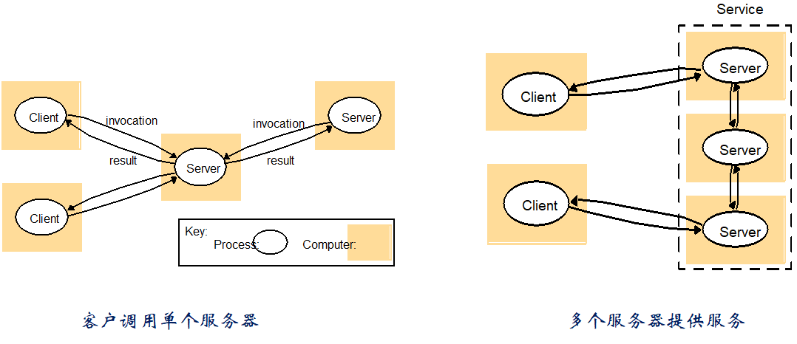
    * Peer-to-Peer
      * 所有参与的进程**运行相同的程序**，并且相互之间提供相同的接口集合
      * 进程间通信依赖于对应用的需求。
      * 共享数据对象，个体计算机只保存应用数据库的一小部分，存储、处理和通信的负载分不到联网的多个计算机上。
      * 每个数据对象被复制到多个计算机上，一方面分散负载，另一方面提高数据可用性。
      * 应用案例：Bittorrent
      * 
  * 放置（在物理基础设施的什么地方）
    * 放置：解决对象和服务等实体与底层物理基础设施的映射问题。
    * 从性能的角度考虑：
      * 实体间的通信模式
      * 给定计算机的可靠性和当前的负载
      * 不同计算机之间的通信质量
    * 放置策略
      * 服务映射到多个服务器
      * 缓存
      * 移动代码
      * 移动代理

* **体系结构模式**：体系结构模式提供组合的、重复出现的结构，这些结构在一些给定的场景下表现良好

* **Layering**（与抽象紧密相关）：

  * 复杂系统被分成若干层，每层利用下层提供的服务。一个给定的层提供一个软件抽象，高层不了解其底层的实现细节以及其他更低的层

  * platform：由最底层的硬件和软件层构成，这些层为上层提供服务，在每个计算机独立实现，提供系统API，便于进程间通信及协调。（PaaS）
  * middleware：一个软件层，表示成一组计算机上的进程或对象，这些进程或对象相互交互，实现分布式应用的**通信和资源共享支持**，目的是屏蔽异构性，给程序员提供方便的编程接口。通过对抽象的支持，提升应用程序活动的层次。一些抽象包括远程方法调用、进程组织间的通信、事件的通知、共享数据共享数据的分区、放置和检索、共享数据的复制等
  * 

* **Tiered architecture**（更细节具体的分层）

  * 对layering的补充，是在特定层组织功能、放置功能至合适的服务或物理节点的技术，与layering上层的应用和服务的组织最相关
  * 两层模式：表示逻辑、应用逻辑和数据逻辑被分到客户进程和服务器进程，通常通过分割应用逻辑来完成划分。
    * 一部分业务逻辑放在客户端，一部分放在服务器端
    * 交互延迟低
    * 应用逻辑分布到不同进程，导致有些功能不能直接被调用
  * 三层模式：逻辑元素与物理服务器一一对应，每层都定义了明确的角色
    * 软件可维护性高
    * 增加了管理三个服务器的复杂性
    * 可推广至多层方案
  * 
  * 表示逻辑：涉及用户交互和修改呈现给用户的应用视图
    应用逻辑：涉及与应用相关的特定应用业务逻辑详细的处理
    数据逻辑：涉及应用的持久存储，通常在一个数据库管理系统中

* **Thin client**（瘦客户）

  * 一个提供了基于窗口的本地用户界面的软件层，提供访问远程计算机的服务
  * 客户设备的假设和需求小，可以访问复杂的网络服务
  * 复杂性从最终用户设备移到互联网服务$\rightarrow$云计算
  * 

## 基础模型

* 物理模型和体系结构模型共享一些基础特征
  * 都由**进程**组成，这些进程在计算机网络上通过发送消息进行通信
  * 共享设计需求：实现进程及网络性能的**可靠**性，确保系统资源的安全性
* 基础模型包含分布式系统的基本组成，以便理解和推理系统的行为，目的是
  * 显式地表达所建模的系统的相关假设
  * 给定假设，归纳出哪些可能，那些不可能，比如了解设计依赖什么，不依赖什么
* 分布式系统基础模型包含以下需要解决的问题
  * 交互
  * 故障
  * 安全
* **交互模型**
  * 分布式系统中影响进程交互的两个重要因素
    * **通信性能**通常是一限制特性
    * 不可能维护单一的**全局时间**
  * 通信通道的性能
    * 通道的实现方式：可以是流或消息传递（TCP/IP、Socket）
    * 计算机网络上的通信性能：延迟、带宽和抖动（jitter）
      * 延迟：从一个进程开始发消息到另一个进程开始接受消息之间的间隔时间
        带宽：给定时间内网络能传递的信息总量
        抖动：传递一系列信息所花费的时间的变化值，与多媒体数据有关
  * 计算机时钟和时序事件
    * 分布式系统中每台计算机有自己的时钟，本地进程获取当前的时间值
    * 不同计算机上运行的两个进程将时戳与事件关联，即使同时读时钟，各自本地时钟也提供不同的时间值
    * 时钟漂移率：计算机时钟偏离绝对参考时钟的比率
  * 交互模型的两个变体：同步分布式系统和异步分布式系统
  * **同步分布式系统**（考！）
    * 满足的约束
      * 进程执行每一步的时间有一个上下限（响应要求，银行）
      * 通过通道传递的每个消息在一个已知的时间范围内接收到
      * 每个进程有一个本地时钟，时钟偏移率在一个已知的范围内
    * 实际应用时，可以采用超时检测进程的故障
  * **异步分布式系统**（考！）
    * 对以下因素没有限制
      * 进程执行速度
      * 消息传递延迟
      * 时钟漂移率
    * 实际的分布式系统大多是异步的，如互联网
* **故障模型**
  * 分布式系统中，进程和通信通道都有可能出现故障
  * 故障模型定义了故障可能发生的模式，从而理解故障的影响
  * 故障分类
    * Omission failure：进程或通信信道不能完成应该做的动作
      * Process omission failure：进程崩溃、停止
      * Communication omission failure：通信通道不能将消息从进程P的outgoing message buffer传递到进程Q的incoming message buffer，消息丢失
      * 
    * 随机故障（Byzantine拜占庭故障）：描述可能出现的最坏故障，任何类型的故障。
      * 进程随机故障：进程随机地丢掉要做的步骤或执行一些不必要的处理步骤。
      * 通信通道随机故障：消息丢失、损坏或多次传递等
    * Timing failure：同步分布式系统中适用，在规定的时间间隔内，客户没有响应
      * 
    * Masking failure：分布式系统中的组件通常基于一组其他组件构造，利用存在故障的组件构造可靠的服务是可能的，例如数据多副本存储。
* **安全模型**
  * 分布式系统安全可以通过保证进程和用于进程交互的通道的安全，以及保护所封装的对象免遭未授权访问来实现。
  * 其他内容参见“Distributed Systems: Concepts and Design”

# 分布式文件系统

* 文件系统最初是为集中式计算机系统和台式机开发的，作为操作系统设施提供方便的磁盘存储访问接口，通过访问控制机制和文件锁机制实现数据和程序的共享

* 分布式文件系统支持程序像对本地文件一样对远程文件进行存储和访问，而且能获得与访问本地磁盘文件类似的性能和可靠性

* 分布式文件系统以文件形式支持信息共享，以持久存储的形式支持硬件资源的共享（共享资源是分布式系统的主要目标，共享存储信息是分布式资源共享的最重要的方面之一）

* 大规模广域可读写文件存储系统会产生**负载均衡、一致性、可靠性、可用性和安全性**问题

* | 存储系统及其性质     | **共享** | **持久性** | **分布式缓存/副本** | **一致性维护** | **实例**                                                     |
  | -------------------- | -------- | ---------- | ------------------- | -------------- | ------------------------------------------------------------ |
  | 主存                 | ×        | ×          | ×                   | 1              | RAM                                                          |
  | 文件系统             | ×        | √          | ×                   | 1              | Unix文件系统                                                 |
  | 分布式文件系统       | √        | √          | √                   | √              | SUN NFS                                                      |
  | Web                  | √        | √          | √                   | ×              | Web Server                                                   |
  | 分布式共享内存       | √        | ×          | √                   | √              | Ivy file system                                              |
  | 远程对象（RMI）      | √        | ×          | ×                   | 1              | CORBA                                                        |
  | 持久对象存储         | √        | √          | ×                   | 1              | CORBA Persistent State Service（Common Object Request Broker公共对象请求代理，一个中间件） |
  | Peer-to-peer存储系统 | √        | √          | √                   | 2              | OceanStore                                                   |

  1：严格的单份复制、√：弱保证、2：非常弱的保证

* 文件系统的特点

  * 文件系统负责文件的组织、存储、检索、命名、访问控制、共享和保护，提供描述文件抽象的程序接口。
  * 文件包括数据和属性
    * 数据包括一系列数据项，读写操作可访问这些数据项的任何部分
    * 属性包括文件长度、时间戳、文件类型、拥有者身份、访问控制列表
  * 目录：是一类特殊类型的文件，提供从文件名字到内部文件标识符的映射，可以包括其他目录的名字，形成层次化的文件命名方案。
  * 元数据：文件系统用于管理文件而存储的所有关于文件的信息，包括文件属性、目录和其他文件系统使用的持久信息
  * 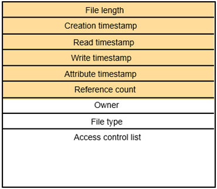

* 文件系统操作

  * 以Unix文件系统为例，主要的文件操作如下，由操作系统内核实现
    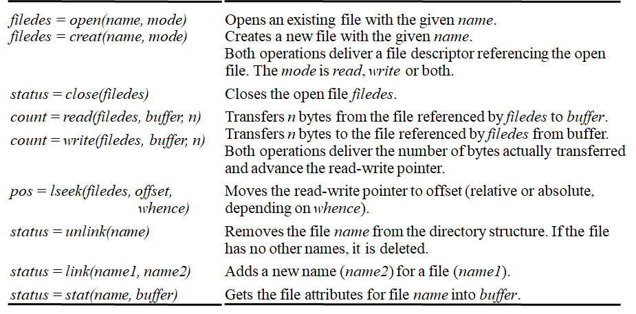

* 分布式文件系统的需求

  * 透明性
    * 访问透明性：客户程序不需要了解文件的分布性，只需通过文件访问操作访问本地或远程文件。
    * 位置透明性：客户程序使用统一的文件命名空间，在不改变路径名的情况下，文件或文件组可以被重定位。
    * 移动透明性：移动文件时，客户程序和客户节点上的系统管理表不必修改
    * 性能透明性：服务的负载在一定范围变化时，客户程序的性能不受影响
    * 伸缩透明性：文件服务可以不断扩充，以应对负载和网络规模的增长
  * 并发文件更新：一个客户对文件的修改的操作不影响同时访问同一个文件的其他客户，即并发控制
  * 文件复制：一个文件可以表示为其内容在多个位置的多个备份
  * 硬件和操作系统异构性：文件访问接口定义明确，不受操作系统和计算机异构性的影响、这是开放性的一个重要方面。
  * 容错：文件服务在客户和服务器出现故障时可以继续提供服务
  * 一致性：多个拷贝在多个节点上存储或缓存时，会因为网络延迟导致一个拷贝的修改延迟反映到其他拷贝,需要确定一致性原则
  * 安全性：提供访问控制机制
  * 效率：应提供至少和传统文件系统相同的能力，且达到一定的性能要求。

* 文件服务体系结构

  * 文件系统三个组件
    * Flat file service：实现文件内容上的操作，唯一文件标识符UFID表示文件
    * Directory service：提供文件名字到UFID的映射，生成目录以及为目录增加新的文件名等功能
    * Client service：运行在客户机上，在应用程序接口上集成和扩展flat file service和directory service，提供用户级程序使用
    * 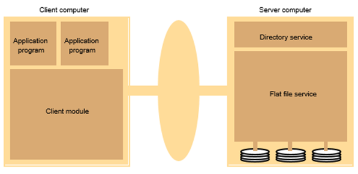
      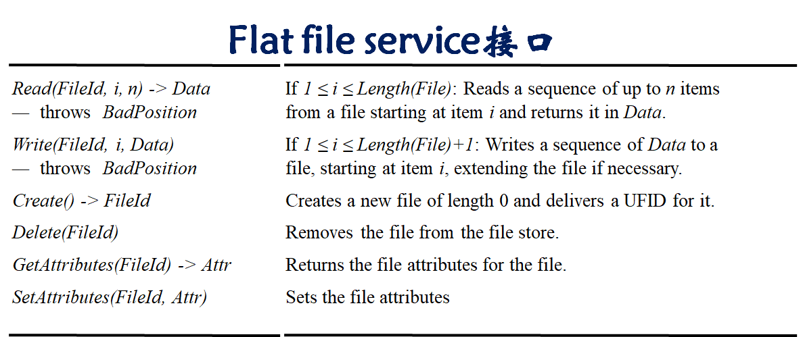
      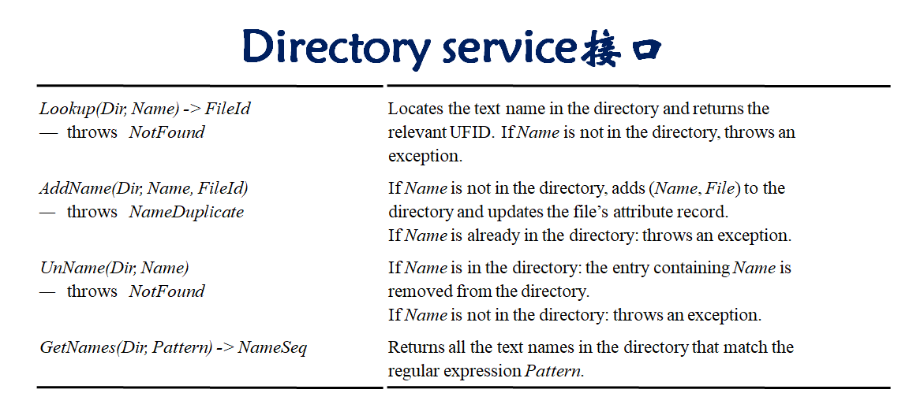

* 层次文件系统

  * 层次文件系统由组织成树形结构的目录组成，每一个目录包含文件和其他可以从此目录访问的目录名字，例如，Unix文件系统
  * 可以使用路径名来访问任何一个文件或目录
  * 客户模块提供函数，用来获得给定路径文件的UFID

* 分布式文件系统案例

  * 通用的分布式文件系统
    * SUN Microsystem 的网络文件系统NFS
    * CMU的Andrew文件系统AFS
    * DFS
    * FastDFS
    * Coda。。。。。。
  * 定制的分布式文件系统
    * Google File System（GFS）
    * Hadoop File System（HDFS）

## GFS

* 研发GFS的动机：满足Google搜索引擎和其他web应用程序迅速增长的需求
  * 在廉价、不可靠计算机上存储大量的数据
  * 针对Google的应用，对存储的文件类型和访问模式进行优化
    * 例如，文件数量不多，但文件大小很大，106个100MB的文件，甚至GB
    * 大文件的顺序读和对文件的追加操作的顺序写——数据分析应用
    * 并发访问多，大量并发追加写操
  * GFS整体上满足Google基础设施的所有需求
    * 从数据和客户数量的角度必须可伸缩
    * 基础设施发生故障时是可靠的
    * 是开放的，以支持新的应用
    * 对高吞吐量进行了优化，而不是优先考虑延迟

* 一些假设
  * 组件失效率高：廉价的商用机器容易出现故障
  * 大文件数量较多：基本上每个文件 100MB或更大，大部分是GB级文件
  * 文件访问模式是写一次，大多数是添加操作：并发操作
  * 大量流数据读操作
  * 持久的高吞吐量、低延迟
* GFS体系结构
  * GFS提供从文件到块的映射，然后将文件的操作映射为各个块的操作。
  * 一个master节点，多个chunkservers（数百个）
  * 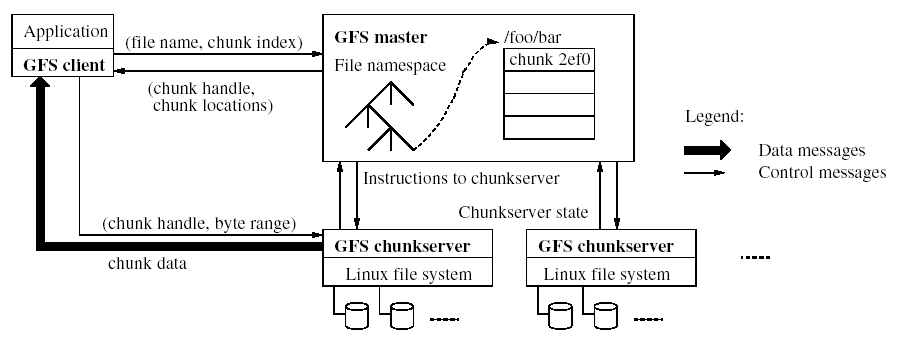
* GFS设计决策
  * 文件以**chunk**为单位存储
    * 大小为固定的64MB
  * 通过复制提高可靠性
    * 每个chunk有3个以上的副本存储在不同的chunkservers
  * **单一master**负责协调访问以及保存元数据
    * 简单的集中式管理
  * 没有数据缓存
    * 大数据集合、流数据读操作获益
  * API接口常用，但是定制的
    * 简化问题，针对Google应用
    * 添加了snapshot和record append操作

* Master节点
  * 管理有关文件系统的元数据
  * 维护多个数据副本的位置信息
  * 全局元数据
    * 文件和chunk命名空间
    * 文件名与chunks的映射表
    * 每个chunk副本的地址
    * 访问控制信息
  * 元数据持久存储在操作日志中，记录关键的元数据修改，恢复系统用
    * 在本地磁盘持久存储
    * 有副本
    * 快速恢复目的的checkpoint机制
* Chunkserver
  * Chunkserver存储数据
  * 客户端和Master节点的通信只获取元数据，所有的数据操作都是由客户端**直接和Chunkserver**进行交互。
    * Client可以同时访问多个chunkserver，提高系统的I/O性能
  * Chunk服务器不需要缓存文件数据
    * Chunk以本地文件的方式保存，Linux操作系统的文件系统缓存会把经常访问的数据缓存在内存中。
* GFS的**一致性**管理：每个块有多个副本，数据修改（写操作和追加操作）时保持数据副本一致性很重要，比如多个client同时向三个副本写数据。（GFS一致性，考！）
  * 数据流和控制流分离，数据更新时，将master参与度降到最低
  * 提供**宽松的一致性模型**：
    * 每个chunk都只有一个副本来管理多个client的并发写入。对于一个chunk，master会将一个租约（lease）授予其中一个副本，由具有租约的副本来管理所有要写入这个chunk的数据。
    * 被授予租约的副本称为primary副本（剩下两个为secondary副本）， primary副本管理所有客户端的并发请求，负责针对该chunk当前所有并发变更（mutation）操作（write, append, delete）按顺序写到chunk上（mutation order）。
    * Secondary副本按照这个mutation order写数据。
    * 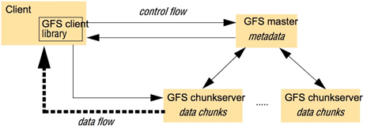
* GFS的一致性管理步骤
  1. 当master收到来自client的修改操作请求时，master授予其中一个副本lease，然后将primary副本和其他secondary副本的标示返回给client
  2. client将所有数据发送到多个副本，数据暂存在缓存（可以任意顺序），直到收到进一步的指示才进行写操作
  3. 一旦所有的副本确认收到数据，client向primary副本发送写请求，然后primary副本确定并发请求的顺序，按照顺序在primary副本节点进行更新
  4. Primary副本请求在secondary副本上以同样的顺序执行同样的修改操作，直到所有的修改成功执行后，其他副本发送确认消息
  5. 如果primary副本收到了所有secondary副本写数据的确认消息后，向客户报告成功消息，否则报告失败消息。失败表明副本处于不一致的状态
     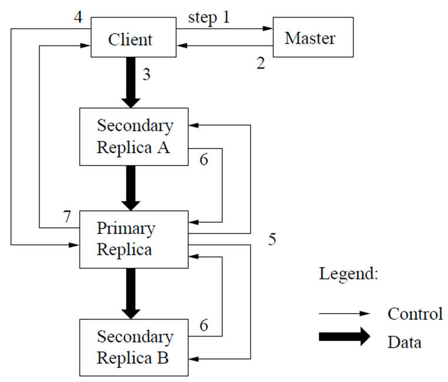

## HDFS

* 概述

  * Hadoop分布式文件系统(HDFS)的设计目标是针对适合运行在通用硬件(commodity hardware)上的分布式文件系统
  * HDFS是一个高度容错性的分布式文件系统，适合部署在廉价的机器上
  * HDFS能提供高吞吐量（IO大）的数据访问，非常适合大规模数据集上的应用
  * HDFS放宽了一部分POSIX（ Portable Operating System Interface of UNIX 可移植操作系统接口）约束，来实现流式（Spark Flink）读取文件系统数据的目的

* 前提和设计目标

  * **硬件错误**
    * 硬件错误是常态而不是异常。HDFS可能由成百上千的服务器所构成，每个服务器上存储着文件系统的部分数据。构成系统的组件数目巨大，任一组件都有可能失效，错误检测和快速、自动的恢复是HDFS最核心的架构目标
  * **流式数据访问**
    * HDFS的设计中更多考虑到了数据**批处理**，而不是用户交互处理。比之数据访问的低延迟问题，关注高吞吐量
  * **大规模数据集**
    * 运行在HDFS上的应用具有很大的数据集。HDFS上的一个典型文件大小一般都在GB至TB，支持大文件存储。它应该能提供整体上高的数据传输带宽，能在一个集群里扩展到数百个节点。一个单一的HDFS实例应该能支撑数以千万计的文件
  * **简单的一致性模型**
    * 支持“一次写入多次读取”的文件访问模型，简化了数据一致性问题，并且使高吞吐量的数据访问成为可能。（查询、分析）
  * **“移动计算比移动数据更划算”**
    * 一个应用请求的计算，离它操作的数据越近就越高效，当数据达到海量级别的时就能降低网络阻塞的影响，提高系统数据的吞吐量。HDFS为应用提供了将计算移动到数据附近的接口。
  * **异构软硬件平台间的可移植性**
    * 考虑到平台的可移植性，方便了HDFS作为大规模数据应用平台的推广
  * **简单的一致性模型**
    * 支持“一次写入多次读取”的文件访问模型，简化了数据一致性问题，并且使高吞吐量的数据访问成为可能。
  * **“移动计算比移动数据更划算”**
    * 一个应用请求的计算，离它操作的数据越近就越高效，当数据达到海量级别的时就能降低网络阻塞的影响，提高系统数据的吞吐量。HDFS为应用提供了将计算移动到数据附近的接口。
  * **异构软硬件平台间的可移植性**
    * 考虑到平台的可移植性，方便了HDFS作为大规模数据应用平台的推广

* HDFS体系结构

  * 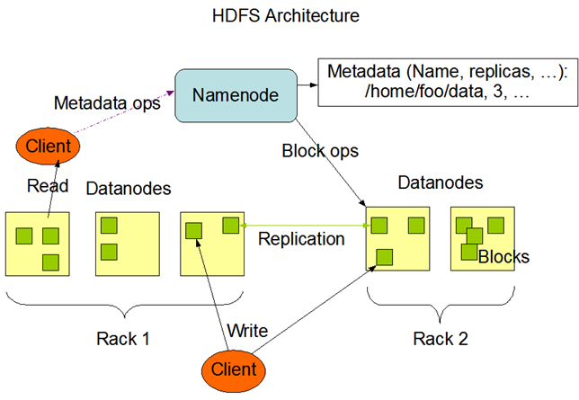

  * 术语对照

  * | **GFS术语** | **HDFS术语** |
    | ----------- | ------------ |
    | Master      | NameNode     |
    | ChunkServer | DataNode     |
    | Chunk       | Block        |

* Namenode和Datanode。HDFS采用master/slave架构

  * 一个HDFS集群是由一个Namenode和一定数目的Datanodes组成。
  * Namenode是一个中心服务器，负责管理文件系统的名字空间(namespace)以及客户端对文件的访问。Namenode执行文件系统的名字空间操作，比如打开、关闭、重命名文件或目录。它也负责确定数据块到具体Datanode节点的映射。
  * 集群中的Datanode一般是一个节点一个，负责管理它所在节点上的存储，负责处理文件系统客户端的读写请求。在Namenode的统一调度下进行数据块的创建、删除和复制。
  * 一个文件被分成一个或多个数据块，这些块存储在一组Datanode上。

* 文件系统的名字空间 namespace

  * HDFS支持传统的层次型文件组织结构。用户或者应用程序可以创建目录，然后将文件保存在这些目录里。
  * 文件系统名字空间的层次结构和大多数现有的文件系统类似，用户可以创建、删除、移动或重命名文件。
  * Namenode负责**维护文件系统的名字空间**，任何对文件系统名字空间或属性的修改都将被Namenode记录下来。应用程序可以设置HDFS保存的文件的副本数目。文件副本的数目称为文件的复制因子，这个信息也是由Namenode保存。

* 数据复制

  * HDFS被设计成能够在一个大集群中跨节点可靠地存储超大文件的文件系统。它将每个文件存储成一系列的数据块，除了最后一个，所有的数据块都同样大小。
  * 为了容错，文件的**所有数据块都会有副本**。每个文件的数据块大小和复制因子都是可配置的。应用程序可以指定某个文件的副本数目。副本系数可以在文件创建的时候指定，也可以在之后改变。HDFS中的文件是write-one，并且**严格要求在任何时候只能有一个writer**。
  * Namenode**全权管理数据块的复制**，它周期性地从集群中的每个Datanode接收心跳信号和块状态报告(Blockreport)。接收到心跳信号意味着该Datanode节点工作正常。块状态报告包含了一个该Datanode上所有数据块的列表。
  * 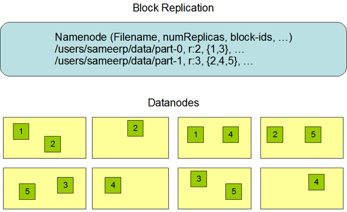
    示例：文件part-0，复制因子是2，文件组成包括block1和block3，可以看到block1在DataNode1和DataNode3分别存储；文件part-1由3个块组成，复制因子是3，可以看到block2,4,5分别在三个DataNode存储

* 复制-副本存放

  * 副本的存放是HDFS可靠性和性能的关键。

  * HDFS采用机架感知(rack-aware)的策略来改进数据的可靠性、可用性和网络带宽的利用率。

  * 大型HDFS实例一般运行在跨越多个机架的PC集群上，不同机架上的两台机器之间的通讯需要经过交换机。在大多数情况下，同一个机架内的两台机器间的带宽会比不同机架的两台机器间的带宽大。

  * 通过rack-aware过程，Namenode可以确定每个Datanode所属的机架id。简单但没有优化的策略就是将副本存放在不同的机架上。这种策略设置可以将副本均匀分布在集群中，有利于当组件失效情况下的负载均衡。但是写操作需要传输数据块到多个机架，这增加了写的代价。

  * 在大多数情况下，复制因子是3，将一个副本存放在本地机架的节点上，一个副本放在同一机架的另一个节点上，最后一个副本放在不同机架的节点上

  * *通过rack awareness过程，Namenode可以确定每个Datanode所属的机架id。简单但没有优化的策略就是将副本存放在不同的机架上。这样可以有效防止当整个机架失效时数据的丢失，并且允许读数据的时候充分利用多个机架的带宽。这种策略设置可以将副本均匀分布在集群中，有利于当组件失效情况下的负载均衡。但是，因为这种策略的一个写操作需要传输数据块到多个机架，这增加了写的代价。*

    *在大多数情况下，副本系数是3，HDFS的存放策略是将一个副本存放在本地机架的节点上，一个副本放在同一机架的另一个节点上，最后一个副本放在不同机架的节点上。这种策略减少了机架间的数据传输，这就提高了写操作的效率。机架的错误远远比节点的错误少，所以这个策略不会影响到数据的可靠性和可用性。于此同时，因为数据块只放在两个（不是三个）不同的机架上，所以此策略减少了读取数据时需要的网络传输总带宽。在这种策略下，副本并不是均匀分布在不同的机架上。三分之一的副本在一个节点上，三分之二的副本在一个机架上，其他副本均匀分布在剩下的机架中，这一策略在不损害数据可靠性和读取性能的情况下改进了写的性能*

* 复制-副本选择

  * 为了降低整体的带宽消耗和读取延时，HDFS会尽量让读操作进程读取离它**最近**的副本。如果与读进程在同一个机架上有一个副本，那么就读取该副本。
  * 如果一个HDFS集群跨越多个数据中心，那么客户端也将首先读**本地**数据中心的副本。

* 文件系统元数据的持久化

  * Namenode上保存着HDFS的名字空间。对于任何对文件系统元数据产生修改的操作，Namenode都会使用称为**EditLog**的**事务日志**记录下来。
    * 例如，在HDFS中创建一个文件，Namenode就会在Editlog中插入一条记录来表示；
    * 同样地，修改文件的复制因子也将往Editlog插入一条记录。Namenode在本地操作系统的文件系统中存储这个Editlog。
  * 整个文件系统的名字空间，包括数据块到文件的映射、文件的属性等，都存储在**FsImage**的文件中，这个文件放在Namenode所在的本地文件系统上。
  * DataNode不知道关于文件的任何信息，只存储文件的数据块。

* 通讯协议

  * 所有的HDFS通讯协议都建立在**TCP/IP**协议之上。
  * 客户端通过一个可配置的TCP端口连接到Namenode，通过ClientProtocol协议与Namenode交互。
  * Datanode使用Datanode Protocol协议与Namenode交互。
  * Client Protocol和Datanode protocol协议被抽象封装为远程过程调用(**RPC**)模型，Namenode不会主动发起RPC，而是响应来自客户端或 Datanode 的RPC请求。

* **健壮性**

  * HDFS的主要目标就是即使在出错的情况下也要保证数据存储的可靠性。常见的三种出错情况是：Namenode出错，Datanode出错和网络割裂(network partitions)。
  * **磁盘数据错误，心跳检测和重新复制**
    * 每个Datanode节点周期性地向Namenode发送心跳信号。网络割裂可能导致一部分Datanode跟Namenode失去联系。Namenode通过心跳信号的缺失来检测这一情况，并将这些近期不再发送心跳信号Datanode标记为宕机，不会再将新的IO请求发给它们。
    * 任何存储在宕机Datanode上的数据将不再有效。Datanode的宕机可能会引起一些数据块的复制因子低于指定值，Namenode不断地检测这些需要复制的数据块，一旦发现就启动复制操作。
    * 在下列情况下，可能需要重新复制：某个Datanode节点失效、某个副本遭到损坏、Datanode上的硬盘错误、文件的复制因子增大。
  * **集群均衡**
    * 如果某个Datanode节点上的空闲空间低于特定的临界点，按照均衡策略系统就会自动地将数据从这个Datanode移动到其他空闲的Datanode。
    * 当对某个文件的请求突然增加，那么也可能启动一个计划创建该文件新的副本，并且同时重新平衡集群中的其他数据。
  * **数据完整性**
    * 从某个Datanode获取的数据块有可能因为Datanode的存储设备错误、网络错误或者软件bug造成出错。
    * HDFS客户端软件实现了对HDFS文件内容的校验和(checksum)检查。
      * 当客户端创建一个新的HDFS文件，计算这个文件每个数据块的校验和，并将校验和作为一个单独的隐藏文件保存在同一个HDFS名字空间下。
      * 当客户端获取文件内容后，它会检验从Datanode获取的数据跟相应的校验和文件中的校验和是否匹配，如果不匹配，客户端可以选择从其他Datanode获取该数据块的副本。
  * **元数据磁盘错误**
    * FsImage和Editlog是HDFS的核心数据结构，如果损坏了，整个HDFS实例都将失效。
    * Namenode可以配置成支持维护多个FsImage和Editlog的副本。任何对FsImage或者Editlog的修改，都将同步到它们的副本上。
      * 这种多副本的同步操作可能会降低Namenode每秒处理的名字空间事务数量。即使HDFS的应用是数据密集的，但不是元数据密集的。当Namenode重启的时候，它会选取最近的完整的FsImage和Editlog来使用。
    * Namenode是HDFS集群中的单点故障(single point of failure)所在。如果Namenode机器故障，需要手工干预。可以尝试自动重启或在另一台机器上做Namenode故障转移。
  * **快照**
    * 快照支持某一特定时刻的数据的复制备份。利用快照，可以让HDFS在数据损坏时恢复到过去一个已知正确的时间点

* 数据组织

  * **数据块**
    * HDFS适用于处理大数据集应用，这些应用都具有数据“写一次，读多次”特点，并且读取速度应能满足流式读取的需要。典型的数据块大小是64MB，HDFS中的文件总是按照64M被切分成不同的块，每个块尽可能地存储于不同的Datanode中。
  * **复制流水线**
    * 当客户端以复制因子3向HDFS文件写入数据的时候，客户端会从Namenode获取一个Datanode列表用于存放副本。然后客户端开始向第一个Datanode传输数据，第一个Datanode以4 KB大小接收数据，将每一部分写入本地存储，并同时传输该部分到列表中第二个Datanode节点。第二个Datanode也是这样的操作，并同时传给第三个Datanode。最后，第三个Datanode接收数据并存储在本地。
    * Datanode能流水线式地从前一个节点接收数据，并同时转发给下一个节点，数据以流水线的方式从前一个Datanode复制到下一个。

* HDFS的访问：DFShell、Java API

* MapReduce

  * 由Google提出，基于函数式编程模型思想
  * 动机：在成千上百CPU上方便地并行处理大规模数据
  * 思想：分而治之
  * 自动并行和分布
  * 容错，提供状态监控工具
  * 程序员接口清晰，两个函数map()和reduce()
  * 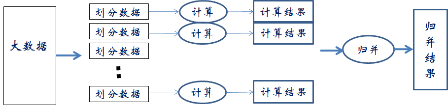

* 编程模型

  * 基于函数式编程思想。
  * 用户实现两个函数接口：
    * map(in_key, in_value) -> (out_key, intermediate_value) list
      * 输入是数据的key-value 对，如文件名，行数
      * 输出是out-key和中间结果。
    * reduce (out_key, intermediate_value list) ->out_value list
      * Map计算结束后，给定的out-key的中间结果归并在一起
      * 通常，每个key只有一个最后值。
    * 
      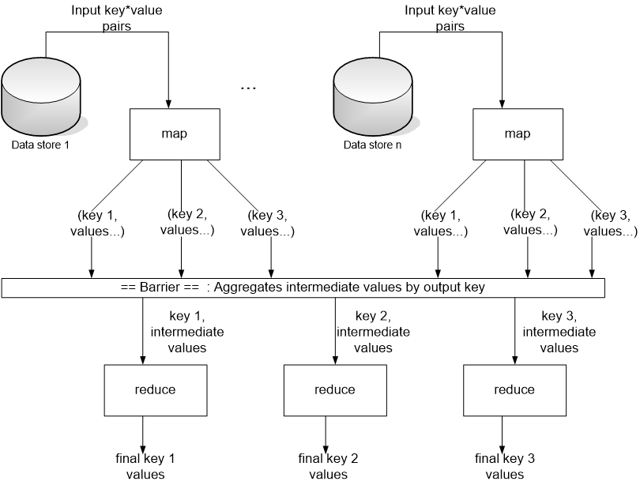

* 并行化
  * map()函数并行执行，给定数据集，按照key生成 不同的中间结果
  * reduce() 函数针对不同的out-key并行执行
  * 所有值的处理是独立的。
  * 瓶颈：直到所有的map函数执行结束后，reduce阶段才开始。

# 分布式系统—Coordination and Agreement（协调和协定）
* 发生故障时，分布式系统中的进程如何协调他们的指令？
  系统发生不同类型的故障时如何对共享值达成协定？
  针对共享值，如何保证数据的**一致性**？
  同步系统和异步系统处理的差异性
* 分布式系统中的数据复制
  * 在分布式系统中，数据复制的目的：
    * 提高系统的可用性，防止单点故障导致系统不可用；
    * 提高系统的性能，使分布在不同节点上的数据副本都能够为用户供服务
  * 数据复制带来了数据一致性挑战：
    * 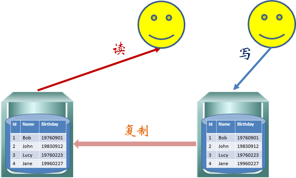
    * 客户端C2将系统中的值K由V1修改为V2，但客户C1无法立即读到K的最新值
    * 不同节点上的数据一致性无法通过应用程序来解决
  * 如何解决数据一致性
    * 阻塞写操作，直到复制结束完成写操作
    * 导致什么问题？特别是写操作频繁的应用
* 数据**一致性级别**（分布式系统如何保证数据一致性，又不影响系统运行的性能？通过数据一致性级别来区别对待）
  * 强一致性：不论针对哪一个副本进行数据更新，之后所有的读操作都能读到最新的数据，即读到的数据是最新写入的数据。
  * 弱一致性：数据更新后，用户可以在某个时间后读到更新后的数据——不一致性窗口，即不承诺立即读到最新写入的数据。
  * 最终一致性：弱一致性的特例，系统中的副本经过一段时间后最终能够达到一致，保证用户最终可以读到数据的更新。（大型分布式系统推崇）
* **同步分布式系统**
  * 进程执行每一步的时间有一个上限和下限
  * 通过通道传递的每个消息在一个已知的**时间范围**内接收到
  * 每个进程有一个本地时钟，它与实际时间的**偏移率**在一个已知范围内
* **异步分布式系统**
  * 进程的执行速度：可长可短
  * 消息传递延迟：消息可以在任意长时间后接收到
  * 时钟漂移率：任意的
* **分布式系统中的故障假设**
  * 假设每对进程都通过可靠的通道连接（假设不成立）
    * 底层网络组件可能出现故障，但进程使用能屏蔽故障的可靠通讯协议，例如重传丢失或损坏的消息
  * 假设进程故障不隐含对其他进程的通信能力的威胁
    * 没有进程依赖其他进程来转发消息
  * 在同步系统中，假设在必要的地方硬件冗余
    * 底层出现故障时，可靠通道不仅最终能传递每个消息，而且能在指定的时间完成传递工作。例如：两个网络之间的router故障，导致四个进程被分为两对，每个网络内的进程对可以通信，但两对进程不可以通信$\rightarrow$网络分区（网络割裂）（副本，即使割裂也能访问）
  * 正确进程：不论何种故障，在运行中的任何点都没有故障的进程。
* **分布式系统故障模型**（分类）
  * 遗漏故障：进程或通信通道不能完成其应该做的动作。
    * 进程遗漏故障：进程崩溃
    * 通信遗漏故障：发送遗漏、接受遗漏、通道遗漏
  * 随机故障（Byzantine拜占庭故障）：描述可能出现的最坏故障，任何类型的故障。
    * 进程随机故障：进程随机地丢掉要做的步骤或执行一些不必要的处理步骤。
    * 通信通道随机故障：消息丢失、损坏或多次传递等
  * Timing failure: 同步分布式系统中，在规定的时间间隔内，客户没有响应。
  * Masking failure： 分布式系统中的组件通常基于一组其他组件构造，利用存在故障的组件构造可靠的服务是可能的，例如数据多副本存储。

## 共识问题

* 现实问题1—Pepperland协定：Pepperland军队的两支部队驻扎在山顶，山下是入侵的敌军。如果部队都不下山，他们是安全的。两支部队通过派出通信兵穿越山谷进行通信。
  * 两支部队需要协商：哪一方先发起对敌人的冲锋？何时发起冲锋？
  * 同步通讯模式
    * 有一些约束。例如，每个消息至少*min*分钟至多*max*分钟到达对方；如果蓝军发出“冲锋”消息，那么蓝军等待min分钟后发起冲锋；红军收到消息后等待1分钟，然后发起冲锋。这样冲锋就得以保证：率先发起冲锋的部队发出冲锋消息后，另一支部队不超过max-min+1分钟就发起冲锋。
  * 异步通讯模式
    * 形成约定。例如，两支队伍通告人员情况，人多一方率先冲锋，如果人数一样，红军先发起冲锋；
    * 何时冲锋的问题：通讯兵的速度是变化的（网络延迟），消息到达对方的时间是不确定的，可能几个小时，可能几分钟
* 现实问题2：所有正确控制飞船引擎的进程，当每一个计算机提议了一个操作后，控制飞船的所有正确的计算机需要决定“继续”还是“终止”。
* 现实问题3：控制太空飞船的多个计算机，需要对太空飞船的任务是继续执行还是终止达成协定，必须正确协调对于共享资源（如传感器、传动装置）的动作。
* 问题：系统采用主从结构是否会使上述问题的处理简单化？
* 共识问题的**含义**：分布式系统中，一个或多个进程提议了一个值后，一组进程如何对这个值达成一致意见。
* 3个相关问题
  * 拜占庭将军（Byzantine generals）
  * 交互一致性（interactive consistency）
  * 全排序组播（totally ordered multicast）
* **系统模型**
  * 分布式系统中一组进程pi（i=1,2,…,N）
  * 进程之间通过消息传递进行通信
  * 假设通信是可靠的，进程可能出现故障
  * 故障为拜占庭（随机）进程故障和崩溃故障
  * 假设N个进程中至多有*f* 个故障进程，其余进程是正确的
  * 假设进程对所发送的消息不进行数字签名
* 共识问题**定义**
  * 为达到共识，每个进程pi最初处于未决（undecided）状态，并且提议一个值vi（i=1,2,…,N）。进程间相互通信并交换值V。每个进程设置决策变量di的值，进程进入决定（*decided*）状态。处于*decided*状态的进程不能改变di 的值（i=1,2,…,N）。
  * 例：三个参与共识算法的进程
    * 进程1和进程2提议继续，进程3提议放弃，随后崩溃
    * *d*是决策变量，*v*是提议的一个值
* 共识算法每次执行要求**满足的条件**
  * ①Termination：最终每个正确的进程都设置其决策变量*d*。
  * ②Agreement：所有正确进程的决策变量值相同，即如果*pi*和*pj*都是正确的而且都进入了*decided*状态，那么*di*=*dj*（*i,j*=1,2,…,*N*）
  * ③Integrity：如果正确的进程都提议同一个值，则处于decided状态的任何正确进程选择该值。（有些文献称作有效性）
    * 应用不同，integrity定义可以有所变化。例如较弱的完整性指的是decision variable值等于某些正确进程提议的值，而不是所有的正确进程提议的值
* 共识算法**执行示例**
  * 假设系统中的进程不出现故障。
    * 将进程归为一组，然后让每个进程将其所提议的值可靠地**组播**到组里其他进程。
    * 每个进程等待，直到收集到所有N个值（包括自己的）,调用函数*majority*（*v1*,*v2*,…,*vn*）,返回出现最多的v值；如果不存在，返回一个特殊值，如⊥
  * Termination由组播的可靠性保证
  * Agreement和Integrity由majority函数的定义和可靠组播的完整性保证（如有序值时，minimum、maximum也是合适的函数）
  * 每个进程收集相同的提议值，而且每个进程采用同样的函数计算，因此他们一定全部一致（agree）。且如果每个进程提议相同的值，那么它们最终都决定这个值。

* **拜占庭将军问题**：1982年Leslie Lamport年提出拜占庭将军问题，一种容错理论。
  * 理论上，在分布式计算领域，在异步系统和不可靠通道上达到一致性状态是不可能。（存在消息丢失的不可靠信道上试图通过消息传递的方式达到一致性是不可能的）
  * Lamport设想的一个场景：拜占庭帝国有许多支军队，不同军队的将军之间必须制订一个统一的行动计划，做出进攻或者撤退的决定。同时各个将军在地理上都是分布的，只能依靠军队的通讯员传递消息进行通讯。这些通讯员可能会存在叛徒，可以任意篡改消息，达到欺骗将军的目的。
* **交互一致性问题**
  * 共识问题的一个变种
  * 每个进程提议一个值，正确的进程最终就“值向量”达成一致，称为决策向量。
  * 每个进程有一个“值向量”，其中向量的每个分量与进程一一对应。
  * Requirements
    * Termination：最终每个正确的进程都设置其决策变量*d*。
    * Agreement：所有正确进程的决策向量相同
    * Integrity：如果*Pi*正确，那么所有正确进程都将*vi*作为它们决策向量的第*i*个分量
* 共识问题及相关问题**描述性定义**
  * 共识问题C
    * *Ci*（*v1*,*v2*,…,*vN*），返回进程*pi*的决策值，其中*v1*,*v2*,…,*vN*是各个进程提议的值
  * 拜占庭将军问题BG
    * *BGi*（*j*,*v*）,返回进程*pi*的决策值，其中*pj*是将军，他提议的值是v
  * 交互一致性性问题IC
    * *ICi*（ *v1*,*v2*,…,*vN* ）[j]，返回进程*pi*的决策向量的第j个分量，其中*v1*,*v2*,…,*vN*是各个进程提议的值
  * 三类问题具有相关性，可以从*BGi*构造*ICi*，从*ICi*构造*Ci*，从*Ci*构造*BGi*
* **同步系统中的共识问题**
  * 解决同步系统中的共识问题的算法
    * 假设*N*个进程，最多有*f* 个进程会出现崩溃故障，最坏情况是*f* 个进程都崩溃
  * 为达成共识，每个正确的进程从别的进程收集提议值
  * 算法处理*f* +1轮，每轮中正确的进程采用*B-multicast*组播需要共识的的值
  * 经过*f* +1轮后，所有正确的进程达成一致。
* **同步系统中的共识算法**
  * $value_i^r$ 记录*r* 轮进程*pi*知道的提议值
  * 每个进程组播上一轮没有发出去的值
  * 每个进程接收其他进程组播的类似的消息，并记录新的值
  * 每轮持续的时间长度基于每个正确的进程组播消息所需要的最长时间
  * *f* +1轮后，每个进程选择*minimum* value作为决策值。$\rightarrow$共识
  * Requirement满足
    * 同步系统$\rightarrow$termination满足
    * 应用minimum函数$\rightarrow$agreement 和integrity
  * 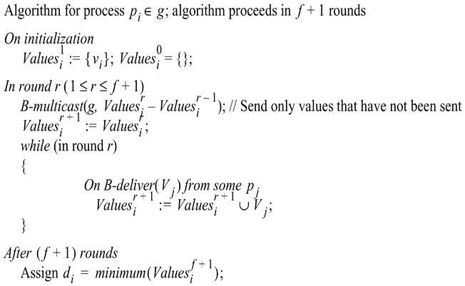
* **同步系统中的拜占庭将军问题**
  * 假设进程可能出现随机故障，即一个故障进程可能在任何时候发送任何消息，也可能漏发消息。
  * 假设*N*个进程最多有*f* 个进程会发生故障。正确的进程通过超时发现丢失信息，但不能断定发送进程崩溃（发送进程可能静默一段时间后再次重发）。
  * 假设进程间**通信信道是私有的、可靠**的。
  * Lamport 于1982年针对三个进程发送无签名消息的情况进行了分析，认为如果允许一个进程出现故障（两种情景），那么无法满足拜占庭将军问题的条件。
    * 一个上尉出现故障：P3出现故障
      * p1向p2和p3发送值v，p2正确地将值v发送给p3。p3发送错误的值u给p2。P2收到了两个不同的值，但不能判断哪一个值是司令发送的
    * 司令出现故障：P1出现故障
      * 司令p1出错，给不同的上尉发送不同的消息。P2收到两个不同的值3:1:u表示p3向p2发动value1（来自司令）的值U（自己的U）
    * 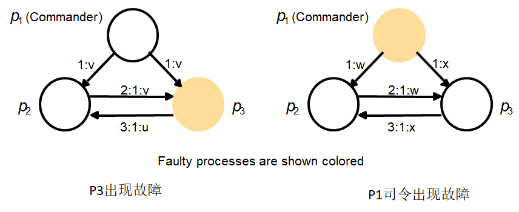
    * **不存在**同步系统BG问题的解决方法，反证法：假设存在可以解决该问题的方案，即可以达成共识（考！）
      * 当司令正确（p1正确）时，根据integrity，p2要决定值v；
      * 如果无法分辨p1故障还是p3故障，那么p2接受司令的值；
      * 如果p3正确，则p3接受司令的错误的值，但是根据agreement，p2和p3确定的值不一致。违反了agreement条件
    * 如果将军们使用数字签名，若一个出现故障，可以实现拜占庭agreement
* **N≤3f的不可能性**
  * 只要N≤3f，就不可能有BG问题的解决方法
  * 证明：假设存在解决方法（可能考！）
    * 设3个进程p1，p2，p3模拟n1，n2，n3个将军，其中n1+n2+n3=N，并且n1，n2，n3 ≤ N/3。
    * 假设3个进程中有一个进程错误。正确的进程与其他进程通信发送信息；错误的进程发送的信息可能是伪造的。
    * 因为N≤3f，且n1，n2，n3≤N/3 ，所以最多f个将军（进程）出错。
    * 由于假设存在解决方法，即达成共识的算法可以停止，也即可以满足三个需求（termination，agreement和integrity），那么正确将军（在两个正确的进程中）会达成一致并满足integrity。
    * 但是，由于三个进程中两个进程达成共识，即每个正确的进程确定所有进程所选择的值
    * 产生矛盾：与三个进程中有一个进程是错的产生矛盾。
* **N≥3f+1的同步系统中的拜占庭将军问题的解决方法**
  * 以N≥4，f=1情况，具体以N=4，f=1为例
  * 正确的将军通过两轮消息取得一致
    * 第一轮，司令给每个上尉发送一个值
    * 第二轮，每个上尉将收到的值发送给自己同级的上尉
  * 每个上尉收到司令的一个值，以及其他上尉N-2个值。
  * 如果司令有错，所有上尉都是正确的，那么每个上尉都会收到司令发出的值
  * 如果一个上尉出错，则他的同事会收到N-2份司令的值以及出错上尉的一个值
  * 不论哪一种情况，每个正确的上尉对所收到的值集合应用*majority*函数
  * 因为N≥4，则N-2≥2。因此majority函数会忽略出错上尉发来的值，而且司令正确的时候，该函数可以输出司令的值。
* 4个拜占庭将军
  * 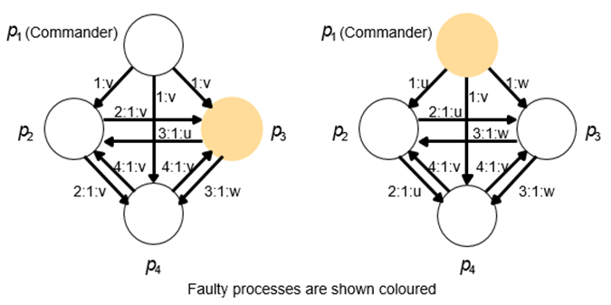
  * 左图场景：
    P2决定*majority*（v,u,v）=v
    P4决定*majority*（v,v,w）=v
    两个正确的上尉达成一致
  * 右图场景
    P2，p3和p4决定*majority*（v,u,w）= ⊥
    正确的三个上尉达成一致
  * 考虑了错误进程漏发消息的情况。如果一个正确的进程在一个适当的时间范围内（同步系统）没有收到消息，继续执行，好似错误进程发送了一个特殊值⊥
* 解决拜占庭将军问题的算法的效率问题（**不**考！）
  * 进行几轮消息传递？(影响算法终止需要的时间）
  * 发送了多少消息？消息长度是多少？（影响带宽的利用，影响执行时间）
  * 消息是否数字签名？
* **异步系统的不可能性**
  * Fischer等人证明：在一个异步系统中，即使只有一个进程出现故障，也没有可以确保拜占庭将军问题、交互一致性问题的方法。
  * 但是，并不是说分布式系统中，如果一个进程出现错误，进程就永远不能达到共识。
    * 考虑部分同步系统（partially synchronous system），部分同步系统比同步系统要弱，实际系统可采用其作为系统模型；而且比异步系统要强，使共识问题得以解决
  * 三种解决不可能性问题的技术
    * 屏蔽故障：例如复制技术，保留足够多的信息以便故障后重启时利用
    * 使用故障检测器达到共识：例如协商超时的时间，可能会导致network partition
    * 使用随机化达到共识：概率算法，分析进程的行为

## Paxos算法

* 如何在一个可能发生计算机宕机或网络异常的分布式系统中，快速且正确地对某个数据的值达成一致，并且保证不论发生任何异常都不会破坏整个系统的一致性。（非拜占庭将军问题，通信可靠不被篡改，可以存在丢失延迟）
* 实际场景中：
  * 大多数系统部署在同一个局域网中，消息被篡改的情况罕见
  * 硬件和传输导致的消息不完整情况，由校验算法可以避免
  * 工程实践时，假设信道可靠，所有的消息完整，没有被篡改，如何保证数据一致性
* 1990年Lamport提出了理论上的一致性解决方法，给出了严格的数学证明，最常用且被认为最有效
  * 在古希腊有一个叫做Paxos的小岛，岛上采用议会的形式来通过法令，议会中的议员通过信使传递消息。议员和信使都是兼职，他们随时可能离开议会厅，并且信使可能会重复传递消息，也可能一去不复返。因此，议会的协议要保证在这种情况下法令仍然能够正确地产生，并且不会出现冲突。

* Paxos算法的**一致性问题描述**
  * 假设有一组可以提出提案的进程集合，对于一致性算法需要保证：
    * 在这些被提出的提案中，**只有一个**会被选定；
    * 如果没有提案被提出，就不会有被选定的提案；
    * 当一个提案被选定后，进程应该可以获取被选定的提案信息
  * Paxos算法的目标是保证最终有一个提案会被选定，当提案被选定后，进程最终也能获取到被选定的提案

* Paxos算法（协议）
  * Paxos算法在以下环境执行：
    * 备份服务器可能以任意速度执行
    * 备份服务器可以访问崩溃后恢复的稳定的、持久的存储
    * 消息可能会丢失、乱序或重复，可以被无误地发送出去，传递时间长短不一
  * 解决问题：分布式系统中的一致性问题
    * 分布式系统中初始状态相同的各节点执行相同的指令，指令序列完全一致，访问相同的数据，最终得到的结果完全一致。
  * Paxos本质是异步系统的分布式共识协议，保证正确性而不保证终止
* Paxos算法中的**三种角色**（节点类型）
  * Proposer：提出提案（proposal），包括提案编号 (Proposal ID) 和提议的Value。
  * Acceptor：参与决策，回应Proposers的提案。收到Proposal后可以接受提案，若Proposal获得多数Acceptors的接受，则称该Proposal被批准。
  * Learner：不参与决策，从Proposers/Acceptors获取并使用最新达成一致的Value
  * 一个节点可以兼具多重类型（角色）
  * 满足以下三个条件可以保证数据一致性
    * 提案只有被proposer提出后才能被批准
    * 每次只批准一个提案
    * 只有提案确定被批准后，learner才能获取这个提案
* 通过提案的**两个阶段**
  * 准备阶段
    * proposer选择一个提案，并设置编号为n，向Acceptors发出Prepare请求
    * Acceptors针对收到的Prepare请求进行Promise承诺
  * 批准阶段
    * Proposer收到**多数**Acceptors承诺的Promise后，向Acceptors发出Propose请求， Acceptors针对收到的Propose请求进行Accept处理，回复Accept消息
    * 如果符合acceptors的约束条件，acceptors收到请求后批准这个请求
  * Proposer在收到**多数**Acceptors的Accept之后，标志着本次Accept成功，提案形成，将形成的提案发送给所有Learners（发布）。
  * 为了减少发布过程中的消息量，acceptors将通过的提案发送给learners中的一个子集，由子集中的learners去通知其他的learners
* Paxos**算法流程**示意
  * 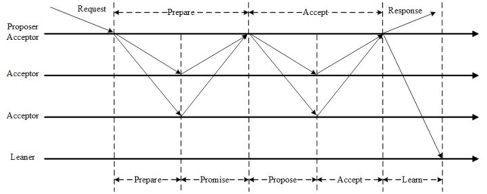
* 消息传递（没讲）
  * Prepare: Proposer生成全局唯一且递增的Proposal ID (可使用时间戳加Server ID)，向所有Acceptors发送Prepare请求，这里无需携带提案内容，只携带Proposal ID即可。
  * Promise: Acceptors收到Prepare请求后，根据约束条件，应答请求
    * 不再接受Proposal ID小于等于当前请求的Prepare请求。
    * 不再接受Proposal ID小于当前请求的Propose请求。
    * 不违反约束条件下，回复已经Accept过的提案中Proposal ID最大的那个提案的Value和Proposal ID，没有则返回空值。
  * Propose: Proposer 收到多数Acceptors的Promise应答后，从应答中选择Proposal ID最大的提案的Value，作为本次要发起的提案。如果所有应答的提案Value均为空值，则可以自己随意决定提案Value。然后携带当前Proposal ID，向所有Acceptors发送Propose请求。
  * Accept: Acceptor收到Propose请求后，在不违背自己之前作出的承诺下，接受并持久化当前Proposal ID和提案Value。
  * Learn: Proposer收到多数Acceptors的Accept后，决议形成，将形成的决议发送给所有Learners。
* Chubby回顾
  * Chubby是Google的分布式锁服务，GFS和Bigtable用它解决分布式协作、元数据存储和Master选举等与分布式锁服务相关的问题
  * 通常一个数据中心运行一个chubby cell（服务实例）
  * Chubby服务端最底层是容错日志系统，通过Paxos算法保证集群中所有机器上的**日志保持一致**
* Google实现Paxos算法的步骤
  * 根据共识决策选举一个coordinator
    * 每个coordinator配备一个序列号，对coordinator排序。
    * 每个副本维护目前所看到的**最高**的序列号，想竞标为coordinator的副本选择一个更高的唯一序列号，通过propose消息**组播**给其他副本
    * 如果其他副本没有收到更高序列号的消息，就回复promise消息，表明不处理序列号更低的其他coordinator，或者发送一个“否决”应答，表明不选举该coordinator 。
    * Promise消息包含发送者最近收到的值（作为共识的一个proposal），如果没有其他proposal，该值为空。
    * 如果某个副本收到大部分的promise消息，该副本被选举为coordinator，支持该coordinator的副本称为quorum（法定人群）。
    * 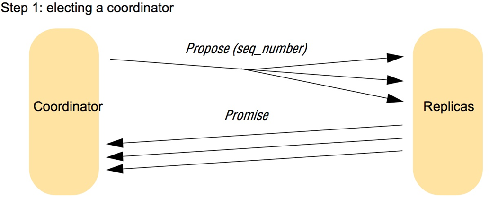
  * 寻找共识
    * 选举出的coordinator必须选出一个值，然后将这个值用accept消息发送给相关的quorum（法定人群）
      * 如果任一promise消息中包含一个值，那么coordinator必须从其收到的值的集合中选取一个；否则coordinator自由选择一个值
      * 收到accept消息的quorum成员**必须接受**这个值，并通过acknowledge消息确认收到该值。
      * Coordinator可以无限期等待，直到大部分副本确认已收到accept消息为止。
      * 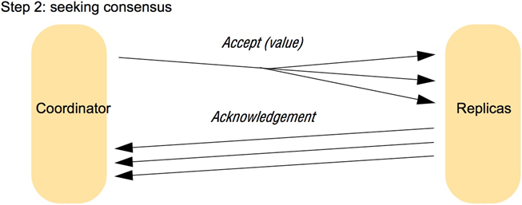
  * 达成共识
    * 如果大部分副本确认了，那么已经有效地达成了共识。然后coordinator广播一个commit消息通知其他副本已达成共识
    * 否则coordinator丢弃提议值，重新开始
    * 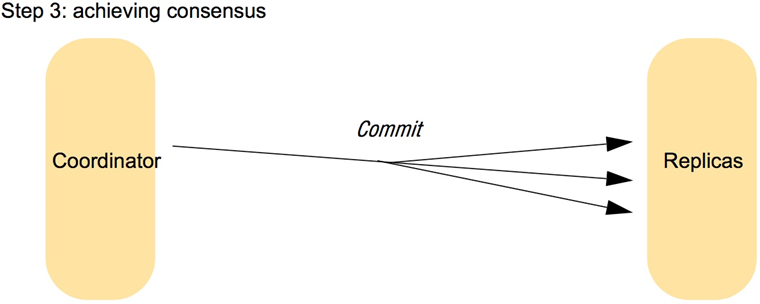

## Raft共识算法（考！）

* chatGPT：*Raft算法是一种分布式一致性算法，用于解决分布式系统中多个节点之间如何达成一致性的问题。Raft算法由 Diego Ongaro 和 John Ousterhout 在2014年提出，其目标是设计一种更易理解、更易实现、更易调试的分布式一致性算法。*

  *在Raft算法中，集群中的所有节点被分为三类：Leader、Follower和Candidate。Leader节点负责接收客户端的请求并将其复制到其他节点，从而确保所有节点的状态保持一致。Follower节点则接收来自Leader的复制请求，并将其应用到本地状态机。Candidate节点是一个过渡状态，在某些情况下会成为新的Leader节点，比如当前的Leader节点宕机了。*

  *Raft算法将分布式一致性问题分解为几个部分，包括Leader选举、日志复制和安全性等。Leader选举是Raft算法中最核心的问题，它通过选举一个节点来担任Leader，保证所有的节点都复制同一个日志序列。为了确保安全性，Raft算法采用了一种称为“先进大多数”的机制，即只要大多数节点复制了某个日志条目，那么该日志条目就被视为已提交，并可以被应用到本地状态机。*

  *相对于其它分布式一致性算法，如Paxos算法，Raft算法的设计更加模块化，易于理解和实现。此外，Raft算法提供了一些机制，如快照机制和领导者日志压缩，以提高算法的性能和可靠性。因此，Raft算法已经被广泛应用于许多领域，如数据库、分布式存储、分布式计算等*
