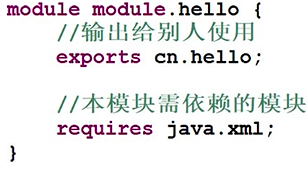
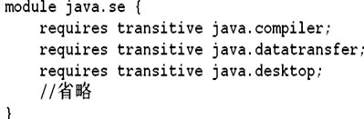
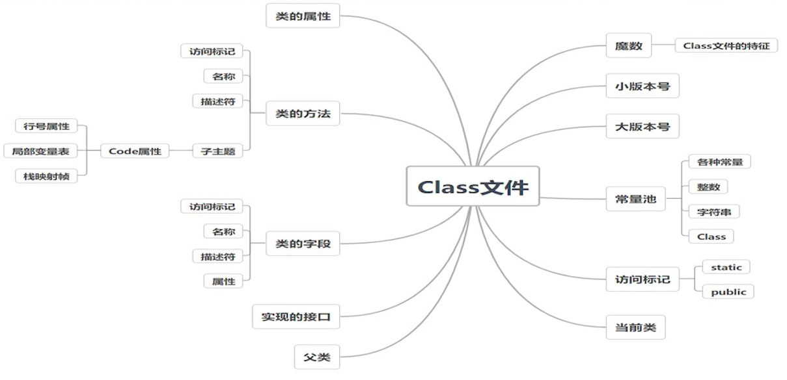
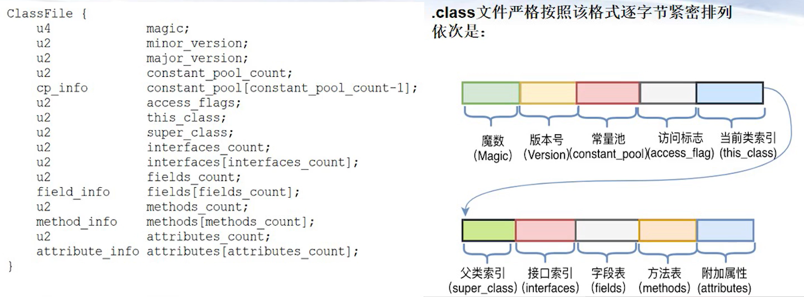
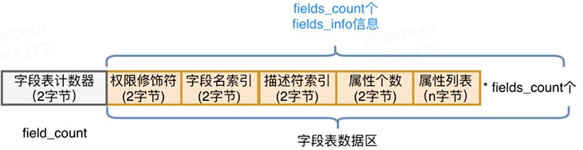
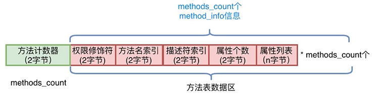

# (1)语法糖

## for & for-each

* for-each从JDK5开始引入
* for-each语法简介，可以避免越界
* for-each不可删除、替换元素。可以对元素进行操作，但是修改元素的指针是无效的。
* for-each不知道当前元素的位置索引，只能正向遍历不能反向遍历，不可同时遍历两个集合
* for和for-each性能接近  

## 枚举类型

* java5推出枚举类型 
* enum关键字声明枚举类，是Enum的子类，继承了相应方法，但无需写extends
* 不能直接new枚举类对象，enum内部有多少个值就有多少个实例对象
* 枚举类可以添加属性、构造函数、方法。构造函数只能是private或package-private(default)，内部调用
* ordinal()返回枚举值所在的索引位置，从0开始
* compareTo() 比较枚举值的索引位置大小
* valueOf() 将字符串初始化为枚举对象
* values() 返回所有枚举值
* toString() 返回枚举值的字符串表示

~~~java
public class FruitTest {
	public static void main(String[] args) {
		Fruit a1 = Fruit.ORANGE;
		System.out.println("Price is " + a1.getPrice());
	}
}

enum Fruit
{
	APPLE(10), ORANGE(8);
	private int price;
	
	Fruit(int price) {
		this.price = price;
	}
	
	public int getPrice() {
		return this.price;
	}
}
~~~

## 不定项参数

* 普通函数的形参列表的个数、类型、顺序固定
* JDK5提供了不定项参数的功能
* 类型后面加3个点，如int.../String... 本质是一个数组
* 一个方法只能由一个不定项参数，且必须位于参数列表最后
* 重载的优先级规则：规定参数的方法比可变参数的优先级更高；调用语句同时与两个带可变参数的方法匹配则报错

~~~java
public class VariableArgumentTest {

	public static void main(String[] args) {
		print();
		print("aaa");
		print("aaa", "bbb");
		print("aaa", "bbb", "ccc");

	}
	
	public static void print(String... args) {
        System.out.println(args.length);
        for (String arg : args) {
            System.out.println(arg);
        }
    }
	
	//当只有一个参数时，本方法优先级更高
	public static void print(String s)
	{
		 System.out.println("I am another method");
	}
	
	//错误：一个方法不可以有多个可变参数
//	public static void print(String... args, int... irgs) 
//	{
//        
//  }
	
	//错误：一个调用语句不能同时有2个带可变参数的方法适配
//	public static void print(String s1, String... args)
//	{
//		
//	}

}
~~~

## 静态导入

* JDK5引入
* import static 导入一个类的静态方法和静态变量，可以在写代码时简化书写
* 少使用*通配符，最好具体到静态变量或者方法。静态方法名具有明确特征，如有重名则需要补充类名

~~~java
import static java.lang.Math.pow;
import static java.lang.Math.sqrt;
import static java.lang.System.*;
import static java.lang.System.out;

public class ImportStaticTest {
	public static void importMath()	{
		int a=3, b=4, c=0;
		c = (int) sqrt(pow(a,2)+pow(b,2));
		c = (int) Math.sqrt(Math.pow(a,2)+Math.pow(b,2));
		out.println("c is " + c);
		System.out.println("c is " + c);		
	}
}
~~~

## 自动装箱和拆箱

* JDK5引入
* 简化基本类型和对象转换的写法
* 装箱和拆箱是编译器的工作，在class中已经转化。JVM没有自动拆箱和装箱的语句
* ==：基本类型是内容相同，对象是指针相同
* 封装类可能为null
* 封装类与基础数据类型进行+-*/==时会把封装类拆箱
* 封装类的==是判断内存地址

~~~java
Integer obj1 = 5;  //自动装箱
Integer obj2 = Integer.valueOf(5);

int a1 = obj1;     //自动拆箱
int a2 = obj1.intValue();

ArrayList<Integer> list = new ArrayList<>();
list.add(1);
list.add(Integer.valueOf(2));

int a3 = list.get(1);
int a4 = list.get(1).intValue();
~~~

~~~java
Integer a1 = 1000;
int a2 = 1000;
Integer a3 = 2000;
Long a4 = 2000L;
long a5 = 2000L;

System.out.println(a1 == a2);  //拆箱再进行数值比较
System.out.println(a3 == (a1 + a2));  //拆箱再进行数值比较
System.out.println(a4 == (a1 + a2));  //拆箱再进行数值比较
System.out.println(a5 == (a1 + a2));  //拆箱再进行数值比较

System.out.println(a3.equals(a1+a2)); //true，equals要求同类，且内容相同
System.out.println(a4.equals(a1+a2)); //false
System.out.println(a4.equals((long) (a1+a2))); //true

//System.out.println(a3 == a4); //不同类型不能比较
~~~

## 多异常并列

* JDK7引入，简化写法

~~~java
try{
    test();
}catch(IOException ex){
    //do
}catch(SQLException ex){
    //do
}

//如果多个异常处理方式是统一的
try{
    test();
}catch(IOException | SQLException ex){ //注意是管道符不是或
    //do
}

//注意！多异常之间不能有继承关系（直接间接都不可）
try{
    test();
}catch(IOException | FileNotFoundException ex){
    //这样满足左边的异常就一定不会进入右边的异常
}
~~~

## 整数类型用二进制数赋值

* JDK7引入
* 避免二进制计算
* 八进制：01234；十六进制0xabcd；

~~~java
byte a1 = (byte) 0b00100001;
short a2 = (short) 0b1010000101000101;
int a3 = 0b10100001010001011010000101000101;
int a4 = 0b101;
int a5 = 0B101; //B可以大小写
long a6 = 0b1010000101000101101000010100010110100001010001011010000101000101L;

final int[] s1 = { 0b00110001, 0b01100010, 0b11000100, 0b10000100 };
~~~

## 数字下划线

* JDK7引入
* 增加数字可读性和纠错功能
* 编译器会把下划线去掉
* 下划线前后必须有数字
* 可以连续下划线
* 可以二/八/十/十六进制使用

~~~java
long a1 = 9999999999L;
long a2 = 9_999_999_999L;

int a3 = 0b0111_1011_0001; //二进制, 0b开头
int a4 = 0_214;           //八进制, 0开头
int a5 = 123___45;         //可以多个下划线
int a6 = 0x7_B_1;          //十六进制
float a7 = 3.56_78f;       //float
double a8 = 1.3_45__67;    //double

int b1 = 0b_123_4;  //_必须在数字之间
int b2 = 0123_4_;   //_不能在末尾
int b3 = _123;      //_不能在开头
int b4 = 0_x_123;   //不能拆开0x
int b5 = 0x_51;     //_必须在数字之间
long b6 = 1000_L;   //_必须在数字之间
float b7 = 1.34f_;  //_不能在末尾
~~~

## 接口方法

* Java 8 推出接口的默认方法/静态方法，为Lambda表达式提供支持
* 接口的方法需要default关键字，其他定义和普通函数一样
  * 不是package里面的权限
  * 默认方法不能重写Object中的方法（toString，hashCode）
  * 实现类可继承/重写父接口的默认方法
  * 接口可以继承/重写父接口的默认方法
  * 当父类和父接口都有同名都参数的默认方法，子类继承父类的默认方法。（这样可以兼容JDK8之前的代码）
  * 子类实现了两个接口，且两接口有默认方法是同名同参数的，则编译失败。否则必须在子类中重写这个default方法

~~~java
public interface Animal {
	public void move();
}
public interface NewAnimal {
	public default void move()
	{
		System.out.println("I can move.");
	}	
//  不能重写Object的方法
//	public default String toString()
//	{
//		return "aaa";
//	}
}
public interface NewLandAnimal extends NewAnimal {
	public default void move()
	{
		System.out.println("I can move on land.");
	}
}
public abstract class NewFlyAnimal implements NewAnimal{
	public void move()
	{
		System.out.println("I can move in sky");
	}
}
public class NewLion implements NewLandAnimal{
	public static void main(String[] args) {
		new NewLion().move();
	}
}
public class NewSwan extends NewFlyAnimal implements NewLandAnimal{
	public static void main(String[] args) {
		new NewSwan().move();
		//当父类和父接口都有同名的方法，以父类的为主
		//这样可以兼容JDK7及以前的代码
	}
}
public class Lion implements Animal, NewAnimal {
	public static void main(String[] args) {
		new Lion().move();
	}
	//当实现的2个接口都含有同名方法，且至少有一个是默认方法
	//则子类需要重写该方法，以免歧义
	public void move() {
		NewAnimal.super.move();		
        //删NewAnimal，super代表的是Object对象，没有move方法
        //删super，move不是静态方法，不能通过类名访问
	}	
}
~~~

* java8 接口静态static方法
* 该静态方法属于本接口，不属于子类/子接口
* 子类（子接口）没有继承静态方法，只能通过接口名来调用

~~~java
public interface StaticAnimal {
	public static void move()
	{
		System.out.println("I can move");
	}
}
public interface StaticLandAnimal extends StaticAnimal {
	//也继承不到StaticAnimal的move方法
}
public class StaticSwan implements StaticAnimal {
	
	public static void main(String[] args) {
		StaticAnimal.move();
		StaticLandAnimal.move(); //error
		new StaticSwan().move(); //error
	}
}
//	public static void move()
//	{
//		System.out.println("I can fly");
//	}
~~~

* java 9 接口的私有方法（带实现）
* 解决多个默认方法/静态方法的内容重复问题
* 私有方法属于本接口，只在本接口内使用，不属于子类/子接口
* 子类（子接口）没有继承该私有方法，也无法调用
* 静态私有方法可以被静态/默认方法调用，非静态私有方法被默认方法调用

~~~java
public interface PrivateAnimal {
	public default void run()
	{
		move();
		move2();
		System.out.println("I can run");
	}
	public default void fly()
	{
		move();
		System.out.println("I can fly");
	}
	private void move()
	{
		//非静态的私有方法
		System.out.println("I can move");
		System.out.println("I am growing");
	}
	
	public static void run2()
	{
		move2();
		System.out.println("I can run");
	}
	public static void fly2()
	{
		move2();
		System.out.println("I can fly");
	}
	private static void move2()
	{
		//静态的私有方法
		System.out.println("I can move");
		System.out.println("I am growing");
	}
}
~~~

* 接口VS抽象类（java12及之前）
  * 相同点：
    * 都是抽象的，不能被实例化，不能new
    * 可以有实现方法
    * 可以不需要继承者实现所有方法
  * 不同点：
    * 抽象类最多只能继承一个。接口可以实现多个
    * 接口的变量默认是public static final且必须具有处置，子类不能修改。抽象类的变量默认是default，子类可以继承修改
    * 接口没有构造函数。抽象类有构造函数
    * 接口没有main函数。抽象类可以有main函数
    * 接口有public/default/private方法。抽象类有public/private/protected/不写关键字(default)的方法
* 接口的方法建议少用，如果有Lambda表达式需求，可以使用
  * 默认方法：default标注，可以被子类/子接口所继承/重写
  * 静态方法：static标注，只属于本接口，不属于子类/子接口，子类/子接口可以访问
  * 私有方法：private标注，只属于本接口，不属于子类/子接口

## try-with-resource

* 程序打开外部资源，在使用后需要正确关闭。考虑到异常，是用try-catch-finally进行保证
* JDK7提供try-with-resource
* 将输入流放到try后面的小括号里（以前是没有括号的），里面是资源对象，没有finally。try到catch到结束以后，try后括号里的资源会被自动关闭。编译器会加入finally

~~~java
//老
FileInputStream fis = ......;
try{
    ......
}catch(Exception e){
    ......
}finally{
    if(null!=fis){
        fis.close
    }
}

//新
try(FileInputStream fis = ......){
    ......
}catch(Exception e){
    ......
}
~~~

* JDK7的资源要求定义在try中，如果已经在 外面定义，则需要一个本地变量
* JDK9可以直接使用外部资源变量，不再要求定义临时变量

~~~java
//JDK7
FileInputStream fis1 = ......;
try(FileInputStream fis2 = fis1){
    ......
}catch(Exception e){
    ......
}

//JDK9
FileInputStream fis = ......;
try(fis){
    ......
}catch(Exception e){
    ......
}
~~~

* 原理：资源对象必须实现AutoCloseable接口（新的自带接口），即close方法

~~~java
public class MyTryWithResourceTest {
	public static void main(String[] args) {
		//将会自动调用conn的close方法
		try(MyConnection conn = new MyConnection()){
			conn.sendData();
		}catch(Exception ex){
			ex.printStackTrace();
		}
	}
}

class MyConnection implements AutoCloseable {
	 public void sendData() throws Exception {
		 System.out.println("Send Data....");
	 }
	 public void close() throws Exception {
		 System.out.println("Close....");
	 }
}
~~~

## ResourceBundle文件加载

* 在JDK9之前，ResourceBundle默认以ISO-8859-1的方式加载Properties文件，这需要JDK自带的native2ascii工具对文件进行转义。
* 西欧的字符编码，要求其他字符转化成Unicode字符，以ISO-8859-1的方式进行加载。JDK9及以后删除了native2ascii工具，Properties文件可以直接以UTF-8保存，之前转码后的文件不受影响，如果发现不是有效的UTF-8，则以ISO-8859-1的方式加载

## var类型

* java之前是强类型的程序语言
* JDK 10 推出var：局部变量推断，避免信息冗余，对齐变量名，更容易阅读
* 本质还是强类型，编译器负责推断类型，并写入字节码文件，因此推断后不能更改。和传统弱类型有区别
* var的限制
  * 可以作用在局部变量上，非类成员变量
  * 可以用于for/for-each
  * 声明必须初始化
  * 不能用在形参和返回类型
  * 滥用导致整体阅读性变差
  * var只在编译时其作用，没在字节码中引入新的内容，也没有串门的JVM指令去处理var

~~~java
int a1 = 5;
float a2 = 0.25f;
String a3 = "abc";
URL a4 = new URL("https://github.com/");

var b1 = 5;
var b2 = 0.25;
var b3 = "abc";
var b4 = new URL("https://github.com/");		

//var b0;              //error 必须赋初值
//b3 = 5;              //error 类型被确定不能被修改
//var b5=5,b6=6,b7=7;  //error 不能用var推断多个变量，不适合用于复合语句
//var b8=null;         //error 无法推断是什么类型

int[] nums = new int[3];
//var nums2 = {0,1,2};  //error 无法推断是什么数组

for(var i=0;i<nums.length;i++){
    nums[i] = i*2;
}
for(var i:nums){
    System.out.println(i);
}

//var可以和三元操作符配合，再来确定类型
var a5 = a1>b1? 10:15;
var b5 = a1+2<=b1? a1+10:b3;
System.out.println(b5.getClass().getName());

//var也可以推断出obj具有print方法
var obj = new Object(){ 
    public void print(){
        System.out.println("I can print"); 
    }
};		
obj.print();

//var对继承有效
//子类型var可以赋值给父类型的var
var obj1 = new Father();
var obj2 = new Son();
obj1 = obj2;  //隐含子类型对象转为父类对象

//var不能放在形参或者返回值
public var f1(var a){
    return 1;
}
~~~

## switch

* 支持的类型：byte(Byte), short(Short), char(Character), String(JDK 7), Enum(JDK 5)。截止JDK12，不支持long/float/double
* JDK12 多分支合并，->直接连接判定条件和动作，不需要break

~~~java
//老
int result = 0;	
switch(month)
{
    case "Jan": case "Mar": case "May": case "July": 
    case "Aug": case "Oct": case "Dec": 
        result = 31;
        break;
    case "Apr": case "June": case "Sep": case "Nov": 
        result = 30;
        break;
    case "Feb":
        result = 28;
        break;
    default: 
        result = -1;
}

//新
//this method works based on Java 12.
//modify project properties/Java Compiler/Enable preview features
int result = 0;
//new switch, don't need break clauses
//-> 之后 : expression/block/throw   
switch(month)
{
    case "Jan","Mar","May","July","Aug","Oct","Dec" -> result = 31;			
    case "Apr","June","Sep","Nov" -> result = 30;
    case "Feb" -> result = 28;
    default -> result = -1;
}

//switch返回值
int num = 2;
int days = switch (num) {
    case 1,3,5,7,8,10,12 -> 31;
    case 4,6,9,11 -> 30;
    default -> {
        int result = 28;
        break result;  //代码块中break返回结果
    }
};
//
String word = switch (num) {
    case 1 : break "One";
    case 2 : break "Two";
    default : {
        String result = String.format("Other (%d)", num);
        break result;
    }
};
/*如果需要多个语句来处理并返回，视频中(JDK12)是break result;来将result值传递给days，但是我本地的JDK17似乎并不支持。查询搜索可知，在JDK13(还是14)中使用的是yield关键字返回值。可能12并非长期支持，所以没有对此做向下兼容
*/
//更改
int num = 2;
int days = switch (num) {
    case 1,3,5,7,8,10,12 -> 31;
    case 4,6,9,11 -> 30;
    default -> {
        int result = 28;
        yield result;  //代码块中yield返回结果
    }
};
//
String word = switch (num) {
    case 1 : yield "One";
    case 2 : yield "Two";
    default : {
        String result = String.format("Other (%d)", num);
        yield result;
    }
};
~~~

# (2)泛型

## 入门

* 问题：集合存放多个不同类型的对象容易出现转型错误ClassCastException

~~~java
ArrayList list = new ArrayList();
list.add(123);
list.add("456");
list.add(789);

for(Object o:list){
    //编译可以通过  运行报错
    System.out.println(((String) o));
}
~~~

* 解决：集合存放多个对象时限定一种类型。不需要转型
* 泛型：Generic Programming，JDK1.5推出。编写的代码可以被很多不同类型的对象所重用

~~~java
//<String> 限定了list只能存放字符串		
ArrayList<String> list = new ArrayList<String>();
list.add("123");
list.add("456");
list.add("789");
String a1 = list.get(1);
for(String o:list){
    System.out.println(o);
}

//Java 7 菱形语法 限定存储Integer
ArrayList<Integer> list2 = new ArrayList<>();
list2.add(123);
list2.add(456);
list2.add(789);
int a2 = list2.get(1);
~~~

* 泛型
  * 泛型类：ArrayList、HashSet、HashMap等
  * 泛型方法：Collection.binarySearch，Arrays.sort等。虽类本身不能被很多类所使用，但是其方法可以被很多类所使用
  * 泛型接口：List，Iterator等
* 泛型本质：参数化类型，避免类型转换，代码可复用

~~~java
//Collections.binarySearch方法支持泛型
int pos1 = Collections.binarySearch(list, "456");
int pos2 = Collections.binarySearch(list2, 456);

//Iterator接口支持泛型
Iterator<String> iter = list.iterator();  
while(iter.hasNext()){  
    System.out.println(iter.next());  
}
Iterator<Double> iter2 = set1.iterator();  
while(iter.hasNext()){  
    System.out.println(iter.next());  
}
~~~

## 自定义泛型设计

* 泛型类：具有泛型变量的类
  * 在类名后用\<T>来代表引入类型，没有template关键字
  * 多个字母表示多个引入类型，如\<T,U>
  * 引入类型可以修饰成员变量/参数/返回值
  * 泛型类调用：传入具体的类

~~~java
public class Interval<T> {
	private T lower;
	private T upper;

	public Interval(T lower, T upper) {
		this.lower = lower;
		this.upper = upper;
	}
	//get, set ......
}

Interval<Integer> v1 = new Interval<Integer>(1,2);
int lower = v1.getLower();
int upper = v1.getUpper();		
System.out.println(lower + "," + upper);

Interval<Integer> v2 = new Interval<>(1,2);		
Interval<Integer> v3 = getReverse(v2);		
System.out.println(v3.getLower() + "," + v3.getUpper());

/*注意写法，public和static是修饰符，<T>代表整个方法的引入类型是什么，泛型方法的指定的变量，Interval<T>是返回值
*/
public static <T> Interval<T> getReverse(Interval<T> interval){
    return new Interval<T>(interval.getUpper(), interval.getLower());
}
~~~

* 泛型方法：具有泛型参数的方法
  * 该方法可在普通类/泛型类中
  * 引入类型\<T>在修饰符后，返回类型前

~~~java
public class ArrayUtil {
	public static <T> T getMiddle(T... a){
		return a[a.length/2];
	}
}

String s1 = ArrayUtil.<String>getMiddle("abc", "def", "ghi");
Integer i1 = ArrayUtil.getMiddle(1,2,3);//可以从参数局部推断，可以省略方法前的泛型

//null is ok，只要不是全null
String s2 = ArrayUtil.<String>getMiddle("abc", "def", null);

//error 寻找共同超类（这里是Number），再转型
Integer i2 = ArrayUtil.getMiddle(1,2.5f,3L);
~~~

* 泛型接口
  * 和泛型类相似，在类名后加\<T>
  * T用来指定方法返回值和参数
  * 实现接口时，指定类型 

~~~java
public interface Calculator<T> {
	public T add(T operand1, T operand2);
}

public class IntegerCalculator implements Calculator<Integer> {
//实现接口时就指定类型
	public Integer add(Integer operand1, Integer operand2) {
		return operand1 + operand2;
	}
}

IntegerCalculator c1 = new IntegerCalculator();
System.out.println(c1.add(1,2));

Calculator<Integer> c2 = new IntegerCalculator();//可以把new出来的对象转换为父接口的类型对象
System.out.println(c1.add(1,2));

//T也可以再是一个泛型类
public class Interval<T> {
	private T lower;
	private T upper;

	public Interval(T lower, T upper) {
		this.lower = lower;
		this.upper = upper;
	}
	//get, set ......
}
public class IntervalCalculator implements Calculator<Interval<Integer>>{

	public static void main(String[] args) {
		Calculator<Interval<Integer>> c = new IntervalCalculator();
		
		Interval<Integer> operand1 = new Interval<Integer>(1,2);
		Interval<Integer> operand2 = new Interval<Integer>(3,4);
		Interval<Integer> operand3 = c.add(operand1, operand2);
		System.out.println("[" + operand3.getLower() + "," + operand3.getUpper() + "]");//[4,6]
	}

	public Interval<Integer> add(Interval<Integer> operand1, Interval<Integer> operand2) {
		int lower = operand1.getLower() + operand2.getLower();
		int upper = operand1.getUpper() + operand2.getUpper();
		return new Interval<Integer>(lower, upper);
	}
}
~~~

## 泛型类型限定

* 特定场合下，需要对类型进行限定（使用某些特定方法时）

* 泛型限定：

  * \<T extends Comparable>约定必须是Comparable的子类
  * extends固定，后面可以多个，以&拼接，如\<T extends Comparable & Serializable>
  * 不管后面是类还是接口，都统一用extends关键字
  * extends限定可以有多个接口，但只能由一个类，且类必须排第一位，（类比Java继承），多个接口先后顺序没关系
  * 逗号隔参数，\<T extends File & Cloneable, U extends Serializable>

* 泛型类之间的继承

  * 无论S和T之间是什么关系，Pair\<S>和Pair\<T>之间都没有任何关系

    ~~~java
    Pair<Apple> apples = new Pair<>(new Apple(3), new Apple(4));
    Pair<Fruit> fruits = apples;
    fruits.setFirst(new Orange(5)); //报错
    ~~~

  * 泛型类可以扩展或实现其他的类，如ArrayList<T\>实现List<T\>

    ~~~java
    List<Orange> oranges = new ArrayList<Orange>();
    ~~~

* 泛型通配符类型

  * 弥补泛型类直接继承关系的不足

  * 上限界定符，Pair\<? extends S>，Pair能接受的参数类型是S自身或者子类。

    ~~~java
    //Pair<Apple>  and Pair<Orange> 皆可 
    //Fruit的子类，都有getSize()方法
    public void printFruits(Pair<? extends Fruit> fruits){		
        Fruit first=fruits.getFirst();
        Fruit second=fruits.getSecond();
    
        System.out.println("The sizes of fruits are " 
                           + first.getSize() + "," + second.getSize());
    }
    ~~~

    只能get不能set，编译器只能保证获取的类型，不能保证放入的对象是什么类型

    ~~~java
    Pair<Apple> apples = new Pair<>(new Apple(3), new Apple(4));
    Pair<? extends Fruit> fruits = apples;
    //fruits 里面保存的是Fruit的子类，但是不知道具体是哪个子类，所以不能保存
    //fruits.setFirst(new Orange(5)); //编译错误
    ~~~

  * 下限界定符，Pair\<? super S>，Pair能接受的参数类型是S的自身或者超类（Object <- Fruit <- Apple <- GreenApple）

    ~~~java
    Pair<? super Apple> fruits = new Pair<Fruit>();
    		
    fruits.setFirst(new Apple(5)); //Apple到超类Fruit的转型
    fruits.setSecond(new GreenApple(5)); //GreenApple到超类Fruit的转型
    fruits.setSecond(new Object());//Object无法向下转为Apple的超类
    ~~~

    只能set不能get，编译器保证放入的是S本身或者超类，但不保证获取的是什么具体类型

    void setFirst(? super Apple) ，只要放进来的是Apple及其子类，肯定可以转型到Apple的某一个父类

    ? super Apple getFirst()，无法得知获取的类型，只能是Object

    ~~~java
    Pair<? super Apple> fruits = new Pair<Fruit>();
    
    fruits.setFirst(new Apple(5)); //Apple到超类的转型
    fruits.setSecond(new GreenApple(5)); //GreenApple到超类的转型
    
    //Fruit obj = fruits.getFirst(); //也未知其超类对象的方法，故报错			
    //fruits.getFirst().hello(); //也未知其超类对象的方法，故报错	
    ~~~

  * 泛型PECS原则：Procedure Extends，Consumer Super。如果要从泛型类读取类型T的数据，并且不能写入，这时候泛型类是一个生产者，他提供数据给外界程序使用，可以使用? extends通配符。如果要向泛型类写入类型T的数据并且不需要读取，可以使用下界限定符? super，此时泛型类可以看做消费者，在消费你提供的数据。如果既想写又想读，就不要通配符

  * 无限定类型的泛型：Pair\<?>，无法get（不确定出来是什么类型，get后的结果只能赋值给Object），也无法set（无法放入任何对象包括Object）。很少用

## 泛型实现的本质和约束

* 泛型是JDK1.5引入的新特性，JDK向后兼容，带来问题：如果新编译出来的字节码文件里面带有泛型信息，就和之前的JVM指令不兼容，JVM为了保证兼容性，在JVM/class里是不存在泛型对象的
* JVM采用类型擦除技术，在class里只有普通的类和方法，没有泛型对象
* 擦除泛型变量，替换为原始类型（raw type），无限定的话则为Object，有限定则为第一个类型

~~~java
public class Pair<T> {
	private T first;
	private T second;

	public Pair(T first, T second) {
		this.first = first;
		this.second = second;
	}

	public T getFirst() {
		return first;
	}

	public void setFirst(T first) {
		this.first = first;
	}
}

//Pait<T>经过类型擦除后的代码
public class Pair {
	private Object first;
	private Object second;

	public Pair(Object first, Object second) {
		this.first = first;
		this.second = second;
	}

	public Object getFirst() {
		return first;
	}

	public void setFirst(Object first) {
		this.first = first;
	}
}

public class NewPair<T extends Comparable & Serializable>/*都是接口*/ {
	private T first;
	private T second;

	public NewPair(T first, T second) {
		this.first = first;
		this.second = second;
	}

	public T getFirst() {
		return first;
	}

	public void setFirst(T first) {
		this.first = first;
	}
}
//有限定擦除后
public class NewPair {
	private Comparable first;
	private Comparable second;

	public NewPair(Comparable first, Comparable second) {
		this.first = first;
		this.second = second;
	}

	public Comparable getFirst() {
		return first;
	}

	public void setFirst(Comparable first) {
		this.first = first;
	}
}
~~~

* 擦除泛型变量后，为了保证类型的安全性，需要自动进行类型转换

  ~~~java
  Fruit a = fruits.getFirst();
  --->
  Object a1 = fruits.getFirst();
  Fruit a = (Fruit)a1;
  ~~~

* 添加自动桥方法来完成整个方法的重载

  ~~~java
  public class IntPair extends Pair<Integer> {
  	public IntPair(Integer first, Integer second) {
  		super(first, second);
  	}
  
      //此处有两个setFirst方法，另一个来自继承父类，形参为Object，里面会调用IntPair.setFirst
  	public void setFirst(Integer first) {
  		super.setFirst(first);
  	}
  
  	public static void main(String[] args) {
  		IntPair nums = new IntPair(1, 2);
  		Pair<Integer> nums2 = nums; // 转为父类对象
  		nums2.setFirst(3); // 多态调用子类的setFirst方法。通过自动桥方法来使得多态的方法能被正确调用
  	}
  }
  ~~~

* 泛型约束条件

  * 不能用基本类型来实例化泛型
  * 运行时类型查询只适用于原始类型
  * 不能创建参数化类型的数组
  * 可变参数警告
  * 不能实例化类型变量
  * 不能构造泛型数组
  * 泛型类的静态上下文中类型变量无效
  * 不能抛出或捕获泛型类的异常实例
  * 可以消除对受查异常（checked exception）的检查
  * 类型擦除后引发的方法冲突

## Java类型的协变和逆变

* 子类型

* 类型变化关系（type variance）：更复杂类型中的子类型关系，与子类型之间的关系相关联

* 例子：假设Cat是Animal的子类，任何包含Cat的语句是否可以被Animal语句来取代？比如List<Cat\>是否可以被List\<Animal>取代，一个返回值为Cat的函数是否可以被返回值为Animal的函数取代，一个List\<Animal>中的Cat实例和Fish实例如何比较

* Type Variance形式化定义：

  * A、B是类型，f( · )表示类型转换（可能是方法、数组或者泛型等），$A\leq B$表示A继承于B
  * f( · )是协变（covariant）的，如果$A \leq B \Rightarrow f(A)\leq f(B)$
  * f( · )是逆变（contravariant）的，如果$A \leq B \Rightarrow f(B)\leq f(A)$
  * f( · )是不变（invariant）的，如果上述两种关系都不成立，即f(A)和f(B)没有关系
  * f( · )是双变（bivariant）的，如果$A \leq B \Rightarrow f(B)\leq f(A) \space and \space f(B) \leq f(A)$

* Java数组是协变的，如：String是Object的子类，String[]是Object[]的子类

  ~~~java
  // A <- B <- C
  B[] array1 = new B[1];
  array1[0] = new B();
  A[] array2 = array1;
  
  try {
      array2[0] = new A(); 
      // compile ok, runtime error 父类不能转换为子类
  } catch (Exception ex) {
      ex.printStackTrace();
  }
  
  try {
      array2[0] = new C(); 
      // compile ok, runtime ok
  } catch (Exception ex) {
      ex.printStackTrace();			
  }
  ~~~

* Java的（原始的）泛型是不变的，如：String是Object的子类，List\<String>和List\<Object>没有关系

  ~~~java
  ArrayList<B> list1 = new ArrayList<B>();
  list1.add(new B());
  
  ArrayList<A> list2 = list1;  
  //compile error
  ~~~

* 弥补继承上不足，Java泛型采用通配符，支持协变和逆变（PECS原则）

  ~~~java
  ArrayList<? extends A> list3 = new ArrayList<B>();   //协变
  ArrayList<? super B> list4 = new ArrayList<A>();     //逆变 A是B的父类，ArrayList<A>转型为? super B，ArrayList<A> <= ArrayList<? super B>
  ~~~

* 复合情况下，数组协变，泛型不变

  ~~~java
  B[] r1 = test(new ArrayList<B>()); //compile error 实参是ArrayList<B>，形参是ArrayList<A>，两者没有关系
  A[] r2 = test(new ArrayList<B>()); //compile error 同上，不匹配，根本不用考虑返回值
  Object[] r3 = test(new ArrayList<Object>()); //compile error ArrayList<Object>和ArrayList<A>之间也没有任何关系
  
  A[] r4 = test(new ArrayList<A>());
  Object[] r5 = test(new ArrayList<A>());
  
  public static A[] test(ArrayList<A> list){
      return new A[1];
  }
  ~~~

* 方法中的情况：JDK1.4重写的方法参数和返回值要求一样，JDK1.5后重写的方法，参数要求一样，返回值是协变的，可以说父类返回值的子类

  ~~~java
  class Father{
  	public B f1(B obj){
  		System.out.println("Father.f1()");
  		return new B();
  	}
  }
  
  class Son extends Father{
  	public B f1(B obj){
  	//public C f1(B obj)   //返回值是C，也是对的 
  		System.out.println("Son.f1()");
  		return new C();
  	}
  }
  ~~~

# (3)Java反射

## 入门

* reflection
  * 程序可以访问、检测和修改它本身状态或行为的能力，即自描述和自控制
  * 可以在运行时加载、探知和使用编译期间完全未知的类，甚至在程序运行的时候生成一个新的类，再加载再运行
  * 加入动态语言特性，弥补Java强类型语言的不足
  * java.lang.reflect包在Java2就有，Java5完善
  * 在运行中分析类的能力，可以看类到底有什么属性方法
  * 在运行中查看和操作对象
    * 基于反射自由地创建对象
    * 反射构建出无法直接访问的类（比如构造函数为private的类，在外界无法new，可以通过反射产生出具体的对象）
    * set或get到无法访问的成员变量（比如某类的成员变量是private而且没有getter和setter，可以临时性把属性从private改为public）
    * 调用不可访问 方法
  * 实现通用的数组操作代码
  * 类似函数指针的功能（将某类的成员方法封装成Method对象，传递给其他类或者方法来使用，参数可以是某个函数）

~~~java
/*创建对象的几种方法*/
//第一种 直接new 调用构造函数，创建对象的方法
A obj1 = new A();
obj1.hello();	

//第二种 clone
public class B implements Cloneable {
	public void hello(){
		System.out.println("hello from B");
	}
	
	protected Object clone() throws CloneNotSupportedException{
		return super.clone();
	}
}
//obj3是obj2的克隆对象  没有调用构造函数 生成对象的速度更快
B obj2 = new B();
obj2.hello();		
//新对象和旧对象的内容一样，内存里是两个副本。注意深度克隆和浅克隆的区别。
B obj3 = (B) obj2.clone();
obj3.hello();

//第三种 序列化  没有调用构造函数 
//将对象通过文件流输出为文件，创建对象时将包含数据的文件读入就可以重新创建出一个对象
public class C implements Serializable {
	private static final long serialVersionUID = 1L;

	public void hello() {
		System.out.println("hello from C");
	}
}
//序列化会引发安全漏洞，未来将被移除出JDK，请谨慎使用！！！
C obj4  = new C();
ObjectOutputStream out = new ObjectOutputStream(new FileOutputStream("data.obj"));   
out.writeObject(obj4);   
out.close();   

ObjectInputStream in = new ObjectInputStream(new FileInputStream("data.obj"));   
C obj5 = (C) in.readObject();   
in.close();   
obj5.hello(); 

//第四种 反射 newInstance  调用构造函数	    
Object obj6 = Class.forName("A").newInstance();		
Method m = Class.forName("A").getMethod("hello"); //获取A类hello方法的句柄
m.invoke(obj6);

A obj7 = (A) Class.forName("A").newInstance();//可以直接强转

//第五种 反射 newInstance  调用构造函数
Constructor<A> constructor = A.class.getConstructor();   
A obj8 = constructor.newInstance();
obj8.hello();
~~~

## 反射关键类

* Class：类型表示，JVM为每个对象保留其类型标识信息（Runtime Type Identification）

  ~~~java
  //三种获取方式
  Class c1 = s1.getClass();
  
  Class c2 = Class.forName("java.lang.String");
  
  Class c3 = String.class;
  System.out.println(c3.getName());	
  ~~~

* Field：成员变量

  ~~~java
  class A{
  	public int age;
  	private String name;
  	
  	public A(int age, String name){
  		this.age = age;
  		this.name = name;
  	}
  }
  
  A obj = new A(20, "Tom");
  Class c = obj.getClass();
  
  //获取本类及父类所有的public字段
  Field[] fs = c.getFields(); 
  System.out.println(fs[0].getName() + ":" + fs[0].get(obj));
  
  //获取本类所有声明的字段
  Field[] fs2 = c.getDeclaredFields();
  for(Field f : fs2){
      f.setAccessible(true);//使这个对象的这个属性临时性地从private编程public，就可以获取变量名和变量值
      System.out.println(f.getName() + ":" + f.get(obj));
  }
  ~~~
  
* Method：成员方法

  ~~~java
  class B {
  	public void f1() {
  		out.println("B.f1()...");
  	}
  
  	private String f2(String s) {
  		out.println("B.f2()...");
  		return s;
  	}
  }
  
  B obj = new B();
  Class c = obj.getClass();
  
  // 获取public方法 包括父类和父接口
  Method[] ms = c.getMethods();
  for (Method m : ms) {
      if ("f1".equals(m.getName())) {
          m.invoke(obj, null);//非静态方法invoke时需传进去一个对象
      }
  }
  
  // 获得该类的所有方法
  Method[] ms2 = c.getDeclaredMethods();
  for (Method m : ms2) {
      if ("f2".equals(m.getName())) {
          m.setAccessible(true);
          String result = (String) m.invoke(obj, "abc");//abc是实参，invoke的返回值就是函数的返回值，转型为String
          out.println(result);
      }
  }
  ~~~

* Constructor：构造函数

  ~~~java
  class D {
  	private int num;
  
  	public D() {
  		this.num = 10;
  	}
  
  	public D(int num) {
  		this.num = num;
  	}
  
  	public void printNum() {
  		System.out.println(this.num);
  	}
  }
  
  
  D d = new D();
  Class c = d.getClass();
  
  Constructor[] cons = c.getConstructors();
  for (Constructor con : cons) {
      if (con.getParameterCount() > 0) {
          // 形参个数大于0 是有参构造函数
          D obj = (D) con.newInstance(100);//传入实参
          obj.printNum();
      } else {
          // 无参构造函数
          D obj = (D) con.newInstance();
          obj.printNum();
      }
  }
  ~~~

* 父类/父接口

  ~~~java
  class Father { }
  class Son extends Father implements Cloneable, Comparable{
  	protected Object clone() throws CloneNotSupportedException{
  		return super.clone();
  	}
  
  	public int compareTo(Object o) {
  		return 0;
  	}
  }
  
  
  Son son = new Son();
  Class c = son.getClass();
  
  Class father = c.getSuperclass();//获取父类信息Father
  System.out.println(father.getName());
  
  Class[] inters = c.getInterfaces();//获取所有的父接口
  for(Class inter : inters){
      System.out.println(inter.getName());
  }
  ~~~

* 类的修饰符，注解，包等信息参阅API手册

## 反射的应用

* JDBC：Connection连接到各个不同的数据库，采用反射的办法来构建出Java和数据库之间不同的桥梁。

~~~java
//构建Java和数据库之间的桥梁介质
try{            
    Class.forName("com.mysql.jdbc.Driver");//将类加载进JVM，还没有new
    //Class.forName(className, true, currentLoader) //和上面等价，用类加载器去加载
    //通知类加载器加载此类的class文件
    System.out.println("注册驱动成功!");
}catch(ClassNotFoundException e1){
    System.out.println("注册驱动失败!");
    e1.printStackTrace();
    return;
}

//构建Java和数据库之间的桥梁：URL，用户名，密码
conn = DriverManager.getConnection(url, "root", "123456");
//DriverManager将会挑选加载合适的驱动类，newInstance办法，并采用getConnection方法连接，返回这个连接
//如果换一个数据库，只需要把商法的com.mysql.jdbc.Driver的类名换掉，这个类名也可以从配置文件读入
~~~

* 数组扩充：给定一个数组将其长度扩大一倍。Java的数组一旦创建，其长度不再更改。方法：新建一个大数组（相同类型），然后将旧数组的内容拷贝进去

~~~java
public static Object goodCopy(Object oldArray, int newLength) {
    // Array类型
    Class c = oldArray.getClass();
    // 获取数组中的单个元素类型
    Class componentType = c.getComponentType();
    // 旧数组长度
    int oldLength = Array.getLength(oldArray);
    // 新数组
    Object newArray = Array.newInstance(componentType, newLength);
    // 拷贝旧数据
    System.arraycopy(oldArray, 0, newArray, 0, oldLength);
    return newArray;
}

int[] a = { 1, 2, 3, 4, 5 };
a = (int[]) goodCopy(a, 10);
~~~

* 动态指定方法。给定类名、方法名即可执行。加上定时器，即可做定时任务执行

~~~java
class Worker {
	public static void hello() {
		System.out.println("Hello java!");
	}
}
class MyTask extends TimerTask {
	public void run() {
		try {
			Method m = Class.forName("Worker")
					.getClass().getMethod("hello");
			m.invoke(null);// 静态方法可以不用new对象
		} catch (Exception e) {
			e.printStackTrace();
		}
	}
}

Timer timer = new Timer();

Calendar now = Calendar.getInstance();//获得当前时间对象
now.set(Calendar.SECOND, 
        now.get(Calendar.SECOND) + 1);//时间对象增加1s
Date runDate = now.getTime();//作为定时任务的启动时间

MyTask task2 = new MyTask();//new 定时任务
timer.scheduleAtFixedRate(task2, runDate, 3000); 
// 固定速率 每隔3秒自动运行task2 里面的run方法通过反射来调用Worker.hello()方法

Thread.sleep(15000);
timer.cancel(); // 取消定时器
~~~

* Json和Java对象互转
* Tomcat的Servlet的创建
* MyBatis Object-Relation Mapping
* Spring， IOC的Bean容器（HashMap）
* Reflection增强工具包

## 编译器API

* 反射前提：类（class文件）必须先存在

* 编译器API：

  * 对.java文件即时编译
  * 对字符串即时编译
  * 监听在编译过程中产生的静态和错误
  * 在代码中运行编译器（并非Runtime命令行调用javac命令）

* JavaCompiler

  * JDK1.6推出，在javax.tools包

  * 可用在程序文件中的Java编译器接口（代替javac.exe）

  * 在程序中编译java文件产生class文件

  * run方法：继承于java.tools.Tools，较简单。可以编译java源文件，生成class文件，但不能指定输出路径。监控错误信息，调用后就在源码所在的目录生成class文件

    ~~~java
    public static void successCompile() {
        JavaCompiler compiler = ToolProvider.getSystemJavaCompiler();
        // 第一个参数：输入流，null表示默认使用system.in
        // 第二个参数：输出流，null表示默认使用system.out
        // 第三个参数：错误流，null表示默认使用system.err
        // 第四个参数：String... 需要编译的文件名
        // 返回值：0表示成功，其他错误
        int result = compiler.run(null, null, null, "F:/temp/Hello1.java", "F:/temp/Hello2.java");
        System.out.println(0 == result ? "Success" : "Fail");
    }
    
    public static void failCompile() throws UnsupportedEncodingException {
        ByteArrayOutputStream err = new ByteArrayOutputStream();//用来接收错误信息
        JavaCompiler compiler = ToolProvider.getSystemJavaCompiler();
        // 第一个参数：输入流，null表示默认使用system.in
        // 第二个参数：输出流，null表示默认使用system.out
        // 第三个参数：错误流，null表示默认使用system.err
        // 第四个参数：String... 需要编译的文件名
        // 返回值：0表示成功，其他错误
        int result = compiler.run(null, null, err, "F:/temp/Hello3.java");
        if (0 == result) {
            System.out.println("Success");
        } else {
            System.out.println("Fail");
            System.out.println(new String(err.toByteArray(), Charset.defaultCharset().toString()));
        }
    }
    ~~~

    

  * getTask方法：更强大。可以编译java源文件，也可以编译在内存中的java字符串

    ~~~java
    public static void compileJavaFromString() {
        StringBuilder sb = new StringBuilder();
        String className = "Hello";
    
        //sb.append("package com.test;\n");
        sb.append("public class Hello{\n");
        sb.append("public static void main(String[]args){\n");
        sb.append("System.out.print(\"hello world\"); \n");
        sb.append("}\n");
        sb.append("}");
    
        //将上述源码编译
        Class<?> c = compile(className, sb.toString());
        try {
            Object obj = c.newInstance();// 反射生成对象
            Method m = c.getMethod("main", String[].class);// 调用main方法
            m.invoke(obj, new Object[] { new String[] {} });
        } catch (Exception e) {
            e.printStackTrace();
        }
    }
    
    private static Class<?> compile(String className, String javaCodes) {
        //将字符串包装为SimpleJavaFileObject对象 字符串->文件
        JavaSourceFromString srcObject = new JavaSourceFromString(className, javaCodes);		
        System.out.println(srcObject.getCode());
        Iterable<? extends JavaFileObject> fileObjects = Arrays.asList(srcObject);
    
        JavaCompiler compiler = ToolProvider.getSystemJavaCompiler();//系统的java编译器对象
        StandardJavaFileManager fileManager = compiler.getStandardFileManager(null, null, null);//系统的文件管理器
        DiagnosticCollector<JavaFileObject> diagnosticCollector = new DiagnosticCollector<JavaFileObject>();  //编译过程的分析信息收集器
    
        //设置编译的输出目录，并包装在options中
        String flag = "-d";
        String outDir = "";
        try {
            File classPath = new File(Thread.currentThread().getContextClassLoader().getResource("").toURI());
            outDir = classPath.getAbsolutePath() + File.separator;
            System.out.println(outDir);
        } catch (URISyntaxException e1) {
            e1.printStackTrace();
        }		
        Iterable<String> options = Arrays.asList(flag, outDir);//编译的参数包装成数组
    
        //JavaCompiler.getTask方法：以future的任务形式(多线程)，来执行编译任务，异步
        // 第一个参数：额外输出流，null表示默认使用system.err
        // 第二个参数：文件管理器，null表示编译器标准文件管理器
        // 第三个参数：诊断监听器，null表示使用编译器默认方法来报告诊断信息
        // 第四个参数：编译器参数，null表示无参数
        // 第五个参数：需要经过annotation处理的类名，null表示没有类需要annotation处理
        // 第六个参数：待编译的类
        JavaCompiler.CompilationTask task = 
            compiler.getTask(null, fileManager, diagnosticCollector, options, null, fileObjects);
    
        //等待编译结束 异步future执行
        boolean result = task.call();
        if (result == true) {
            try {
                return Class.forName(className);
            } catch (ClassNotFoundException e) {
                e.printStackTrace();
            }
        }else{
            //print the Diagnostic's information   
            for(Diagnostic diagnostic : diagnosticCollector  
                  .getDiagnostics()){  
                System.out.println("Error on line: "   
                                   + diagnostic.getLineNumber() + "; URI: "   
                                   + diagnostic.getSource().toString());  
            }  
        }
        return null;
    }
    
    //把类包装成SimpleJavaFileObject对象（Java源码在字符串里，并不在硬盘，需要一个虚拟的Java文件对象
    /*A file object used to represent source coming from a string.*/
    public class JavaSourceFromString extends SimpleJavaFileObject {
    	private String code;
    
    	public JavaSourceFromString(String name, String code) {
    		super(URI.create("string:///" + name.replace('.', '/') + Kind.SOURCE.extension), Kind.SOURCE);
    		this.code = code;
    	}
    
    	public CharSequence getCharContent(boolean ignoreEncodingErrors) {
    		return code;
    	}
    	public String getCode(){
    		return code;
    	}
    }
    ~~~

* java编译器API的作用：

  * JavaEE的JSP编译
  * 在线编程环境
  * OJ
  * 自动化的构建和测试工具

* 基于JavaCompiler的继承工具

  * Janino
  * InMemoryCompiler
  * Java-Runtime-Compiler
  * Apache Commons JCI(Java Compiler Interface)（JDK1.5及以前）

# (4)Java代理

## 代理模式和静态代理

* 代理（proxy）：代替处理

* 代理模式：设计模式的一种，又称委托模式。为目标对象提供（包装）了一个代理，此代理可以控制目标对象的访问。外界不用直接访问目标对象，而是访问代理对象，由代理对象再调用目标对象。代理对象中可以添加监控和审查处理。代理对象解决了调用对象和被调用对象的耦合问题

* Java代理之静态代理：

  * 代理对象持有目标对象的句柄。目标对象放到代理对象里当作一个成员变量，代理对象可以操作目标对象

  * 所有调用目标对象的方法，都调用代理对象的方法

  * 对每个方法都需要静态编码（结构简单，但代码繁琐。如果目标对象添加方法，则代理对象也添加方法，同样要做前置处理和后置处理。代理对象对目标对象每个方法都要包装，方法多了就要写很多）

    ~~~java
    public interface Subject{
        public void request();
    }
    //目标对象
    class SubjectImpl implements Subject{
      public void request(){
          System.out.println("I am dealing the request.");
      }
    }
    //静态代理对象
    class StaticProxy implements Subject{
    	//实际目标对象
        private Subject subject;
        
        public StaticProxy(Subject subject){
            this.subject = subject;
        }
        
        public void request(){
            System.out.println("PreProcess");
            subject.request();
            System.out.println("PostProcess");
        }
    }
    //静态代理模式
    public class StaticProxyDemo {
        public static void main(String args[]){
        	//创建实际对象
            SubjectImpl subject = new SubjectImpl();
            
            //把实际对象封装到代理对象中
            StaticProxy p = new StaticProxy(subject);//客户只知道代理对象，只用代理对象，不知道Subject对象
            p.request();
        }
    }
    ~~~

## 动态代理

* 对目标对象的方法每次被调用，进行动态拦截。每次调用代理对象方法的时候，所有的方法都会被拦截，送到代理处理器（实现InvocationHandler接口）
  
* 代理处理器：
  * 持有目标对象的句柄
  * 实现InvocationHandler接口，实现invoke方法。所有代理对象方法调用都会转发到invoke方法来。invoke的形参method，就是指代理对象方法的调用。在invoke内部，可根据method，使用目标对象不同的方法来相应请求

~~~java
/**
 * 代理类的调用处理器
 */
class ProxyHandler implements InvocationHandler{
    private Subject subject;
    public ProxyHandler(Subject subject){
        this.subject = subject;
    }
    
    //此函数在代理对象调用任何一个方法时都会被调用。
    @Override
    public Object invoke(Object proxy/*代理对象*/, Method/*反射里的，具体哪个方法被调用*/ method, Object[] args/*具体形参*/)
            throws Throwable {
    	System.out.println(proxy.getClass().getName());
    	//定义预处理的工作，当然你也可以根据 method 的不同进行不同的预处理工作
        System.out.println("====before====");
        Object result = method.invoke(subject, args);//调用真实的方法
        System.out.println("====after====");
        return result;
    }
}

//动态代理模式
public class DynamicProxyDemo {
    public static void main(String[] args) {
    	//1.创建目标对象
    	SubjectImpl realSubject = new SubjectImpl();    
    	
    	//2.创建代理处理器对象
    	ProxyHandler handler = new ProxyHandler(realSubject); 
    	
    	//3.动态生成代理对象 Proxy类来生成对象
        Subject proxySubject = 
        		(Subject)Proxy.newProxyInstance
        		  (SubjectImpl.class.getClassLoader(),
                   SubjectImpl.class.getInterfaces(), handler); 
        //proxySubject真实类型com.sun.proxy.$Proxy0
        //proxySubject继承Proxy类，实现Subject接口
        //newProxyInstance的第二个参数，就是指定代理对象的接口，给定接口，自己产生出子对象，它所有方法的调用都被handler接管，handler的invoke方法接管所有的代理对象的方法请求
        
        //4.客户端通过代理对象调用方法
        //本次调用将自动被代理处理器的invoke方法接收
        proxySubject.request();    
        
        System.out.println(proxySubject.getClass().getName());
        System.out.println(proxySubject.getClass().getSuperclass().getName());
    }
}
~~~

* 代理对象
  * 根据给定的借口，由Proxy类自动生成的对象
  * 特殊的类型com.sun.proxy.$Proxy0（内部类名无需关心），继承于java.lang.reflect.Proxy
  * 通常和目标对象实现同样的接口（可另实现其他的接口）
  * 实现多个接口时
    * 接口的排序非常重要
    * 当接口里面有方法同名，则默认以第一个接口的方法调用

~~~java
public interface Cook {
	public void doWork();
}
public class CookImpl implements Cook{
	public void doWork(){
		System.out.println("cook for you");
	}
}
public interface Driver {
	public void doWork();
}
/**
 * 代理类的调用处理器
 */
class ProxyHandler implements InvocationHandler{
    private Cook cook;
    public ProxyHandler(Cook cook){
        this.cook = cook;
    }
    
    //此函数在代理对象任何一个方法时被调用时自动跳转到invoke方法，对method方法进行判断，再实行真正的方法。
    @Override
    public Object invoke(Object proxy, Method method, Object[] args)
            throws Throwable {
    	System.out.println("proxy类型:" + proxy.getClass().getName());
    	System.out.println("调用方法 " + method + "；参数为 " + Arrays.deepToString(args));
        Object result = method.invoke(cook, args);       
        return result;
    }
}

public class MultipleInterfacesProxyTest {

	public static void main(String[] args) throws Exception {
        Cook cook = new CookImpl();
        ClassLoader cl = MultipleInterfacesProxyTest.class.getClassLoader();//类加载器，后续讲
        ProxyHandler handler = new ProxyHandler(cook);
        
        //生成代理类型
        Class<?> proxyClass = Proxy.getProxyClass(cl, new Class<?>[]{Driver.class,Cook.class});
                
        //生成代理对象
        Object proxy = proxyClass.getConstructor(new Class[]{InvocationHandler.class}).
                newInstance(new Object[]{handler});
        System.out.println(Proxy.isProxyClass(proxyClass));
        
        Proxy p = (Proxy) proxy;
        System.out.println(p.getInvocationHandler(proxy).getClass().getName());        
        System.out.println("proxy类型:" + proxyClass.getName());
        
        //代理对象都继承于java.lang.reflect.Proxy，但是获取父类确是Object而不是Proxy
        Class father = proxyClass.getSuperclass();
        System.out.println("proxy的父类类型:" + father.getName());
        
        Class[] cs = proxy.getClass().getInterfaces();
        for(Class c:cs){
        	System.out.println("proxy的父接口类型:" + c.getName());
        }
        System.out.println("=====================");
        
        Method[] ms = proxy.getClass().getMethods();
        for(Method m:ms){
        	System.out.println("调用方法 " + m.getName() + "；参数为 " + Arrays.deepToString(m.getParameters()));
        }
        System.out.println("=====================");
        
        Cook c = (Cook) proxy;
        c.doWork();
        
        Driver d = (Driver) proxy;
        d.doWork();//注意，调用的也会Cook的doWork方法，已经被invoke拦截了。如果方法重名，则以第一个接口作为类名来调用
    }
}
~~~

## AOP编程

* 面向切面编程：Aspect Oriented Programming
  * 面向对象：将需求功能划分为不同的、独立、封装良好的类，并让它们通过继承和多态实现相同和不同行为
  * 面向切面：将通用需求功能从众多类中分离出来，使得很多类共享一个行为，一旦发生变化，不必修改很多类，而只需要修改这个行为即可
* 分离代码的耦合
* 业务逻辑变化不需要修改源码，不用重启
* 加快编程和测试速度

~~~java
//动态代理实现简单的AOP
public interface Person {
	void eat();
	void washHand();
	void bath();
}
public class PersonImpl implements Person {
	public void eat() {
		System.out.println("I am eating");
	}
	public void washHand() {
		System.out.println("I am washing hands");
	}
	public void bath() {
		System.out.println("I am bathing");
	}
}
//代理处理器
public class ProxyHandler implements InvocationHandler {
	static String beforeMethod = "";
	static String afterMethod = "";
	private Person receiverObject; //成员变量，接受真实的实现类
	
	public ProxyHandler(Person object){
		this.receiverObject = object;
	}
	
	@Override
	public Object invoke(Object proxy, Method method, Object[] args) throws Throwable {
		//处理before方法
		if(beforeMethod!=null&&beforeMethod.length()>0){
			ClassLoader cl = ProxyHandler.class.getClassLoader();
			Class<?> c = cl.loadClass(receiverObject.getClass().getName());
			Method m=c.getMethod(beforeMethod);
			Object obj = c.newInstance();
			m.invoke(obj);
		}
		
		//处理目标方法
		Object result = method.invoke(receiverObject, args);
		
		//处理after方法
		if(afterMethod!=null&&afterMethod.length()>0){
			method.invoke(receiverObject, args);
			ClassLoader cl = ProxyHandler.class.getClassLoader();
			Class<?> c = cl.loadClass(receiverObject.getClass().getName());
			Method m=c.getMethod(afterMethod);
			Object obj = c.newInstance();
			m.invoke(obj);
		}
		return result;
	}
}

public class Main {
	public static void initXml(){
		XmlReader.readXml("aops.xml");//读取配置规则
		ResourceListener.addListener("E:/java/source/PMOOC04-03/");//监控文件是否有变化，如果有变化，就读入新的内容
	}	
	
	public static void main(String[] args) throws Exception{
		Main.initXml();		
		
		Person action = new PersonImpl();
		ProxyHandler mh = new ProxyHandler(action);
		ClassLoader cl = Main.class.getClassLoader();
		Class<?> proxyClass = Proxy.getProxyClass(cl, new Class<?>[]{Person.class});
        Person proxy = (Person) proxyClass.getConstructor(new Class[]{InvocationHandler.class}).
                newInstance(new Object[]{mh});
        
        while(true){
			proxy.eat();
			try{
				Thread.sleep(3000);
			}
			catch(Exception e){
				e.printStackTrace();
			}
		}
	}
}

//aops.xml 更改方法则只需要该配置文件，无需修改源码
<aops>
   	<aop>
   		<method>washHand</method>
   		<type>before</type>
   		<method>eat</method>
   	</aop>
</aops>
~~~

~~~java
public class ResourceListener {

	private static ExecutorService fixedThreadPool=Executors.newCachedThreadPool();
    private WatchService ws;//Java NIO引入的类，用于文件系统的文件变化监控和处理
    private String listenerPath;
    private ResourceListener(String path){
        try{
            ws=FileSystems.getDefault().newWatchService();
            this.listenerPath=path;
        }catch (Exception e){
            e.printStackTrace();
        }
    }
    private void start(){
        fixedThreadPool.execute(new Listener(ws, listenerPath));
    }
    
    public static void addListener(String path){
    	try{
    		ResourceListener resourceListener=new ResourceListener(path);
            Path p=Paths.get(path);
            p.register(resourceListener.ws, StandardWatchEventKinds.ENTRY_MODIFY,StandardWatchEventKinds.ENTRY_DELETE,
                StandardWatchEventKinds.ENTRY_CREATE);
            resourceListener.start();
    	}catch (Exception e){
    		e.printStackTrace();
    	}
    	
    }
    
    class Listener implements Runnable{
    	WatchService ws;
    	String listenerPath;
    	Listener(WatchService ws,String listenerPath){
    		this.ws = ws;
    		this.listenerPath = listenerPath;
    	}
    	
		@Override
		public void run() {
			try {  
                while(true){  
                    WatchKey watchKey = ws.take();  
                    List<WatchEvent<?>> watchEvents = watchKey.pollEvents();  
                    for(WatchEvent<?> event : watchEvents){  
                    	String context = event.context().toString();//对象
                    	String kind = event.kind().toString();//变更类型
                    	if(context.equals("aops.xml")){
                    		if(kind.equals("ENTRY_MODIFY")){
                    			XmlReader.readXml(listenerPath+"/"+event.context());
                    		}
                    	}
                    }  
                    watchKey.reset();  
                }  
            } catch (InterruptedException e) {  
                e.printStackTrace();  
                try {
                    ws.close();
                } catch (Exception e1) {
                }
            }
		}
    	
    }
}

public class XmlReader {
	public static void readXml(String filePath){
		String xml = load(filePath);
		try{
			DocumentBuilderFactory dbFactory = DocumentBuilderFactory.newInstance();
			Document document;
			DocumentBuilder dbBuilder = dbFactory.newDocumentBuilder();
			StringReader sr = new StringReader(xml);		  
			InputSource is = new InputSource(sr);
			document = dbBuilder.parse(is);
			Element root = document.getDocumentElement();
			findMethod(root.getChildNodes());
		}catch(Exception e){
			e.printStackTrace();
		}
	}
	
	public static void findMethod(NodeList elementList){
		for (int i = 0; i < elementList.getLength(); i++) {
			Node elementNode = elementList.item(i);
			//System.out.println("allnode: "+elementNode.getNodeName());
			if (elementNode.getNodeType() == Node.ELEMENT_NODE) {
				Element element = (Element) elementNode;
				String name = element.getNodeName();
				if(name.equalsIgnoreCase("aop")){
					readMethod(element.getChildNodes());
				}else{
					findMethod(element.getChildNodes());
				}
			}
		}
	}
	
	private static void readMethod(NodeList elementList){
		String methodName = "";
		for (int i = 0; i < elementList.getLength(); i++) {
			Node elementNode = elementList.item(i);
			if (elementNode.getNodeType() == Node.ELEMENT_NODE) {
				Element element = (Element) elementNode;
				String name = element.getNodeName();
				if(name.equals("method")){
					if(methodName==null||methodName.length()==0)
                        methodName = element.getFirstChild().getTextContent();
				}else if(name.equals("type")){
					String type = element.getFirstChild().getTextContent();
					if(type.equals("after")){
						ProxyHandler.afterMethod = methodName;
					}else{
						ProxyHandler.beforeMethod = methodName;
					}
				}
			}
		}
	}
	
	private static String load(String path){
		try{
			File file = new File(path);
	        FileReader reader = new FileReader(file);
	        BufferedReader bReader = new BufferedReader(reader);
	        StringBuilder sb = new StringBuilder();
	        String s = "";
	        while ((s =bReader.readLine()) != null) {
	            sb.append(s + "\n");
	            //System.out.println(s);
	        }
	        bReader.close();
	        return sb.toString();
		}
		catch(Exception e){
			e.printStackTrace();
		}
		return null;
	}

}
~~~

* AOP只是一个概念/规范
* OOP的补充，类似于数据库的触发器
* 主要内容
  * Aspect：配置文件，包括一些Pointcut和相应的Advice
  * Joint point：在程序中明确定义的点（程序中的某个位置），如方法调用、对类成员的访问等
  * Pointcut：一组joint point，可以通过逻辑关系/通配符/正则等组合起来，定义了相应advice将要发生的地方。定义了一组规则，即一组程序位置点，很多个点通过一个规则连起来，满足规则就是pointcut
  * Advice：在pointcut处真实要插入的动作（washHand），通过before/after/around来关联
  * weaving：advice代码在具体joint point的关联方式（比如动态代理、字节码的写入等）
* Java 的AOP实现：AspectJ、Spring AOP

# (5)注解

* Annotation。JDK1.5引入
* 注解位于源码中（代码/注释/注解），使用其他工具进行处理的标签
* 注解用来修饰程序的元素，但不会对被修饰的对象有直接的影响，只有通过某种配套工具才会对注解信息进行访问和处理
* 主要用途：提供信息给编译器/IDE工具。用于其他工具来产生额外的代码/配置文件等。有一些注解可在程序运行时访问，增加程序的动态性

## Java预定义的普通注解

* @Overide：
  * 修饰方法，检查该方法是父类的方法
  * 强制该函数代码必须符合父类中该方法的定义
  * 避免代码错误
* @Deprecated：
  * 修饰类、类的元素、包
  * 标注为废除，建议程序员不再使用这个类/元素/包，将来可能废除
* @SuppressWarnings：
  * 可以修饰变量、方法、构造函数、类等
  * 压制各种不同类型的警告信息，使编译器不显示警告
  * 不同类型是叠加的，如修饰类的警告类型，和修饰方法的警告类型，对于方法来说是叠加的
  * 警告类型名称是编译器/IDE工具自己定的，Java规范没有强制要求名称
    * @SuppressWarnings("unchecked")
    * @SuppressWarnings("deprecated")
    * @SuppressWarnings({"unchecked", "deprecated"})
    * @SuppressWarnings(values = {"unchecked", "deprecated"} )
    * @SuppressWarnings("all")

## 自定义注解

* 注解定义：扩展java.lang.annotation.Annotaion注解接口
* 注解可以包括的类型：
  * 8种基本类型
  * String
  * Class
  * enum
  * 注解类型
  * 上面类型组成的数组
* 注解使用的位置：@Target可以限制位置（包/类/接口/方法/构造器/成员变量/局部变量/形参变量/类型参数）

~~~java
@Retention(RetentionPolicy.RUNTIME)
//表示该注解会保留在class文件中
@Target(ElementType.METHOD) 
//表示该注解只能用于方法
public @interface Test {
}

public class Foo {
	@Test
	public static void m1() {
	}

	public static void m2() {
	}

	@Test
	public static void m3() {
		throw new RuntimeException("Boom");
	}

	public static void m4() {
	}

	@Test
	public static void m5() {
	}

	public static void m6() {
	}

	@Test
	public static void m7() {
		throw new RuntimeException("Crash");
	}

	public static void m8() {
	}
}

public class Main {/*Junit的基本实现原理*/
	public static void main(String[] args) throws Exception {
	      int passed = 0, failed = 0;
	      String className = "annotations.marker.Foo";
	      for (Method m : Class.forName(className).getMethods())/*通过反射获取所有方法*/ {
	         if (m.isAnnotationPresent(Test.class)) {
	            try {
	               m.invoke(null);
	               passed++;
	            } catch (Throwable ex) {
	               System.out.printf("Test %s failed: %s %n", m, ex.getCause());
	               failed++;
	            }
	         }
	      }
	      System.out.printf("Passed: %d, Failed %d%n", passed, failed);
	   }
}
~~~

~~~java
@Retention(RetentionPolicy.RUNTIME)
//表示该注解会保留在class文件中
@Target(ElementType.METHOD)   
//表示该注解只能用于方法
public @interface SingleTest {
	int value() default 0; //变量写成方法的形式
	//String para();
}

public class Foo {
	@SingleTest(1)
	public static void m1(int a) {
		if(a<0){
			throw new RuntimeException("Crash");
		}
	}

	public static void m2() {
	}

	@SingleTest(value=-2)
	public static void m3(int a) {
		if(a<0){
			throw new RuntimeException("Crash");
		}
	}
}

public class Main {
	public static void main(String[] args) throws Exception {
		int passed = 0, failed = 0;
		String className = "annotations.single.Foo";
		for (Method m : Class.forName(className).getMethods()) {
			if (m.isAnnotationPresent(SingleTest.class)) {
				System.out.println(m.getName());
				SingleTest st = m.getAnnotation(SingleTest.class);				
				try {
					m.invoke(null,st.value());//把注解值取出来当形参
					passed++;
				} catch (Throwable ex) {
					System.out.printf("Test %s failed: %s %n", m, ex.getCause());
					failed++;
				}
			}
		}
		System.out.printf("Passed: %d, Failed %d%n", passed, failed);
	}
}
~~~

~~~java
@Retention(RetentionPolicy.RUNTIME)
//表示该注解会保留在class文件中
@Target(ElementType.METHOD)   
//表示该注解只能用于方法

public @interface MultipleTest {
	int a() default 0;
	int b() default 0;
}

public class Foo {
	@MultipleTest(a=1,b=1)
	public static void m1(int a, int b) {
		if(a+b<0){
			throw new RuntimeException("Crash");
		}
	}

	@MultipleTest
	public static void m2(int a, int b) {
		//全部采用默认值
		if(a+b<0){
			throw new RuntimeException("Broken");
		}
	}

	@MultipleTest(b=-2,a=1)
	public static void m3(int a, int b) {
		if(a+b<0){
			throw new RuntimeException("Boom");
		}
	}
}

public class Main {
	public static void main(String[] args) throws Exception {
		int passed = 0, failed = 0;
		String className = "annotations.multiple.Foo";
		for (Method m : Class.forName(className).getMethods()) {
			if (m.isAnnotationPresent(MultipleTest.class)) {
				System.out.println(m.getName());
				MultipleTest st = m.getAnnotation(MultipleTest.class);				
				try {
					m.invoke(null,st.a(),st.b());
					passed++;
				} catch (Throwable ex) {
					System.out.printf("Test %s failed: %s %n", m, ex.getCause());
					failed++;
				}
			}
		}
		System.out.printf("Passed: %d, Failed %d%n", passed, failed);
	}
}
~~~

## 元注解

* 不能作用在Java元素上，而是用来修饰另外的注解

* @Target：设置目标范围

  * 示例：@Target({ElementType.METHOD})
  * ANNOTATION_TYPE
  * CONSTRUCTOR
  * FIELD（成员变量）
  * LOCAL_VARIABLE
  * METHOD
  * PACKAGE
  * PARAMETER
  * TYPE（任何类型，即上面的类型都可以修饰）

* @Retention：设置保持性（注解中最重要的一个）
  * 示例：@Retention(RetentionPolicy.RUNTIME)
  * 这个注解用来修饰其他注解的存在范围
  * Retention.SOURCE 注解仅存在源码，不在class文件（如Override）
  * Retention.CLASS（默认）。注解存在于class但是不被JVM加载，被JVM忽略
  * Retention.RUNTIME。注解可以JVM运行时访问到，可以结合反射来读取注解并做一些其他操作

* @Inherited：注解继承

  * 让一个类和它的子类都包含某个注解（普通的注解没有继承功能）

  * ~~~java
    @Retention(RetentionPolicy.RUNTIME)
    public @interface CommonAnnotation {
    
    }
    @CommonAnnotation
    public class CommonFather {
    
    }
    public class CommonSon extends CommonFather {
    
    }
    
    
    @Retention(RetentionPolicy.RUNTIME)
    @Inherited
    public @interface InheritAnnotation {
    
    }
    @InheritAnnotation
    public class InheritFather {
    
    }
    public class InheritSon extends InheritFather{
    //会继承父类中的InheritAnnotation注解
    }
    ~~~

* @Repeatable：此注解可以重复修饰

  * JDK1.8引入

  * 表示被修饰的注解可以重复应用标注

  * 需要定义注解和**容器注解**（用于存储多行同样的注解）

  * ~~~java
    @Retention(RetentionPolicy.RUNTIME)
    @Repeatable(RepeatableAnnotations.class /*容器注解*/)
    public @interface RepeatableAnnotation {
    	int a() default 0;
    	int b() default 0;
    	int c() default 0;
    }
    @Retention(RetentionPolicy.RUNTIME)
    public @interface RepeatableAnnotations {
    	RepeatableAnnotation[] value();//只用定义原始注解的数组就可以了
    }
    
    public class Student {  
    	@RepeatableAnnotation(a=1,b=2,c=3)
    	@RepeatableAnnotation(a=1,b=2,c=4)
    	public static void add(int a, int b, int c){
    		if(c != a+b){
    			throw new ArithmeticException("Wrong");
    		}
    	}
    }
    
    @RepeatableAnnotation
    @RepeatableAnnotation
    public class Main {
    	public static void main(String[] a) throws Exception{
    		String className = "repeatable.Student";
    		for (Method m : Class.forName(className).getMethods()) {
    			if (m.isAnnotationPresent(RepeatableAnnotations.class)) {
    				RepeatableAnnotation[] annos = m.getAnnotationsByType(RepeatableAnnotation.class);
    				for (RepeatableAnnotation anno : annos) {
    					System.out.println(anno.a() + "," + anno.b() + "," + anno.c());
    					try {
    						m.invoke(null,anno.a(),anno.b(),anno.c());//将注解里面的内容丢到参数里面运行
    					} catch (Throwable ex) {
    						System.out.printf("Test %s failed: %s %n", m, ex.getCause());
    					}
    				}			
    			}
    		}
    	}
    	
    }
    ~~~

* @Documented：文档

  * 指明这个注解可以被Javadoc工具解析，形成帮助文档

  * ~~~java
    @Documented
    @Retention(RetentionPolicy.RUNTIME)
    public @interface DocumentedAnnotation {
    	String value();
    }
    
    
    @DocumentedAnnotation(value="Hello DocumentedAnnotation")/*这一行会被javadoc保留*/
    public void f2() {
        System.out.printf("222222222222");
    }
    ~~~

## 注解的解析

* RetentionPolicy.RUNTIME：可以用反射解析注释

  * Class.getAnnotations() 获取有哪些注解修饰
  * Class.isAnnotation() 是否有注解修饰
  * Class.isAnnotationPresent(Class annotationClass)
  * Method、Field、Constructor

* RetentionPolicy.CLASS：注解在class文件中，但JVM没有加载，只能用字节码工具进行特殊处理

  * 如ASM工具

* RetentionPolicy.SOURCE：注解在java文件中，不在class，只有源码几倍进行注解处理

  * Java提供注解处理器来解析带注解的源码，产生新的文件

    * 注解处理器继承AbstractProcessor，重写process方法
    * 命令：javac -processor 处理器1,处理器2,...   java源文件
    * 编译器定位源文件的注解，然后依次启动注解处理器执行处理。如果某个注解处理器产生新的源文件，那么将重复执行这个处理过程。
    * 注解处理器只能产生新文件，不会修改已有的源文件

  * ~~~java
    @Target({ElementType.METHOD, ElementType.TYPE})
    @Retention(RetentionPolicy.SOURCE)
    public @interface ToString {
        boolean includeName() default true;    
    }
    
    //本处理器处理这个注解：source.annotations.ToString
    @SupportedAnnotationTypes("source.annotations.ToString")
    @SupportedSourceVersion(SourceVersion.RELEASE_8)
    public class ToStringAnnotationProcessor extends AbstractProcessor {
    	@Override
    	public boolean process(Set<? extends TypeElement> annotations, RoundEnvironment currentRound) {
    		if (annotations.size() == 0) {
    			return true;
    		}
    		try {
    			//目标文件名字。注解器读入源文件，解析注解，生成新文件
    			JavaFileObject sourceFile = processingEnv.getFiler()
    					.createSourceFile("source.annotations.ToStringGenerator");//目标文件的输出名字
    			try (PrintWriter out = new PrintWriter(sourceFile.openWriter())) {
    				out.println("// Automatically generated by sourceAnnotations.ToStringAnnotationProcessor");
    				out.println("package source.annotations;");
    				out.println("public class ToStringGenerator {");/*这几行写入头部信息*/
    
    				for (Element e : currentRound.getElementsAnnotatedWith(ToString.class)) {
                        /*解析源文件class*/
    					if (e instanceof TypeElement) {
    						//只有类注解才会进来
    						System.out.println("class:" + e.getSimpleName().toString());
    						TypeElement te = (TypeElement) e;
    						writeToStringMethod(out, te);
    					}
    				}
    				
    				//默认对象
    				out.println("    public static String toString(Object obj) {");
    				out.println("        return java.util.Objects.toString(obj);");
    				out.println("    }");
    				out.println("}");
    			}
    		} catch (IOException ex) {
    			processingEnv.getMessager().printMessage(Kind.ERROR, ex.getMessage());
    		}
    		return true;
    	}
    
    	private void writeToStringMethod(PrintWriter out, TypeElement te) {
    		String className = te.getQualifiedName().toString();
    		out.println("    public static String toString(" + className + " obj) {");
    		ToString ann = te.getAnnotation(ToString.class);
    		out.println("        StringBuilder result = new StringBuilder();");
    		if (ann.includeName())
    			out.println("        result.append(\"" + className + "\");");
    		out.println("        result.append(\"[\");");
    		boolean first = true;
    		for (Element c : te.getEnclosedElements()) {
    			String methodName = c.getSimpleName().toString();
    			ann = c.getAnnotation(ToString.class);
    			if (ann != null) {
    				if (first)
    					first = false;
    				else
    					out.println("        result.append(\",\");");
    				if (ann.includeName()) {
    					String fieldName = Introspector.decapitalize(methodName.replaceAll("^(get|is)", ""));
    					// Turn getWidth into width, isDone into done, getURL into URL
    					out.println("        result.append(\"" + fieldName + "=" + "\");");
    				}
    				out.println("        result.append(toString(obj." + methodName + "()));");
    			}
    		}
    		out.println("        result.append(\"]\");");
    		out.println("        return result.toString();");
    		out.println("    }");
    	}
    }
    
    
    // javac -cp .;e:\PMOOC05-05\bin -processor source.annotation.ToStringAnnotationProcessor rect/*.java
    
    @ToString
    public class Rectangle {
        private Point topLeft;
        private int width;
        private int height;
        public Rectangle(Point topLeft, int width, int height) {
            this.topLeft = topLeft;
            this.width = width;
            this.height = height;
        }
        @ToString(includeName=false) 
        public Point getTopLeft() { return topLeft; }
        
        @ToString public int getWidth() { return width; }
        
        @ToString public int getHeight() { return height; }
    }
    @ToString(includeName=false)
    public class Point {
        private int x;
        private int y;
        public Point(int x, int y) {
            this.x = x;
            this.y = y;
        }
        @ToString(includeName=false) 
        public int getX() { return x; }
        
        @ToString(includeName=false) 
        public int getY() { return y; }
    }
    
    
    public class SourceLevelAnnotationDemo{
       public static void main(String[] args){
          Rectangle rect = new Rectangle(new Point(10, 10), 20, 30);
          System.out.println(ToStringGenerator/*注解处理器生成的类*/.toString(rect));
           //输出 rect.Rectangle[[10,10],width=20,height=30]
       }
    }
    ~~~

## RUNTIME注解实现的本质

~~~java
//注解用方法的形式定义成员属性，用javap -c Fruit反编译后是interface
//interface里面那就通常只能放方法了，所有变量都是常量，不可更改
@Retention(RetentionPolicy.RUNTIME)
public @interface Fruit {
//public interface Fruit extends java.lang.annotation.Annotation
	String name() default "";
    //public abstract java.lang.String name();
}

@Fruit(name = "Apple")
public class Main {
    public static void main(String[] args) throws Exception{
    	Fruit fruit = Main.class.getAnnotation(Fruit.class);
        //由反编译可知Fruit是接口类型
    	System.out.println(fruit.name());//Apple
    	
    	System.out.println(fruit.getClass().getName());
    	//com.sun.proxy.$Proxy1 输出fruit对象的真实类型，是代理类
    	System.out.println(fruit.getClass().getGenericInterfaces()[0]);
    	//interface Fruit 输出父接口
    	
    	System.setProperty("sun.misc.ProxyGenerator.saveGeneratedFiles", "true");
        //增加代理类导出设置，生成两文件$Proxy0.class & $Proxy1.class
    	InvocationHandler h = Proxy.getInvocationHandler(fruit);
        //获取fruit对象的InvocationHandler
        System.out.println(h.getClass().getName());
        //因为InvocationHandler是接口类型，这里打印出来的是他的子类
        //sun.reflect.annotation.AnnotationInvocationHandler 专门处理注解的
        //这个包很少见，不属于Java核心类库，CHM找不到。位于rt.jar中
        
        Field f = h.getClass().getDeclaredField("memberValues");
        f.setAccessible(true);
        
        Map memberValues = (Map) f.get(h);  
        
        //only contain "name" key
        for(Object o : memberValues.keySet()){
        	System.out.println(o.toString());
        }
        
        //change the value of "name" key
        memberValues.put("name", "Pear");
        System.out.println(fruit.name()); //Pear
    }
}
~~~

* RUNTIME注解调用路线
  * 注解采用接口中的方法来表示变量（接口的普通变量不能修改，相当于常量，所以退而求其次采用方法表示变量）
  * Java为注解产生一个代理类。代理类包括一个AnnotationInvocationHandler成员变量
  * AnnotationInvocationHandler有一个Map类型名为memberValues的成员变量，用来存储所有的注解的属性赋值
  * 在程序中，调用注解接口的方法时，将会被代理类接管，然后根据方法名字，到Map里面拿相应的Value并返回
* RUNTIME注解的设计思路
  * 传统接口中的变量都是public final static
  * 注解需要随意赋值
    * 注解方法表示变量
    * 采用代理类拦截注解方法访问
    * 所有的注解的赋值，都放在Map中，访问的速度快

## 注解的应用例子

Servlet

JUnit

Spring

Lombok

# (6)嵌套类

* Nested classes，一个类定义在别的类的内部

* 静态嵌套类：Static nested classes，类前面有static修饰符

  ~~~java
  public class Outer1 {
  	String name;
  
  	// 静态嵌套类
  	static class Inner1 {
  		String name;
  	}
  }
  ~~~

* 非静态嵌套类：Non-static nested classes，又名内部类Inner classes

  * 普通内部类（成员内部类）

    ~~~java
    public class Outer2 {
    	String name;
    	
    	//普通内部类/成员内部类
    	public class Inner2	{
    		String name;
    	}
    }
    //Outer2和成员Inner2在同一个级别
    ~~~

  * 局部内部类

    ~~~java
    public class Outer3 {
    	String name;
    	
    	//局部内部类
    	public void f1() {
    		class Inner3	{
    			String name;
    		}
    	}	
    }
    //并非类的直接下属，而是放在某一个局部代码块里面
    ~~~

  * 匿名内部类

    ~~~java
    public class Outer4 {
    	String name;
    	
    	//匿名内部类
    	public void f1() {
    		new Thread(new Runnable() {
    			public void run(){
    //Runnable接口不能直接new，加入所需的run方法。从new Runnalbe到}实现了一个匿名类
    				System.out.println("hello");
    			}
    		}).start();
    	}
    } 
    ~~~

* 为什么嵌套类

  * 不同的访问权限要求，更细粒度的访问控制
  * 简介，避免过多的类定义
  * 缺点：嵌套类使语言设计过于复杂，较难学习和使用

* 嵌套类与其他类的关系

  * 嵌套类访问外部包围类
  * 外部包围类访问嵌套类
  * 第三方类访问嵌套类

## 匿名内部类&局部内部类

* 匿名内部类Anonymous classes

  * 没有类名的内部类，必须继承一个父类/实现一个父接口
    * 编译器产生内部名字：类名+$+数字编号，如Outer1\$1.class
  * 没有类名，没有构造函数，能用父类/父接口的构造函数（可带参数）
  * 没有类名，外部包围类和其他类无法访问到匿名内部类
  * 可以继承、改写、补充父类/父接口的方法
  * 内部不可以新定义静态成员变量和方法，除了常量（static final）
  * 可以访问外部包围类的成员变量和方法（包括private）
  * 如果定义在静态方法中，也只能访问外部包围类的静态成员
  * 在实例化后，迅速转型为父类/父接口
  * 这种类型的对象只能new一个对象，之后以对象名字操作

  ~~~java
  public class Outer1 {
  	private String name = "abc";
  	
  	//匿名内部类
  	//public static void f1() 
  	public void f1() {
  		final String name = "def"; 
  		
  		Runnable r = new Runnable() {
  			//匿名内部类不能定义静态变量，除非是常量
  			public final static int a = 5;
  			//public static int b = 3;//不允许，少了个final
  			String name = "ghi";	//允许普通的成员变量
  			public void run(){
  				System.out.println("hello " + name); 
  				//屏蔽外部方法的临时变量
                  /*
                  如果是name，访问的是ghi
                  如果是this.name，访问的是ghi
                  如果是Outer1.this.name，访问的是abc
                  由于变量遮蔽，无法访问def，只有注释ghi，def变量加上final变成常量，name则访问的是
                  */
  				//https://docs.oracle.com/javase/tutorial/java/javaOO/nested.html#shadowing
  			}
  			//静态方法不能在匿名内部类定义
  //			public static void f2() {				
  //			}
  		};
  		new Thread(r).start();
  		System.out.println(r.getClass().getName());
  		
  		Runnable r2 = new Runnable() {
  			public void run(){
  				//System.out.println("hello " + this.name);
  			}
  		};
  		new Thread(r2).start();
  		System.out.println(r2.getClass().getName());	
  		
  	}
  }
  ~~~

* 局部内部类Local classes

  * 定义在代码块中的非静态的类，如方法、for、if
  * 是非静态的类，不能包含静态成员变量和方法，除了常量
  * 定义后即可创建对象使用，有类名，可以重复创建
  * 编译后名称：外部类名+$+序号+内部类名，如Outer2\$1Inner2.class
  * 只能活在这个代码块中，代码块结束后，外界无法使用该类
  * 可以继承其他类，或者实现其他接口
  * 可以访问外部包围类的成员，如果定义在静态方法中，则只能访问包围类的静态成员
  * 局部内部类不能是一个接口，即接口不能定义在代码块中

  ~~~java
  public class Outer2 {
  	private String name = "abc";
  
  	// 局部内部类
  	public void f1() {
  		String name = "def";
  
  		class Inner2 /*extends implements*/{
  			final static int a = 1;
              // static int b = 1; //不行
  			String name = "ghi";
  			
  			public Inner2() {}
  			
  			public void f2() {
  				System.out.println(name);//ghi
  				System.out.println(Outer2.this.name);//abc
  			}
  		}
  
  		Inner2 obj1 = new Inner2();
  		obj1.f2();
  		System.out.println(obj1.getClass().getName());
  	}
  
  	// 局部内部类
  	public static void f2() {
  		final String name = "def";//访问外围的局部变量需要加final
  
  		class Inner2 {
  			public void f2() {
  				System.out.println(name);//def需要加final才能访问
  				//System.out.println(Outer2.this.name);//在静态方法里无法访问非静态成员变量
  			}
  		}
  
  		Inner2 obj1 = new Inner2();
  		obj1.f2();
  		System.out.println(obj1.getClass().getName());
  	}
  }
  ~~~

* 局部内部类和匿名内部类相似，局部内部类可以重用而匿名不能。匿名内部类更简洁所以使用更多

## 普通内部类&静态嵌套类

* 普通内部类

  * 非static，定义在某个类的成员变量的位置上而非方法里
  * 编译后名称：外部类名+$+内部类名
  * 可以继承其他类或实现其他接口
  * 定义后，在类里面均可以使用
  * 可以用private、package private（不写）、protected、public控制外界访问
  * 非静态的类，不能包含静态变量和方法，除了常量
  * 和外部包围类的实例相关，一个普通内部类实例肯定是在一个外部包围类的实例中，且可以访问外部包围类的所有成员
  * 在第三方的类中，需要先创建外部包围类的实例，才能创建普通内部类的实例，不允许单独的普通内部类对象存在

  ~~~java
  public class Outer3 {
  	String name = "aaaaaa";
  	
  	public class Bird extends Animal implements Flyable {
  		public static final int a=3; //常量OK
  		//public static int b = 4;   //error，不能定义普通静态成员
  		public void fly() {
  			System.out.println("I can fly " + name);
  		}
  		public void eat() {
  			System.out.println("I can fly");
  		}
  	}
      
  	public Bird obj = new Bird(); //成员变量
  	
      public void f1() {
  		obj.fly();
  		System.out.println(obj.getClass().getName());
  		this.name = "bbbbbb";
  		obj.fly();
  	}
  	
  	public Bird getBird(){
  		return this.obj;
  	}
  }
  
  public abstract class Animal {
  	public abstract void eat();
  }
  public interface Flyable {
  	public void fly();
  }
  
  public static void main(String[] args) {
      Outer3 foo1 = new Outer3();
      foo1.f1();
  
      Outer3.Bird foo2 = foo1.new Bird();//外围对象.new
      foo2.fly();
      System.out.println(foo2 == foo1.getBird());//false
  
      //foo1对象下，有2个内部类对象obj和foo2与它关联
  
      //不允许没有关联的单独的普通内部类对象
      //Outer3.Bird foo3 = foo1.new Outer3.Bird();
  }
  /*
  I can fly aaaaaa
  commoninner.Outer3$Bird
  I can fly bbbbbb
  I can fly bbbbbb
  false
  */
  ~~~

* 静态嵌套类

  * 类前修饰符static
  * 层级和包围类enclosing class的成员变量/方法一样
  * 可以定义静态成员和非静态成员
  * 不能直接访问包围类的非静态成员，可直接访问包围类的静态成员，可以通过包围类的对象进行访问非静态成员
  * 外界可以通过静态嵌套类名访问其静态成员，通过对象访问其非静态成员
  * 外界需要通过包围类才可以访问到静态嵌套类，并创建其对象，但不需要外部包围类的实例
  * 和一个顶层类没什么区别，纯粹为了打包的方便

  ~~~java
  public class Outer4 {
  	private String outField1 = "outer 111";
  	private static String outStaticField2 = "outer static 222";
  
  	// 静态嵌套类
  	//private static class Inner1 {
  	//static class Inner1 {
  	//protected static class Inner1 {
  	public static class Inner4 {
  		
  		//静态嵌套类可以定义静态和非静态成员
  		private String innField1 = "inner 333";
  		static String innStaticField2 = "inner static 444";
  		
  		public void innFun1(){
  			//静态嵌套类可以直接访问包围类的静态成员
  			System.out.println(innField1);
  			//System.out.println(Outer1.outField1);  //非静态，error
  			System.out.println(Outer4.outStaticField2);
  			
  			//静态嵌套类可以通过对象访问包围类的非静态成员
  			Outer4 outObj = new Outer4();
  			System.out.println(outObj.getOutField1());
  		}
  		
  		public String getInnField1(){
  			return this.innField1;
  		}
  		public static String getInnStaticField2(){
  			hello();
  			//Outer1.hello();
  			return innStaticField2;
  		}
  		public static void hello(){
  			System.out.println("inner hello");
  		}
  	}
  	
  	public String getOutField1(){
  		return this.outField1;
  	}
  	
  	public static void outFun2(){
  		Inner4 obj1 = new Inner4();
  		Inner4 obj2 = new Inner4();
  		System.out.println(obj1 == obj2); //false
  		System.out.println(obj1.getInnField1());
  		System.out.println(Inner4.getInnStaticField2());
  	}
  	
  	public static void hello(){
  		System.out.println("outer hello");
  	}
  }
  
  public static void main(String[] args) {
      //第三方类访问静态嵌套类，直接new静态嵌套类对象，new出来不是同一个，不依赖外部包围类的对象
      Outer4.Inner4  obj1 = new Outer4.Inner4();
      obj1.getInnField1();
  
      Outer4.Inner4  obj2 = new Outer4.Inner4();
      System.out.println(obj1 == obj2);//false，此处static修饰类不表示唯一
  
      System.out.println("================");
      Outer4 obj3 = new Outer4();
      obj3.outFun2();
  }
  
  /*
  false
  ================
  false
  inner 333
  inner hello
  inner static 444
  */
  ~~~

## 嵌套类的对比

* 匿名内部类：如果需要定义额外的变量和方法
* 局部内部类：在一个方法内，需要创建一个新的类型并重复使用
* 普通内部类：和局部内部类相似，在一个类中定义，可重复使用，可以访问外部类的成员，但是不需要访问外部类方法的形参和内部变量
* 静态嵌套类：在一个类中定义，可以重复使用，并需要访问外部类的静态成员

|            | 位置                   | 名字                     | 作用范围                               | 基本信息                                         | 嵌套类内部内容             | 可访问的外部包围类内容 | 和外部类关系                                  |
| ---------- | ---------------------- | ------------------------ | -------------------------------------- | ------------------------------------------------ | -------------------------- | ---------------------- | --------------------------------------------- |
| 匿名内部类 | 成员变量或者成员方法内 | 外部类名+$+数字编号      | 跟随被赋值变量的作用范围，外界无法访问 | 没有类名、没有构造函数，没有static，没有pdpp修饰 | 不能带静态成员，除了常量   | 访问外部的所有成员     | 在外部类对象内部                              |
| 局部内部类 | 成员方法内             | 外部类名+$+序号+内部类名 | 所在的方法内，外界无法访问             | 有类名、构造函数，没有static，没有pdpp修饰       | 不能带静态成员，除了常量   | 访问外部的所有成员     | 在外部类对象内部                              |
| 普通内部类 | 成员变量               | 外部类名+$+内部类名      | 包围类内可以方位，外界可以访问         | 有类名、构造函数，没有static，有pdpp修饰         | 不能带静态成员，除了常量   | 访问外部的所有成员     | 外界可以new但对象必须依附于一个外部包围类对象 |
| 静态嵌套类 | 成员变量               | 外部类名+$+内部类名      | 包围类内可以方位，外界可以访问         | 有类名、构造函数，有static，有pdpp修饰           | 可以定义静态成员变量和方法 | 访问外部的所有静态成员 | 外界可以new，可独立进行工作                   |

* 外部访问和修饰符关系

  * 普通内部类和静态嵌套类可以被外部访问
  * 外部访问普通内部类和静态嵌套类，和普通类之间的访问规则一样

* 变量遮蔽：Shadowing。嵌套类里面的变量和外部包围类的变量重名时

  * 以离得近作为优先原则
  * 优先级高的变量遮蔽优先级低的
  * 外部包围类.this.变量名，可以访问到外部包围类的成员变量
  * 静态嵌套类不能访问非静态变量
  * Java7及以前，匿名内部类和局部内部类只能访问外部包围类的final成员变量
  * Java8及以后，还可以访问试试意义上的final变量（effectively final，即一个变量虽然不是final，但值确定后就再也没修改过）

  ~~~java
  public class ShadowTest {
  
      public int x = 0;
  
      class FirstLevel {
  
          public int x = 1;
  
          void methodInFirstLevel(int x) {
              System.out.println("x = " + x); //第10行 形参
              System.out.println("this.x = " + this.x); // 第8行 当前类FirstLevel的成员变量
              System.out.println("ShadowTest.this.x = " + ShadowTest.this.x); //第4行 外部包围类的成员变量
          }
      }
  
      public static void main(String... args) {
          ShadowTest st = new ShadowTest();
          ShadowTest.FirstLevel fl = st.new FirstLevel();
          fl.methodInFirstLevel(20);
      }
  }
  
  public class ShadowTest2 {
  
      public int x = 0;
      
      public void f1()
      {
      	int x = 20;  //这里无法调用到，变量被x形参遮蔽，局部内部类无法访问得到！
      	class FirstLevel {
              public int x = 1;
  
              void methodInFirstLevel(int x) {
                  System.out.println("x = " + x); //第12行 形参
                  System.out.println("this.x = " + this.x); // 第10行 当前类FirstLevel的成员变量
                  System.out.println("ShadowTest.this.x = " + ShadowTest2.this.x); //第4行
              }
          }
      	
      	FirstLevel obj = new FirstLevel();
      	obj.methodInFirstLevel(10);
      	
      }   
  
      public static void main(String... args) {
          ShadowTest2 st = new ShadowTest2();
          st.f1();;
      }
  }
  
  public class ShadowTest3 {
  
      public int x = 0;
      
      public void f1()
      {
      	int x = 20;  //可以访问得到，没有被遮蔽！
      	class FirstLevel {
              void methodInFirstLevel() {
                  System.out.println("x = " + x); //第8行
                  System.out.println("ShadowTest.this.x = " + ShadowTest3.this.x); //第4行
              }
          }
      	
      	//x=30;
      	FirstLevel obj = new FirstLevel();
      	obj.methodInFirstLevel();
      	
      }   
  
      public static void main(String... args) {
          ShadowTest3 st = new ShadowTest3();
          st.f1();;
      }
  }
  //尽量避免变量遮蔽
  ~~~

## 嵌套类的应用

* 匿名内部类
  * 无需类名，用过即焚，使用广泛
  * 该类的对象只要一个，且方法通常只有一个，代码短（安卓中常用匿名内部类）
* 局部内部类
  * 定义在方法体内，只能在当前方法内使用，代码短
  * 使用较少，介于匿名内部类和普通内部类之间
    * 只用一次，就用匿名内部类，简便
    * 使用多次，就上升到普通内部类，整个类都可以使用
  * 继承某一个类或者接口，重新定义方法，并当作返回值在外部使用
* 普通内部类
  * 广泛使用在具有母子结构的类，内部类对象和外围类保持联系
  * 如Map和Map.Entry，ZipFile和ZipFile.ZipEntryIterator
* 静态嵌套类
  * 和普通类基本一致，只是碰巧声明在一个外围类的内部，好打包
  * 和外围类没有过多联系，可以脱离外围类对象存在，也可以访问外围类的静态成员
  * 如果不需要访问外围类的非静态成员，尽量将普通内部类变更为静态嵌套类
    * 节省普通内部类和外围类的联系开销（普通内部类有一个指向外围类的指针，增大JVM内存开销）
    * 是的外围类对象更容易被垃圾回收器回收
* 嵌套类作用（官方文档）
  * 逻辑上是对类分组的好办法，限定某类智能在一个地方使用
  * 增加了封装encapsulation
  * 使得代码更容易阅读和维护
* 

# (7)Lambda表达式

## Lambda表达式入门

* 面向过程程序语言：参数传递是基本类型的变量

* 面向对象语言

  * 传递基本类型变量
  * 传递对象变量

* 传递方法/代码块（函数式程序语言设计）

  * Java8开始 

* Lambda表达式

  * 类似于匿名方法

  * 可以将方法当作变量传递给其他方法

  * 参数，箭头，表达式语句

  * 可以忽略写参数（形参）类型

  * **坚决不声明返回值类型**

  * 没有public/protected/private/static/final等修饰符

  * 单句表达式将直接返回值，不用大括号

  * 带return语句算多句，必须大括号

  * 参数，箭头，一个表达式
  
    ~~~java
    (String first, String second)->first.length()-second.length()
    ~~~

  * 参数，箭头，{多个语句}
  
    ~~~java
    (first, second)->
    {
        //形参不写类型，可以从上下文推断出来
        int result = (-1)*(first.length()-second.length());
        return result;
    }
    ~~~

  * 无参数，则仅保留括号、箭头、表达式
  
    ~~~java
    public static void main(String[] args) {
    
        new Thread(
            ()->{
                int sum=0;
                for(int i=1;i<=100;i++){
                    sum = sum + i;
                }
                System.out.println("总和:" + sum);
            }
        ).start();
    
    }
    ~~~

  * 只有一个参数，则可省略括号
  
    ~~~java
    public interface Adder {
    	public int selfAdd(int x);
    }
    
    Adder  c1 = x -> x++;
    ~~~

  * 如果有返回值，返回值的类型会在上下文推断出来，无需声明。同时必须满足所有分支都有返回值。
  
    ~~~java
    Adder  c2 =
        x ->
        {
            if(x>0)
                return x+1;//错，无else分支里的返回值
        };
    ~~~
  
    

## 函数式接口

~~~java
Arrays.sort(T[] a, Comparator<? super T> c)
    
Arrays.sort(planets, (String first, String second) -> first.length()-second.length());
/************等价于***************/
Comparator<String> c = (String first, String second) -> first.length()-second.length();
Arrays.sort(planets, c);

/*一段Lambda表达式代码如何变成一个对象*/

//匿名内部类
Comparator<String> c = new Comparator<String>(){
    public int compare(String first, String second){
        return first.length()-second.length();
    }
};
//Lambda表达式（匿名函数）自动成为接口方法的实现。接口的方法为空，有名字没有实现，Lambda表达式没名字，匹配
~~~

* 函数式接口Functional Interface

  * 是一个接口，符合Java接口的定义
  * 只包含一个抽象方法的接口
  * 可以包括其他的default方法、static方法、private方法（JDK8,9）
  * 由于只有一个未实现的方法，所以Lambda表达式可以自动填上这个未实现的方法
  * 采用Lambda表达式可以自动创建出一个（伪）嵌套类的对象（没有实际的嵌套类class文件产生），然后使用，比真正嵌套类更加轻量、简洁、高效

* Comparator接口有两个未实现的方法，compare和equals。任何实现Comparator接口的类肯定继承了Object，也就有equals实现，自动就填充了Comparator的equals方法，实际上也就是compare方法没有着落。即，如果有未实现的方法和Object里的方法一样，可以不算在函数式接口里面

* 自定义函数式接口

  ~~~java
  @FunctionalInterface
  //系统自带的接口注解，专门标记函数式接口，用于编译器检查是否只有一个未实现的方法
  public interface StringChecker {
  	public boolean test(String s);
  	//public boolean test2(String s);//这里会被注解检测出来
  }
  
  
  public static void main(String[] args) {
      String[] planets = new String[] { 
          "Mercury", "Venus", "Earth", "Mars", 
          "Jupiter", "Saturn", "Uranus", "Neptune" };
  
      StringChecker evenLength/*函数式接口产生的对象*/ = s -> 
      {//这里面就相当于test方法
          if(s.length()%2 == 0)
              return true;
          return false;
      };
  
      for(String p : planets)	{
          if(evenLength.test(p)) {
              System.out.println(p);
          }
      }
  }
  ~~~

* 函数式接口只带有一个未实现的方法，内容简单，但是大量重复性的函数式接口也会使得源码膨胀

* 系统自带的函数式接口，涵盖大部分常用的功能，可以重复使用，位于java.util.function包中

  * 

    | 接口          | 参数 | 返回值  | 实例                         |
    | ------------- | ---- | ------- | ---------------------------- |
    | Predicate<T\> | T    | Boolean | 接受一个参数，返回一个布尔值 |
    | Consumer<T\>  | T    | void    | 接受一个参数，无返回         |
    | Function<T,R> | T    | R       | 接受一个参数，返回一个值     |
    | Supplier<T\>  | None | T       | 数据工厂                     |

  * ~~~java
    //Predicate<T> 接受一个参数，返回一个布尔值
    Predicate<String> oddLength = s -> s.length()%2 == 0 ? false:true;
    			
    for(String p : planets)	{
        if(oddLength.test(p)) {
            System.out.println(p);
        }
    }
    
    //Consumer 有一个accept的抽象方法
    //接收一个参数，做操作，没有返回
    Consumer<String> printer = s -> 
        System.out.println("Planet :" + s);
    
    for(String p : planets)	{
        printer.accept(p);
    }
    
    // Supplier 有一个get的抽象方法
    // 无输入参数，返回一个数据
    Supplier<String> planetFactory = () -> 
        planets[(int) floor(random() * 8)];
    
    for (int i = 0; i < 5; i++) {
        System.out.println(planetFactory.get());
    }
    
    //Function 有一个apply的抽象方法
    //接收一个参数，返回一个结果
    Function<String, String> upper = s -> {
        //可以做更复杂的操作
        return s.toUpperCase();
    };
    
    for(String p : planets)	{
        System.out.println(upper.apply(p));
    }
    ~~~

## 方法引用

* Method Reference，Lambda表达式支持传递现有的类库函数

  * Class::staticMethod，如Math::abs
  * Class::instanceMethod，如String::compareToIgnoreCase
  * object::instanceMethod，如System.out::println
    * this::instanceMethod
    * super::instanceMethod
  * Class::new，调用某类构造函数，支持单个对象构建
  * Class[]::new，调用某类构造函数，支持数组对象构建

* 类::静态方法

  * 等价于提供方法参数的Lambda表达式

  * Math::abs等价于x->Math.abs(x)

    ~~~java
    interface NumFunction {
    	double calculate(double num);
    }
    
    public static double worker(NumFunction nf, double num){
        return nf.calculate(num);
    }
    public static void main(String[] args) {
        double a = -5.3;
        double b = worker(Math::abs, a);
        System.out.println(b);
    
        double c = worker(Math::floor, a);
        System.out.println(c);
    }	
    ~~~

* 类::实例方法（非静态方法）

  * 第一个参数将变成方法的执行体

  * String::compareToIgnoreCase等价于(x,y)->x.compareToIgnoreCase(y)

    ~~~java
    Arrays.sort(planets, String::compareToIgnoreCase);
    System.out.println(Arrays.toString(planets));	
    ~~~

* 对象::实例方法

  * 等价于提供方法参数的Lambda表达式

  * System.out::println等价于x->System.out.println(x)

    ~~~java
    interface PrintFunction {
    	public void exec(String s);
    }
    
    public static void worker(PrintFunction pf, String s) {
        pf.exec(s);
    }
    public static void main(String[] args) {
        String a = "abc";
        worker(System.out::println, a);
    }
    ~~~

  * 支持this::instanceMethod

    ~~~java
    public class ThisInstanceMethodTest {
    	public static void main(String[] args) {
    		ThisInstanceMethodTest obj = new ThisInstanceMethodTest();
    		obj.test();
    	}	
    	
    	public void test()	{
    		String[] planets = new String[] { 
    				"Mercury", "Venus", "Earth", "Mars", 
    				"Jupiter", "Saturn", "Uranus", "Neptune" };	
    				
    		Arrays.sort(planets, this::lengthCompare);
    		System.out.println(Arrays.toString(planets));	
    	}
    	
    	public int lengthCompare(String first, String second){
    		return first.length() - second.length();
    	}
    }
    ~~~

  * 支持super::instanceMethod

    ~~~java
    class Father {
    	public int lengthCompare(String first, String second){
    		return first.length() - second.length();
    	}
    }
    
    public class SuperInstanceMethodTest extends Father{
    	public static void main(String[] args) {
    		SuperInstanceMethodTest obj = new SuperInstanceMethodTest();
    		obj.test();
    	}	
    	
    	public void test()	{
    		String[] planets = new String[] { 
    				"Mercury", "Venus", "Earth", "Mars", 
    				"Jupiter", "Saturn", "Uranus", "Neptune" };	
    				
    		Arrays.sort(planets, super::lengthCompare);
    		System.out.println(Arrays.toString(planets));	
    	}
    }
    ~~~

* Class::new

  * 调用某类构造函数，创建一个对象

    ~~~java
    class Person{
    	private String name;
    	private int age;	
    	
    	public Person() {		
    		this.name = "Tom";
    		this.age = 18;
    	}
    	public String getName() {
    		return name;
    	}
    	public int getAge() {
    		return age;
    	}	
    }
    
    Supplier<Person> s = Person::new;
    Person p = s.get();
    System.out.println(p.getName());
    ~~~

* Class[]::new

  * 支持数组对象创建

    ~~~java
    IntFunction<int[]> intArray = int[]::new;		
    int[] nums = intArray.apply(10); //获取到有十个元素的int数组
    
    Function<Integer, Person[]> personArray = Person[]::new;
    Person[] persons = personArray.apply(5);
    ~~~

    

## Lambda表达式应用

* 类似匿名函数，被赋值后可以看作一个函数式接口的对象，但是Lambda表达式没有存储目标类型target type的信息

* Lambda表达式重载调用，依据重载的规则和类型参数推理

  ~~~java
  interface Runnable {
      void run();
  }
  interface Callable<V> {
      V call();
  }
  
  void invoke(Runnable r) {
      r.run();
  }
  <T> T invoke(Callable<T> c) {
      return c.call();
  }
  
  void exec()	{
      String s = invoke(() -> "done");//会自动推理返回值去选用方法
      System.out.println(s);
  }
  ~~~

* Lambda表达式的变量遮蔽

  * Lambda表达式和匿名内部类/局部内部类一样，可以捕获变量，即访问外部嵌套块的变量，但是变量要求是final或者effectively final的

  * Lambda表达式没有变量遮蔽问题，因为它的内容和嵌套块有着相同的作用域，在Lambda表达式中，不可以声明与外部嵌套块（局部变量）同名的参数或者局部变量

    ~~~java
    public class LambdaScopeTest {
    	public int x = 0;
    
    	class FirstLevel {
    
    		public int x = 1;
    
    		void methodInFirstLevel(int x) {
    	            
    			// The following statement causes the compiler to generate
    			// the error "local variables referenced from a lambda expression
    			// must be final or effectively final" in statement A:
    			//
    			// x = 99; //x被修改了，不是effectively final，所以会被报错
                // int m = 0;
    			Consumer<Integer> myConsumer = (y) -> 
    				{//Lambda内部和嵌套的外部共享作用域，即变量不能重名，如外面不能有y，外面如果定义了m，里面就不能定义m
    					System.out.println("x = " + x); // Statement A
    	                System.out.println("y = " + y);
    	                System.out.println("this.x = " + this.x);
    	                System.out.println("LambdaScopeTest.this.x = " +
    	                    LambdaScopeTest.this.x);
    	            };
    
    	        myConsumer.accept(23);
    		}
    	}
    
    	public static void main(String... args) {
    		LambdaScopeTest st = new LambdaScopeTest();
    		LambdaScopeTest.FirstLevel fl = st.new FirstLevel();
    		fl.methodInFirstLevel(23);
    	}
    }
    /*
    x = 23
    y = 23
    this.x = 1
    LambdaScopeTest.this.x = 0
    */
    ~~~

* Lambda表达式的this指代

  * 表达式中的this就是创建这个表达式的方法的this参数

  ~~~java
  interface StringOperation {
  	String name = "abc";
  	public void operate();
  }
  
  public class ThisScopeTest {	
  	private String name = "def";
  
  	public static void main(String[] args) {
  		new ThisScopeTest().test();
  	}
  	
  	public void test() {
  		StringOperation obj = ()->
  		{
  			System.out.println(this.name);//this并非接口的指针
  			System.out.println(getName());
  		};
  		obj.operate();
  	}
  	public String getName() {
  		return this.name;
  	}	
  }
  
  /*
  def
  def
  */
  ~~~

* 为支持Lambda表达式，JDK8的接口有了默认、静态、私有方法

  ~~~java
  List<String> pList = Arrays.asList(planets);
  		
  //从JDK5开始支持for-each语法，但遍历仍显笨拙
  for(String s : pList){
      System.out.println(s);
  }
  
  //从JDK8开始支持Lamdba表达式，遍历更简洁
  pList.forEach(System.out::println);
  /*
  public interface Iterable<T> {
  	Iterator<T> iterator();
  	
      default void forEach(Consumer<? super T> action) {
          Objects.requireNonNull(action);
          for (T t : this) {
              action.accept(t);
          }
      }
  ~~~

* 同等情况下，尽可能用Lambda表达式而非嵌套类。Lambda短小精悍，本身可以自我描述。但Lambda无法创建命名实例，无法获取自身的引用this

* Lambda表达式方法引用比自定义Lambda表达式要好，系统自带的方法引用更简洁高效。对于复杂的Lambda表达式，采用方法引用比内嵌Lambda表达式更清晰、易维护

  ~~~java
  String s = "I like Java . "
  				+ "Java is the best programming "
  				+ "language in the world";
  String[] words = s.split(" ");
  
  HashMap<String, Integer> counter = new HashMap<>();
  
  for(String word:words){//存储每个单词的次数是多少
      //counter.merge(word, 1, (count, incr) -> count + incr);
      counter.merge(word, 1, Integer::sum);
  }
  
  for(String key : counter.keySet()){
      System.out.println(key + ", count " + counter.get(key));
  }
  ~~~

* Lambda表达式（官方文档）

  * 如果你需要封装一个单独的行为，并且传递给其他的代码
  * 如果你需要一个的简单的函数式接口的实例，并且不需要执行任何的先决条件（如调用构造函数，给属性赋值，执行往外的方法）

# (8)Java Stream 流

## 流的概述

* Stream

  * 一串元素，一个流对外提供一个接口，可以访问到一串特定的数据。流不存储元素，但是可以根据需要进行计算转化

  * 数据来源：数据结构，数组，文件等

  * 聚合操作，流支持像SQL操作或者其他函数式语言的操作，如filter/map/reduce/find/match/sorted等

  * pipelining：很多流操作也是返回一个流

  * Internal Iteration：流操作进行迭代，用户感知不到循环遍历

    ~~~java
    long count = 0;
    List<String> pList = Arrays.asList(planets);
    		
    //采用流方法
    count = pList.stream()
        .filter(p->p.length()>5).count();
    
    //采用并行流方法
    count = pList.parallelStream()
        .filter(p->p.length()>5).count();
    
    ~~~

  * 类似于SQL，遵循做什么而非怎么做

    ~~~java
    /*
    从一系列订单里提挑选出一些订单，并进行排序，获取每个订单里的部分信息，最后转存为一个数据结果
    */
    transactions.stream().filter(t->t.getType().equals("grocery"))
    		  .sorted(Comparator.comparing(Transaction::getValue).reversed())
    		  .map(Transaction::getId)
    		  .collect(Collectors.toList())
    		  .forEach(System.out::println);
    ~~~

* 流的工作流程

  * 流的创建
  * 流的转换，将流转换为其他流的中间操作，可包括多个步骤（惰性操作，这些操作并非马上马上，第三步流开始计算才操作）
  * 流的计算结果。应用终止操作，这个操作会强制执行之前的惰性操作，从而产生结果。这个步骤以后，流就再也不用了

## 流的创建

* Collection接口的stream方法

  ~~~java
  // Collection子类产生stream
  Stream<String> a1 = new ArrayList<String>().stream();
  Stream<String> a2 = new HashSet<String>().stream();
  //还有其他的子类如LinkedList，LinkedSet，TreeSet，Vector
  ~~~

* Arrays.stream将数组转为Stream

  ~~~java
  // 使用Arrays.stream 转化数组为stream
  Stream<String> b1 = Arrays.stream("a,b,c,d,e".split(","), 3, 5);
  //split得到String数组，只选择数组的第3到第5个元素放到Stream流中
  ~~~

* 利用Stream类进行转化

  ~~~java
  //of方法，直接将数组转化产生stream
  Stream<Integer> c1 = Stream.of(new Integer[5]);
  Stream<String> c2 = Stream.of("a,b,c".split(","));
  Stream<String> c3 = Stream.of("a", "b", "c");
  
  //empty方法，产生空流。流结构，元素是空的
  Stream<String> d1 = Stream.empty();
  
  //无限流,使用generate方法，根据Lambda表达式产生
  Stream<String> e1 = Stream.generate(()->"hello");
  Stream<Double> e2 = Stream.generate(Math::random);
  
  //无限流，使用iterate方法，第一个参数是种子，第二个是Lambda表达式
  Stream<BigInteger> e3 = Stream.iterate(BigInteger.ZERO, n -> n.add(BigInteger.ONE));
  ~~~

* 基本类型流，只有三种，IntStream、LongStream、DoubleStream

  ~~~java
  IntStream s1 = IntStream.of(1,2,3,4,5);
  
  s1 = Arrays.stream(new int[] {1,2,3});		
  s1 = IntStream.generate(()->(int)(Math.random() * 100));		
  s1 = IntStream.range(1,5); //1,2,3,4  step 1		
  s1 = IntStream.rangeClosed(1,5); //1,2,3,4,5
  
  //基本类型流和对象流的转化
  IntStream s2 = IntStream.of(1,2,3,4,5);
  Stream<Integer> s3 = s2.boxed();//boxed加外壳，基本类型流变为对象流
  IntStream s5 = s3.mapToInt(Integer::intValue);//方法引用，Integer对象变为int
  ~~~

* 并行流

  * 使得所有的中间转换操作都将被并行化

  * Collections.parallelStream()将任何集合转为并行流

  * Stream.parallel()方法，产生一个并行流

  * cpu、线程、自动化

  * 注意需要保证传给并行流的操作不存在竞争

    ~~~java
    IntStream s1 = IntStream.range(1,10000000);
    long evenNum = s1.parallel().filter(n->n%2==0).count();
    System.out.println(evenNum)
    ~~~

* 其他类/方法产生stream流

  * Files.lines方法

    ~~~java
    //Files的lines方法读取一个文件，产生每一行内容的Stream
    Stream<String> contents =  Files.lines(Paths.get("C:/abc.txt")); 
    ~~~

  * Pattern的splitAsStream方法

    ~~~java
    //Pattern的splitAsStream方法，根据一个正则表达式，将内容分为一个字符串的Stream
    Stream<String> words = Pattern.compile(",").splitAsStream("a,b,c");
    ~~~

    

## 流的转换

* Stream的转换，是从一种流到另外一种流，从一组数据经过计算到另外一组数据

  * 过滤，去重
  * 排序
  * 转化
  * 抽取/跳过/连接
  * 其他

* 过滤filter

  * filter(Predicate<? super T> predicate)

  * 接收一个Lambda表达式，对每个元素进行判定，符合条件的留下

    ~~~java
    Stream<Integer> s1 = Stream.of(1, 2, 3, 4, 5);
    Stream<Integer> s2 = s1.filter(n -> n>2);
    s2.forEach(System.out::println);
    //3, 4, 5
    ~~~

* 去重distinct

  * distinct()

  * 对流的元素进行过滤，去除重复，只留下不重复的元素

    ~~~java
    Stream<Integer> s1 = Stream.of(1, 1, 2, 2, 3, 3);
    Stream<Integer> s2 = s1.distinct();
    s2.forEach(System.out::println);
    // 1, 2, 3
    ~~~

  * 对象的判定，先调用hashCode方法，再调用equals方法，两个都一样则判定是一样的（和hashSet判定一样）

    ~~~java
    /**=====自定义对象的去重======**/
    ArrayList<Student> students = new ArrayList<Student>();
    students.add(new Student("Tom", 20));
    students.add(new Student("Tom", 20));
    students.add(new Student("Jerry", 20));
    students.add(new Student("Jerry", 18));
    
    // 先对象的hashCode再调用equals方法进行判重
    Stream<Student> s3 = students.stream().distinct();
    s3.forEach(System.out::println);
    /*
    name:Tom, age:20
    name:Jerry, age:20
    name:Jerry, age:18
    */
    
    class Student {
    	private String name;
    	private int age;
    
    	public Student(String name, int age) {
    		this.name = name;
    		this.age = age;
    	}
    
    	@Override
    	public int hashCode() {
    		return name.hashCode() * 1000 + age;
    	}
    	
    	@Override
    	public boolean equals(Object o) {
    		Student s = (Student) o;
    		if ((this.age == s.age) 
    				&& this.name.equals(s.name)) {
    			return true;
    		} else {
    			return false;
    		}
    	}
    
    	
    	public String toString() {
    		return "name:" + name + ", age:" + age;
    	}
    
    }
    ~~~

    

* 排序sorted

  * sorted()

  * 对流的基本类型包装类元素进行排序

    ~~~java
    Stream<Integer> s1 = Stream.of(3,2,4,1,5);
    Stream<Integer> s2 = s1.sorted();
    s2.forEach(System.out::println);
    //1, 2, 3, 4, 5
    ~~~

  * 提供Comparator，对流的元素进行排序

    ~~~java
    Stream<String> s3 = Stream.of(planets).sorted(
        Comparator.comparing(String::length));
    s3.forEach(System.out::println);
    ~~~

  * 对流的自定义对象元素进行排序，调用对象的compareTo方法

    ~~~java
    ArrayList<Cat> cats = new ArrayList<>();
    cats.add(new Cat(3));
    cats.add(new Cat(2));
    cats.add(new Cat(5));
    cats.add(new Cat(1));
    cats.add(new Cat(4));
    Stream<Cat> s4 = cats.stream().sorted();
    s4.forEach(System.out::println);
    
    class Cat implements Comparable<Cat> {
    	private int size;
    
    	public Cat(int size) {
    		super();
    		this.size = size;
    	}
    
    	@Override
    	public int compareTo(Cat o) {
    		return this.size - o.size;	
    	}
    	
    	public String toString(){
    		return "Size:" + size;
    	}
    }
    ~~~

* 转化

  * map

  * 利用方法引用对流每个元素进行函数计算

    ~~~java
    //map使用方法引用，输入一个参数，返回一个结果
    Stream<Double> s1 = Stream.of(-1.5, 2.5, -3.5);
    Stream<Double> s2 = s1.map(Math::abs);
    s2.forEach(System.out::println);
    ~~~

  * 利用Lambda表达式对流每个元素进行函数计算

    ~~~java
    //map使用Lambda表达式，输入一个参数，返回一个结果
    Stream<Integer> s3 = Stream.of(1,2,3,4,5);
    Stream<Integer> s4 = s3.map(n->n*n);
    s4.forEach(System.out::println);
    ~~~

  * 利用方法引用，对流的每个元素进行函数计算，每一个元素都返回Stream

    ~~~java
    //map使用方法引用，输入一个参数，返回一个Stream
    String[] planets = new String[] { 
        "Mercury", "Venus", "Earth"};
    
    Stream<Stream<String>> allLetters = 
        Stream.of(planets).map(word -> letters(word));
    allLetters.forEach(System.out::print);
    //[['M','e','r','c','u','r','y'],
    // ['V','e','n','u','s'],
    // ['E','a','r','t','h']]
    
    //输入字符串，输出字符流
    public static Stream<String> letters(String word) {
        List<String> result = new ArrayList<>();
        for(int i=0;i<word.length();i++){
            result.add(word.substring(i, i+1));
        }
        return result.stream();
    }
    ~~~

  * 利用方法引用，对流的每个元素进行函数计算返回Stream，并合并。即把结果展开扁平化地汇总在一起，则使用flatMap

    ~~~java
    Stream<String> allLetters2 = 
        Stream.of(planets).flatMap(word -> letters(word));
    allLetters2.forEach(System.out::print);
    //flatMap 执行一对多的转换，然后将所有的Map都展开
    //['M','e','r','c','u','r','y',
    // 'V','e','n','u','s',
    // 'E','a','r','t','h']
    ~~~

  * 抽取limit

    ~~~java
    //获取前n个元素
    Stream<Integer> s1 = Stream.of(1,2,3,4,5,6,7,8,9,10);
    Stream<Integer> s2 = s1.limit(3);
    s2.forEach(System.out::println);
    ~~~

  * 跳过skip

    ~~~java
    //一个流只能使用一次
    //跳过前n个元素
    Stream<Integer> s3 = Stream.of(1,2,3,4,5,6,7,8,9,10);
    Stream<Integer> s4 = s3.skip(8);
    s4.forEach(System.out::println);
    ~~~

  * 连接concat

    ~~~java
    //连接两个流
    Stream<String> s5 = Stream.concat(letters("hello"), letters("world"));
    s5.forEach(System.out::println);
    ~~~

* 其他

  * 额外调试peek，保持原来的流不变，额外执行peek里的函数

    ~~~java
    Stream<Double> s1 = Stream.iterate(1.0, n -> n*2)
        .peek(n -> System.out.println("number:" + n)).limit(5);
    s1.forEach(System.out::println);
    /*
    number:1.0
    1.0
    number:2.0
    2.0
    number:4.0
    4.0
    number:8.0
    8.0
    number:16.0
    16.0
    */
    ~~~

## Optional类型

~~~java
String a = null;
System.out.println(a.length());

if(a != null){
    System.out.println(a.length());
}

/********************/

Stream<Integer> s1 = Stream.of(a);		
long countResult = s1.count();
System.out.println("the count result of s1 is " + countResult);

Stream<Integer> s2 = Stream.of(a);
countResult = s2.filter(n-> n>10).count();
System.out.println("the count result of s2 is " + countResult);

Stream<Integer> s3 = Stream.of(a);
Optional<Integer> maxResult = s3.max((n1,n2)->n1-n2);
System.out.println("the max result of s3 is " + maxResult.get());

Stream<Integer> s4 = Stream.of(a);
maxResult = s4.filter(n-> n>10).max((n1,n2)->n1-n2);
System.out.println("the max result of s4 is " + maxResult.get());
~~~

* Optional<T\>

  * 一个包装器对象，解决java流里的返回空值的问题

  * 要么包装了类型T的对象，要么没有包装任何对象（还是null）

  * 如果T有值，则直接返回T的对象

  * 如果T是null，可以返回一个替代物

    ~~~java
    Optional<String> s1 = Optional.of(new String("abc"));
    String s2 = s1.get();
    System.out.println("s2: " + s2); //abc
    
    Optional<String> s3 = Optional.empty();
    String s4 = s3.orElse("def"); 
    System.out.println("s4: " + s4); //def
    ~~~

* Optional<T\>创建

  * of方法

  * empty方法

  * ofNullable方法，对于对象有可能为null的情况下，安全创建

    ~~~java
    Optional<String> s5 = Optional.of(new String("abc"));
    Optional<String> s6 = Optional.empty();
    String s7 = null;
    Optional<String> s8 = Optional.ofNullable(s7); 
    //s7不为Null，s8就是s7, 否则s8就为Optional.empty()
    ~~~

* Optional<T\>使用

  * get方法，获取值，不安全的用法

  * orElse方法，获取值，如果为null，采用替代物的值

  * orElseGet方法，获取值，如果为null，采用Lambda表达式值返回

  * orElseThrow方法，获取值，如果为null，抛出异常

  * ifPresent方法，判断会否为空，不为空返回true

  * isPresent(Consumer)，判断是否为空，如果不为空，则进行后续Consumer操作，如果为空，则不作任何事情

  * map(Function)，将值传递给Function函数进行计算。如果为空，则不计算

    ~~~java
    import java.util.ArrayList;
    import java.util.Optional;
    
    public class UserTest {
    
    	public static void main(String[] args) {
    		User u1 = oldMethod();
    		if(u1 == null){
    			u1 = new User("noname", 10); 
    		}
    		System.out.println(u1.getName());
    		
    		Optional<User> u2 = newMethod();		
    		System.out.println(u2.orElse(new User()).getName());
    		
    		
    		if(u2.isPresent()){
    			System.out.println(u2.get().getName());
    		}else{
    			//如果u2不存在，使用后面的Lambda表达式进行计算
    			u2.orElseGet(()->new User());
    			
    			//如果u2不存在，爆发异常
    			u2.orElseThrow(IllegalStateException::new);
    		}
    		
    		u2.ifPresent(System.out::println);
    		
    		ArrayList<User> users = new ArrayList<>();
    		users.add(new User(null, 10));
    		
    		//对Optional对象使用map操作
    		String nameUppercase = u2.map(u->u.getName())
    			.map(name->name.toLowerCase())
    			.orElse("noname");
    		System.out.println(nameUppercase);
    		
    	}
    	
    	public static User oldMethod()
    	{
    		try{
    			return new User("Tom", 20);
    		}catch(Exception ex){
    			return null;
    		}
    	}
    	
    	public static Optional<User> newMethod()
    	{
    		try{
    			return Optional.of(new User("Tom", 20));
    		}catch(Exception ex){
    			return Optional.empty();
    		}
    	}
    
    }
    
    ~~~

    

* Optional<T\>注意事项

  * 直接用get容易引发NoSuchElementException异常，Optional对象可能是空的
  * 如果使用isPresent判断值是否存在，这代码和判断null是一样的低效，建议orElse或者orElseGet

## 流的计算结果

* 流的计算

  * 简单约简（聚合函数）

    * count()，计数

    * max(Comparator)，最大值，需要比较器

    * min(Comparator)，最小值

    * findFirst()，找到第一个元素

    * findAny()，找到任意一个元素

    * anyMatch(Predicate)，如有任何一个元素满足Predicate，返回true

    * allMatch(Predicate)，如所有元素满足Predicate，返回true

    * nonMatch(Predicate)，如没有任何元素满足Predicate，返回true

      ~~~java
      Integer[] a = new Integer[] {2,4,6,8};		
      
      Stream<Integer> s1 = Stream.of(a);
      long countResult = s1.filter(n-> n>0).count();
      System.out.println("the count result of s1 is " + countResult);
      
      Stream<Integer> s2 = Stream.of(a);
      Optional<Integer> maxResult = s2.max((n1,n2)->n1-n2);
      System.out.println("the max result of s2 is " + maxResult.get());
      
      Stream<Integer> s3 = Stream.of(a);
      Optional<Integer> minResult = s3.min((n1,n2)->n1-n2);
      System.out.println("the min result of s3 is " + minResult.get());
      
      
      Stream<Integer> s4 = Stream.of(a);
      Optional<Integer> first = s4.findFirst();
      System.out.println("the first result of s4 is " + first.get());
      
      Stream<Integer> s5 = Stream.of(a);
      Optional<Integer> random = s5.findAny();
      System.out.println("the random result of s5 is " + random.get());
      
      Stream<Integer> s6 = Stream.of(a);
      System.out.println(s6.anyMatch(n -> n>6));
      Stream<Integer> s7 = Stream.of(a);
      System.out.println(s7.allMatch(n -> n>6));
      Stream<Integer> s8 = Stream.of(a);
      System.out.println(s8.noneMatch(n->n>100));
      
      /*
      the count result of s1 is 4
      the max result of s2 is 8
      the min result of s3 is 2
      the first result of s4 is 2
      the random result of s5 is 2
      true
      false
      true
      */
      ~~~

  * 自定义约简：reduce

    * reduce，传递一个二元函数BinaryOperator，对流元素进行计算

    * 如求和、求积、字符串连接等标准库没有的操作

      ~~~java
      Integer[] a = new Integer[] {2,4,6,8};
      
      Stream<Integer> s1 = Stream.of(a);
      Optional<Integer> sum = s1.reduce(Integer::sum);
      System.out.println(sum.get());
      
      Stream<Integer> s2 = Stream.of(a);
      Optional<Integer> product = s2.reduce((x,y)->x*y);
      System.out.println(product.get());
      
      Stream<Integer> s3 = Stream.of(a);
      Integer product3 = s3.reduce(1,(x,y)->x*y);
      System.out.println(product3);
      
      String[] b = new String[] {"abc","def","ghi"};
      Stream<String> s4 = Stream.of(b);
      String bigStr = s4.reduce("",(x,y)->x+y);
      System.out.println(bigStr);
      
      /*
      20
      384
      384
      abcdefghi
      */
      ~~~

  * 查看/遍历元素：iterator/forEach

    * iterator()，遍历元素

    * forEach(Consumer)，应用一个函数到每个元素上

      ~~~java
      Stream<Integer> s1 = Stream.of(a);
      Iterator<Integer> it1 = s1.filter(n->n>2).iterator();
      while(it1.hasNext()) {
          System.out.println(it1.next());
      }
      
      Stream<Integer> s2 = Stream.of(a);
      s2.filter(n->n>2).forEach(System.out::println);
      ~~~

  * 存放到数据结构中

    * toArray()，将结果转为数组

    * collect(Collectors.toList())，将结果转为List

    * collect(Collectors.toSet())，将结果转为Set

    * collect(Collectors.toMap())，将结果转为Map

    * collect(Collectors.joining())，将结果连接起来

      ~~~java
      //将流存储为List
      Stream<Integer> s1 = Stream.of(a);
      List<Integer> list1 = s1.collect(Collectors.toList());
      
      //将流存储为指定的LinkedList
      Stream<Integer> s2 = Stream.of(a);
      List<Integer> list2 = s2.collect(Collectors.toCollection(LinkedList::new));
      
      //将流存储为Set
      Stream<Integer> s3 = Stream.of(a);
      Set<Integer> set1 = s3.collect(Collectors.toSet());
      
      //将流变换为字符流，并连接起来
      Stream<Integer> s4 = Stream.of(a);
      String result = s4.map(String::valueOf).collect(Collectors.joining());
      System.out.println(result); //2468
      
      //将流变换为字符流，并连接起来
      Stream<Integer> s5 = Stream.of(a);
      String result2 = s5.map(String::valueOf).collect(Collectors.joining(","));
      System.out.println(result2); //2,4,6,8
      
      
      
      List<Person> persons = new ArrayList<Person>();
      persons.add(new Person(1, "Jerry"));
      persons.add(new Person(2, "Tom"));
      
      //将流存储为Map
      Stream<Person> s6 = persons.stream();
      Map<Integer, String> map1 = s6.collect(Collectors.toMap(Person::getId, Person::getName));
      for(Integer i:map1.keySet())
      {
          System.out.println("id:" + i + ", name:" + map1.get(i));
      }
      ~~~

* 流的高阶计算

  * 分组groupingBy和分区partitionBy
  * 分组后的约简
    * counting
    * summing
    * maxBy
    * minBy
  * 以上方法均在java.util.stream.Collectors

## 流的应用

* Java Stream的优点

  * 统一转换元素
  * 过滤元素
  * 利用单个操作合并元素
  * 将元素序列存放到某一个集合中
  * 搜索满足某些条件的元素的序列
  * 类似SQL操作，遵循做什么而非怎么做”原则
  * 简化了串行/并行的大批量操作

* Java Stream vs 循环迭代代码

  * Stream广 泛使用Lambda表达式，只能读取外围的final或者efectively 
    final变量，循环迭代代码可以读取/修改任意的局部变量。
  * 在循环迭代代码块中，可以随意break/ continue/return， 或者抛出异
    常，而Lambda表达式无法完成这些事情。
  * Stream流不是淘汰循环迭代代码，应该是两者相互搭配使用。

* 注意事项

  * 一个流，一次只能一个用途，不能多个用途，用了不能再用

    ~~~java
    Stream<Integer> s1 = Stream.of(a);
    Stream<Integer> s2 = s1.filter(x->x>4);		
    //Stream<Integer> s3 = s1.filter(x->x>2);  //error s1已经用在了s2上
    
    s1.forEach(System.out::println);  //error 同样，s1已经用在了s2上
    s2.forEach(System.out::println);
    //s2.forEach(System.out::println);           //error
    ~~~

  * 避免创建无限流

    ~~~java
    //无限流
    IntStream.iterate(0, i -> i + 1)
        .forEach(System.out::println);
    
    //需要对流元素进行限制
    IntStream.iterate(0, i -> i + 1)
        .limit(10).forEach(System.out::println);
    
    //又一个无限流
    IntStream.iterate(0, i -> ( i + 1 ) % 2)
        .distinct().limit(10).forEach(System.out::println);
    ~~~

  * 注意操作顺序

    ~~~java
    IntStream.iterate(0, i -> i + 1)
        .limit(10) // LIMIT
        .skip(5) // OFFSET
        .forEach(System.out::println); //5-9
    
    IntStream.iterate(0, i -> i + 1)		
        .skip(5) // OFFSET
        .limit(10) // LIMIT
        .forEach(System.out::println); //5-14
    ~~~

  * 谨慎使用并行流

    * 底层使用Fork-Join Pool，处理计算密集型任务
    * 数据量过小不用
    * 数据结构不容易分解的时候不用，如LinkedList等。很难拆分，链表连起来的结构没法界定任务大小
    * 数据频繁拆箱装箱不用
    * 涉及findFirst或者limit的时候不用。串行满足了多少个条件就结束了

    ~~~java
    IntStream s1 = IntStream.range(1,10000000); 
    long evenNum = s1.parallel().filter(n->n%2==0).count();
    System.out.println(evenNum);
    ~~~

  * Stream vs Collection

    * Stream和Collection两者可以互相转化，转换后失去本身的数据特点
    * 如果数据可能无限，用Stream，惰性计算
    * 如果数据很大很大，用Stream，并行流
    * 如果调用者将使用查找/过滤/聚合等操作，用Stream，函数多，计算快
    * 当调用者使用过程中，发生数据改变，而调用者需要对数据一致性
      有较高要求，用Collection。Collection可以实时观测数据的变化，流的使用过程中数据一般不会变，相当于数据是一个快照，流运行时的数据变更是反映不出来最新的数据

# (9)Java模块化

## Java模块化概述

* JDK8及以前开发模式
  * Java源代码以Java文件（类/接口/注解等）的形式编写
  * 每个Java文件被明确地放入到一个包中
  * Java文件编译后的class文件，可以压缩为jar包，供别的程序调用
  * 一个程序可以使用类库，类库通常以jar包呈现
  * 将所有程序jar包，类库jar包，都放在classpath上，来运行程序
  * 以Jar为中心
* Jar Hell
  * jar文件无法控制别人访问其内部的public的类
  * 无法控制不同jar包中， 相同的类名（包名+类名）
  * Java运行时， 无法判定classpath路径上的jar中有多少个不同版本的文件。Java加载第一个符合名字的类
    * 例如，Main. class需要p1. Foo类，而classpath. 上有foo-1.0. jar和foo-2.0.jar。 当Main运行时，将按照c lasspath顺序，加载第一个jar(1.0)的文件，而忽略后面正确的jar(2.0)里面的文件。
  * Java运行时，无法预判classpath路径上是否缺失了一些关键类
* 模块化必须遵循的三个原则
  * 强封装性：一个模块必须能够对其他模块隐藏其部分代码。（jar无法对外隐藏内部的public类）
  * 定义良好的接口：模块必须向其他模块公开定义良好且稳定的接口。
  * 显式依赖：明确一个模块需要哪些模块的支持才能完成工作。
* Java 9开始引入新的模块化系统：Jigsaw 拼图
  * 以**模块**(module)为中心
  * 对JDK本身进行模块化（JDK拆散，应用不用加载JDK所有的部分）
  * 提供一个应用程序可以使用的模块系统
  * 优点
    * 可靠的配置
    * 强封装性
    * 可扩展开发
    * 安全性
    * 性能优化
  * 
    加锁部分不能访问
  * 
    没有循环依赖
* 以Java 11.0.1为例
  * 共有71个模块
  * 最底层的是java.base（默认直接引用）
  * 每个模块都有明确的依赖模块，不存在循环依赖、双向依赖
  * 使用java --list-modules可以查看JDK的模块列表（需JDK9及以上，推荐11）
  * 每个类都自动引用java.base模块
  * 使用java --describe-module查看平台模块声明

## 模块创建和运行

* Java Jigsaw

  * 自Java9推出，以模块为中心
  * 在模块中，仍以包-类文件结构存在，在包类结构上加如模块
  * 每个模块中， 都有一个module-info.java
    * 描述了这个模块依赖哪些其他的模块，输出本模块中哪些内容
      module java. prefs {
      	requires java. xml;
      	exports java.util.prefs ;
      }

* 命令行创建Module

  * 新建一个项目主目录，如F:\temp\JavaModuleTest

  * 创建src目录（放java）, modules 目录（放class）， lib 目录（放jar）

  * 在src下面建立一个目录module.hello（模块名字，可自由定，注意java保留字）

  * 在module.hello目录下，建立cn\hello包目录，再建立HelloWorld.java

    ~~~java
    package cn.hello;
    
    public class HelloWorld {
    
    	public static void main(String[] args) {
    		Class<HelloWorld> cls = HelloWorld.class;
            Module module = cls.getModule();
            String moduleName = module.getName();
            System.out.println("Module Name: " + moduleName);
    	}
        public void print(){
    		System.out.println("Hello java module");
    	}
    
    }
    ~~~

  * 在module.hello目录下，建立一个module-info.java

    ~~~java
    module module.hello {
        requires java.base; //默认依赖，不写也可
    	//输出给别人使用
    	exports cn.hello;
    }
    ~~~

  * 编译/运行/打包

  * 进入根目录（F:\temp\JavaModuleTest），对模块进行编译

    ~~~sh
    javac -d --module-source-path src src\module.hello\module-info.java src\module.hello\cn\hello\HelloWorld.java
    ~~~

    此时根目录下生成modules文件夹，里面存放module.hello，之中存放module-info.class和编译好的包结构的class文件

  * 将class文件打包成jar文件

    ~~~sh
    jar --create --file libs\module.hello-1.0.jar --main-class cn.hello.HelloWorld -C modules/module.hello
    ~~~

    此时libs文件夹下生成jar包

  * 运行

    ~~~sh
    java --module-path libs\module.hello-1.0.jar --module module.hello
    # 输出 Module Name:  module.hello
    ~~~

  * 链接jlink（JDK9引入），制作自定义运行时映像(custom runtime image)

    * 舍弃无用庞大的JDK库（将class和JDK底层类库抽取出来）
    * 适合在容器中快速部署运行

  * ~~~sh
    jlink --module-path modules --add-modules module.hello --launcher hello=module.hello/cn.hello.HelloWorld --output module-hello-image
    # --launcher是主入口点 hello名字是我们自己定义的，是整个映像执行程序的名字，hello=后的类是我们的主入口点
    ~~~

    根目录下生成一个module-hello-image的文件夹，其中的bin目录下有一个hello.bat文件，将HelloWorld.class打包成可以独立运行的文件，可以单独执行，达到exe效果

* Eclipse创建Module

  * 新建一个JavaProject项目主目录
    * 可以在创建的时候，直接选择创建module-info.java
    * 或者选中项目，右键configure选择Create module-info.java
  * 创建cn.hello.HelloWorld.java
    * 可以选择在默认src目录下，在这个目录下再新建module-info.java
    * 或者可以新建一个source folder， 取名module.hello（默认的src目录没有名字就叫src，不直观），再创建包结构和类文件
  * 修改module-info.java
  * 编译/运行/打包

* 模块的依赖

  * export
  * Eclipse中，Properties---Java Build Path---Modulepath里需要添加模块依赖

* Java Module和Maven Multi Module不一样，那是开发的程序编排方式，对编译没有影响

* 使用JDK9+，不强制创建JavaModule，即不创建module-info.java

* Module的命名是由module-info.java来控制

  * requires
  * exports

## 模块信息文件

* module-info.java
  * 模块安全控制的核心
  * 是模块和外界沟通的总负责
  * 名字和内容组成
  * 模块名字（通常用**.**来表示）
    * 模块名称必须唯一
    * 可以不和包名相同
    * 使用有代表性的词语
    * 不需要包括版本号（在编译打包的时候可以规定版本号）
* requires调用其他的模块
  * java --list-modules查看系统提供的模块
  * java --describe-module看某一个模块
  * requires可以添加多个，中间逗号隔开
  * 单纯requires，模块依赖不会传递，即调用module.hello不会自动调用java.xml
    * 
  * 采用requires transitive达到依赖传递的功能
  * 请注意requires public，JDK11发布时已过时
  * java.se本身就是个聚合模块，一个不含代码，只包含其他模块的模块。嗲用一个聚合模块就可以调用很多歌单个模块
    * 
  * requires N，编译和运行都依赖于N
  * requires transitive N，编译和运行都传递依赖于N
  * requires staticN，编译依赖于N，运行可选可要可不要，通常用到注解上，注解只在编译有用，实际运行加载不到
  * requires transitive static N，编译传递依赖于N，运行可选
* exports将当前模块输出
  * 只有输出，别人才能使用
  * exports可以指定某些包输出
    * exports <package\>
  * 限定输出到特定的模块使用
    * exports <package\> to <module1\>, <module2\>;
* opens将当前模块开放用于反射
  * exports导出的包的public部分可以反射来访问，其他权限修饰的内容和未
    导出的内容无法反射（setAcessible(true)也无效）
  * opens可以打开一些包，其他模块可以反射调用这些包及内容
  * open module打开整个模块
  * 打开一个包：opens <package\>
  * 仅对某些模块打开一个包：opens <package\> to <module1\>,<module\2>

## 服务

* 传统对象的创建方法带来耦合

~~~java
public interface Shoe {
	public void walk();
}
public class DoubleStar implements Shoe {
	public void walk() {
		System.out.println("DoubleStar is walking");		
	}
}
public class ShoeTest { //ShoeTest需要import DoubleStart、Shoe，以上三类紧密耦合
	public static void main(String[] args) {
		Shoe obj = new DoubleStar();//new DoubleStart转型为借口
		obj.walk();
	}
}
~~~

* 采用工厂模式解耦对象创建

~~~java
public class ShoeFactory {
	public static Shoe getShoe(String name) {
		Shoe result = null;
		if ("DoubleStar".equals(name)) {
			result = new DoubleStar();
		} else {
			result = new Warrior();
		}
		return result;
	}
}
public class Test {
	public static void main(String[] args) {
		Shoe obj = ShoeFactory.getShoe("Warrior");//换鞋只需要修改字符串
		obj.walk();
	}
}
~~~

* 服务

  * Java 模块系统引入的新功能，实现解耦（模块系统里两个类相互调用且两个类分别位于不同的模块里面，则俩模块就有依赖关系）
  * 模块对外**只暴露接口**，隐藏实现类
  * provides提供接口，with实现类（不导出）
  * uses消费接口

  ~~~java
  module module.first {
  	exports first.p1;
  //	provides first.p1.Shoe //对外公开接口
  //		with first.p2.DoubleStar,first.p2.Warrior; //公开内部实现类
  	
  	provides first.p1.Shoe 
  	with first.p1.ShoeFactory;
  }
  
  module module.second {
  	requires module.first;	//依赖模块
  	uses first.p1.Shoe;	//使用接口
  }
  ~~~

  * ServiceLoader通过load加载接口的实现类（with语句提供）
  * 每次load，默认情况下都会产生新的各自独享的实例，没有唯一的服务实例。每个模块去调用同一个模块里面的同一个接口，产生的实例是分开的，变量不冲突。
  * 可以调用reload进行刷新

  ~~~java
  public class ShoeTest {
  	public static void main(String[] args){
  		Iterable<Shoe> objs = ServiceLoader.load(Shoe.class);
  		for(Shoe obj:objs){
  			obj.walk();
  			System.out.println(obj.hashCode());
  		}
  		
  		//每次load，都产生新的实例
  		objs = ServiceLoader.load(Shoe.class);
  		for(Shoe obj:objs){
  			obj.walk();
  			System.out.println(obj.hashCode());
  		}
  		
  	//	Iterable<Shoe> objs = Shoe.getA1();
  	//	System.out.println("aaaaaa");
  	//	for(Shoe obj:objs){
  	//		obj.print();
  	//		System.out.println(obj.getClass().getName());
  	//	}
  	//	System.out.println("bbbbbbbbbbb");
  	}
  }
  ~~~

* Java模块系统提供两种方法创建服务实例

  * 直接provides with语句创建，条件是服务实现类有public的无参构造函数
  * 使用单独的静态提供者方法
    * 一个名为provider的public static无参数方法，调用这个方法来产生出一个服务实现类的实例
    * 返回服务接口或子类

  ~~~java
  public class ShoeFactory {
  	public static Shoe provider() {
  		Shoe result = new DoubleStar();
  		return result;
  	}
  }
  //这个方法需对外暴露
  ~~~

## Java模块化应用

* 传统的Java开发
  * package+public/ protected/ default/ private机制
  * jar文件，压缩分发的作用
  * 优点：简单，中小型程序适用
  * 缺点
    * 过于简单，难以适应复杂的权限要求，
    * 程序员可以随意访问和控制代码（pulic直接访问，反射把private都能访问）
* Java模块化系统（Java 9+）
  * 从根源上对JDK进行模块化，降低最终程序运行时负载
  * 在jar层上增加一个module机制
  * 引入exports/ requires/ opens明确模块边界和依赖关系，程序
    更隐私安全
  * 引入服务provides/ uses使得程序更解耦
  * jlink制作运行时映像，使运维更高效
* 向Java模块化系统迁移的制约因素（截止课程2020）
  * Java模块化系统尚未成熟，存在较多变化
    * 只有11是LTS, 9/10/12/13均是STS
  * Java9+JDK版权收费，很多程序员和厂商还是使用Java8
  * 已有的庞大的第三方库，基本不是基于模块开发的，完全融入或使用模块重新开发有困难
  * 构建工具和开发工具IDE尚未大力支持
* 已有的模块系统OSGi
  * OSGi, Open Service Gateway Initiative, https://www.osgi.org/（Eclipse基于此开发）
  * 在OSGi容器里面运行bundle，通过类加载器来控制类的可见性
* Java模块化 vs OSGi
  * Java更偏源头控制，从JDK开始分模块开发和部署
  * OSGi更偏动态性控制，对bundle进行全生命周期控制
  * Java模块化更年轻，尚未成熟，OSGi已经发展多年，更完整.
  * 两者互相借鉴和互操作
  * https://www.infoq.com/articles/java9-osgi-future-modularity
* 网站
  * http://openjdk.java.net/projects/jigsaw/
  * https://docs.oracle.com/en/java/javase/11/docs/apijava.base/java/lang/module/package-summary.html
  * https://docs.oracle.com/en/java/javase/11/
* 书籍
  * 《Java 9模块化开发核心原则与实践》，Sander Mak, Paul Bakker著，王净 等译，Oreilly&机械工业出版社
  * 《The Java Modular System》，Nicolai Parlog著，Manning出版社

# (10)Java字节码

## Java字节码概述

* .class文件：字节码(bytecode)文件
  * class文件是Java一次编译，到处运行的基础
  * class文件具备平台无关性，由JVM执行
  * 每个class文件包含了一个类或接口（或模块的定义，Java9引入）
  * class文件是一个二进制文件，由JVM定义class文件的规范
  * 任何满足这种规范的class文件都会被JVM加载运行
  * class文件可以由其他语言编译生成，甚至不用程序语言直接生成
  * JDK版本不同，所编译出.class文件略有不同（向下兼容）
* .class文件的学习
  * 字节码文件结构
    * 了解class文件的内部各个模块的组成
  * 字节码生成
    * javac，编译器API，其他编译器API（如EclipseJDT）
  * 字节码操作
    * 利用工具对字节码进行查看和编辑
  * 字节码增强
    * 使用Instrument对字节码进行转换
  * 二字节码反编译和混淆（反编译后不可阅读，保护知识产权）
* 

## Java字节码文件构成

* class文件构成
  * 采用类似于C语言结构体的结构来表示数据
  * 包括两种数据类型
    * 定长数据：无符号数，u1，u2，u4（分别代表1个字节、2个字节、4个字节
      的无符号数）
    * 不定长数据：由多个无符号数组成，通常在数据的前面给出其长度
  * 
* 魔数
  * 前4个字节为魔数，十六进制表示0xCAFEBABE，表示该文件为class文件
* 版本号
  * 第5、6字节表示次版本号，7、8字节表示主版本号，可以看出是哪个版本的JDK编译的
* 反编译工具javap
  * JDK提供javap对class文件做反汇编
  * javap HelloWorld
* 常量池
  * 主要存放两大类常量：（节省相同对象的内存开销）
  * 1 字面量：
    * 如文本字符串、final的常量值等
  * 2 符号引用
    * 类和接口的全限定名
    * 字段的名称和描述符
    * 方法的名称和描述符
* 访问标志
  * 常量池结束之后的两个字节，描述该Class是类还是接口，以及是否被public、 abstract、final等修饰符修饰
* 类索引
  * 访问标志后的两个字节，描述的是当前类的全限定名
  * 这两个字节保存的值为常量池中的索引值，根据索引值就能在常量池中找到这个类的全限定名
* 父类索引
  * 当前类名后的两个字节，描述父类的全限定名，同上，保存的也是常量池中的索引值
* 接口索引集合
  * 父类名称后为两字节的接口计数器，描述了该类或父类实现的接口数量
  * 紧接着的n个字节是所有接口名称的字符串常量的索引值
* 字段表（一个类有多少个成员属性）
  * 字段表用于描述类和接口中声明的变量，包含类级别的变量以及实例变量（static以及非static），但是不包含方法内部声明的局部变量
  * 字段表也分为两部分，第一部分为两个字节，描述字段个数；第二部分是每个字段的详细信息fields_info
  * 
* 方法表
  * 字段表结束后为方法表，方法表也是由两部分组成，第一部分为两个字节描述方法的个数;
  * 第二部分为每个方法的详细信息。方法的详细信息较为复杂，包括方法的访问标志、方法名、方法的描述符以及方法的属性。
  * 
* 附加属性
  * 字节码的最后一部分，该项存放了在该文件中类或接口所定义属性的基本信息
  * 属性信息相对灵活，编译器可自由写入属性信息，JVM会忽略不认识的属性信息
  * 如：SourceFile: "HelloWorld.java"
